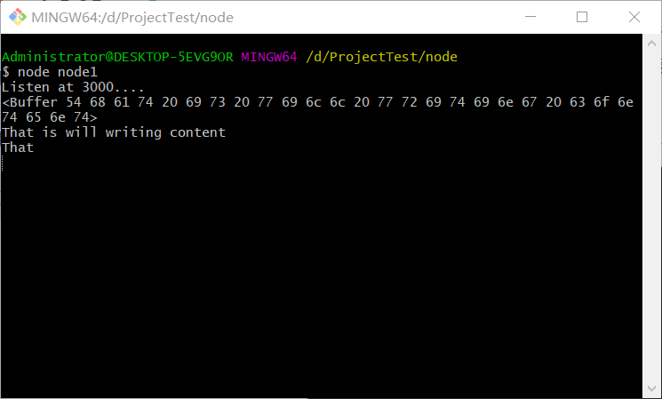

<div style="text-align: center;font-weight: 900;"> NodeJs之File System </div>

<!-- more -->

---

# NodeJs

---

## File System

---

1. `File System` 是 `NodeJs` 中用来 `操作文件` 的库

- 通过 `const fs = require('fs')` 引入该模块

```js
const fs = require('fs');
```

- 常用的方法有 `异步文件读取` fs.readFile、`异步文件写入` fs.writeFile、`同步文件读取` fs.readFileSync、`同步文件写入` fs.writeFileSync
- 因为同步操作可能会导致 `阻塞` ，因此一般采用异步操作以避免该问题

2. fs.writeFile

- `fs.writeFile` 可用于向文件写入信息，若文件存在则不会自动创建，若文件不存在则会创建文件
- `fs.writeFile` 主要有三个参数，第一个参数为文件的写入路径，也就是下述代码中的 `'./text.txt'`，第二个参数为将要给这个文件写入的内容，下述代码中为 `'That is will writing content'` ，第三个参数为回调函数，传入的参数为 `error` 对象，当它的值为 `null` 时表示内容写入文件成功

```js{3,8-14}
const http = require('http');
const childProcess = require('child_process');
const fs = require("fs");

const server = http.createServer((req,res)=>{
	res.stateCode=200;
	res.setHeader('content-type','text/plain');
	fs.writeFile('./text.txt','That is will writing content',(error)=>{
		if(error){
			console.log('File Write Error')
		}else{
			console.log('File write success')
		}
	})
	res.end('Hello World')
})

server.listen(3000,()=>{
	console.log('Listen at 3000....');
	childProcess.exec(`start http://localhost:3000/`)
})
```

- 终端输出 `'File write success'` ，同目录下生成 `text.txt` 文件，内容为 `'That is will writing content'`

3. fs.readFile

- `fs.readFile` 用来读取文件
- `fs.readFile` 主要有两个参数，第一个参数为读取的文件路径。第二个参数为 `回调函数`，回调函数传入第一个参数为 `error` 对象，该对象值为 `null` 时表示读取成功，第二个参数为读取到的数据，值为 `<string | buffer>`

```js{3,8-15}
const http = require('http');
const childProcess = require('child_process');
const fs = require("fs");

const server = http.createServer((req,res)=>{
	res.stateCode=200;
	res.setHeader('content-type','text/plain');
	fs.readFile('./text.txt',(err,data)=>{
		if(err){
			console.log('File read error',err)
		}else{
			console.log(data)
            console.log(data.toString())
            console.log(data.toString(0,5))
		}
	})
	res.end('Hello World')
})

server.listen(3000,()=>{
	console.log('Listen at 3000....');
	childProcess.exec(`start http://localhost:3000/`)
})
```

- 我们来读取上一步使用 `fs.writeFile` 写入并创建的 `text.txt` 文件，对读取到的数据进行一次原始的读取与转化为字符串的读取，发现出现了一个 `buffer` ，里面是一大串数字字母的集合，可知它是我们读取的数据，那它是什么呢？js 中好像没有见过这种数据类型
- `buffer` 其实是 `nodejs` 中定义的一个类，该类用来创建一个存放 `二进制数据` 的 `缓存区`，因为 `JavaScript` 语言本身只有字符串数据类型，没有 `二进制数据类型` ，而在处理如 TCP 流或 `文件流` 时，必须使用到二进制数据
- 读取 `Node` 缓冲区数据，可以使用 `buffer.toString([encoding[,start[,end]]])` ，参数均是可选数据。第一个参数 `encoding` 为使用的编码，缺省为 `utf-8`；第二个参数为 `start`，指定开始读取的索引位置，缺省为 0；第三个参数 `end` 指定结束读取的索引位置，缺省为缓冲区末尾。 
- 未转换与部分转换、全部转换的结果如图所示，`buffer` 缓冲区的 `二进制数据` 可以直接传给浏览器，机器之间可以通过二进制数据 `通信`

---

## 一个简单的文件读取服务器

---

1. 基本要求

- 当访问对应服务器地址时，返回对应的 html 界面

```js
const http = require('http');
const childProcess = require('child_process');
const fs = require('fs');

const server = http.createServer((req, res) => {
  res.stateCode = 200;
  res.setHeader('content-type', 'text/html');
  fs.readFile(`.${req.url}`, (err, data) => {
    if (err) {
      res.writeHead(404);
      res.write('Not Found');
      console.log('File read error', err);
    } else {
      res.end(data);
    }
  });
});

server.listen(3000, () => {
  console.log('Listen at 3000....');
  // childProcess.exec(`start http://localhost:3000/`)
});
```

```html
<!DOCTYPE html>
<html lang="en">
  <head>
    <meta charset="UTF-8" />
    <meta name="viewport" content="width=device-width, initial-scale=1.0" />
    <!-- <meta http-equiv="X-UA-Compatible" content="ie=edge"> -->
    <title>Document</title>
  </head>
  <body>
    网页内容
    
  </body>
</html>
```

2. 注意点

- 如要设置请求头，也就是 `res.setHeader('content-type','text/html)`,请设置为发送的数据类型为 `html` 格式，不要设置为 `plain` ，不然浏览器不会对标签进行解析
