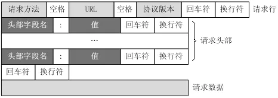

 NodeJs之HTTP协议 

<!-- more -->

---

# NodeJs

---

## HTTP 协议

---

1. 协议简介

- [mozilla-HTPP 协议](https://developer.mozilla.org/zh-CN/docs/Web/HTTP)

| 协议名称 | 特点 |
| :-: | :-: |
| HTTP 1.0 | 非持久连接，每个请求完全独立，速度较慢 |
| HTTP 1.1 | 持久连接，连接成功之后会保持一段时间(一般是 30 秒)，期间若再次请求则不用重新连接 |
| HTTPS | 主要作用分为两种：一种是建立一个信息安全通道保证数据传输的安全性；另一种就是确认网站的真实性 |
| HTTP 2.0 | 异步连接多路复用；头部压缩；请求/响应管线化；多路复用请求；对请求划分优先级；压缩 HTTP 头；服务器推送流（即 Server Push 技术） |

---

## HTTP 报文结构

---

1. 报文( `message` )

- 报文是网络中交换与传输的数据单元，即站点一次性要发送的数据块。报文包含了将要发送的完整的数据信息，它的长短会不一致，并且长度不限且可变

2. 一个完整的 `HTTP` 请求报文一般由 `请求行`、`请求头`、`请求体` 三部分组成 

- ① 请求方法，最常用的是 `GET` 和 `POST`，此外还包括 `DELETE`、`HEAD`、`OPTIONS`、`PUT`、`TRACE`
- ② 请求的 URL 地址，也就是请求的接口地址
- ③ 协议名称及版本号
- ④HTTP 的报文头，包含请求的书写，格式为 `属性名:属性值`，最大不超过 32K
- ⑤HTTP 的报文体，用于传输请求参数、文件等，最大不超过 2G

---

## HTTP 状态码分类

---

| 分类  |                      描述                      |
| :---: | :--------------------------------------------: |
| 100 - |  信息，服务器收到请求，需要请求者继续执行操作  |
| 200 - |           成功，操作被成功接收并处理           |
| 300 - |       重定向，需要进一步的操作以完成请求       |
| 400 - |   客户端错误，请求包含语法错误或无法完成请求   |
| 500 - | 服务器错误，服务器在处理请求的过程中发生了错误 |
