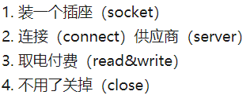
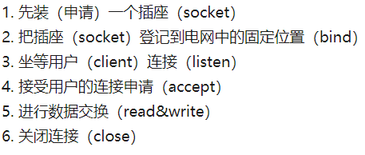

<div style="text-align: center;font-weight: 900;"> Socket </div>

<!-- more -->

---

# Socket

---

## Socket

---

1. 套接字是什么

- 源 IP 地址和目的 IP 地址以及源端口号和目的端口号的组合叫 `套接字`，`websocket` 就是服务端和客户端的结合
- `socket` 是基于 tcp 协议的一种新的 `全双工` 的网络协议，浏览器或服务器可以主动的、同时的给对方发送信息
- `socket` 可以支持不同的传输协议（TCP/UDP），在协议模型中，`socket` 处于应用层与传输层之间的一层抽象层 

2. 服务器与客户端的连接过程

- 服务器建立监听：`server` 初始化 `Socket` 动态库后创建套接字，然后指定 `server` 客户端 `socket` 的地址，循环绑定 `Socket` 直至成功，然后开始建立监听，此时 `server` 处于等待状态，并实时监控网络变化，等待 `client` 的连接请求
- 客户端提出请求：`client` 的 `socket` 向服务器发出连接请求，将要连接的 `socket` 以及 `socket` 相关属性（如地址和端口）指出，再向服务器 `socket` 提出请求
- 连接确认：当服务器端套接字监听到来自客户端的连接请求之后，立即响应并建立一个新进程，然后将服务器端的套接字的描述反馈给客户端，由客户端确认之后连接就建立成功，然后客户端和服务器之间可以互相通信，传输数据，此时服务器端的套接字继续监听并等待来自其他客户端的请求

3. 对连接过程进行简化

- 在等待 `client` 连接的过程中，`server` 在接受用户新的请求后不是在当前 `socket` 上面与用户交流，而是会返回一个新的 `socket`，由这个 `socket` 与用户相连  

4. 服务器的状态

- `server` 在接受一个新的 `socket` 请求之前，会一直处于阻塞状态（监听），直到捕捉到一个新的连接请求

---

## WebSocket

---

1. WebSocket 对比 ajax

- ajax：非实时数据交互（异步，局部刷新）。浏览器需主动给服务器发送请求，且一个请求对应一个响应
- websocket：支持实时数据交互。实现了 `B/S全双工` 通信，服务器可主动给客户端发送信息。本质上还是一个基于 `TCP` 的协议，连接过程类似于 `TCP` 连接的建立过程，连接过程 `（握手过程）`会使用 `http` 协议来发送报文，后续会升级到 `websocket` 协议

2. websocket 的握手过程

- `Brower客户端` 向 `服务器` 发起 `Websocket握手请求` 并发送报文(基于 http 协议)，告诉服务器端想要升级当前的 `http协议` 为 `Websocket协议`
- `Server客户端` 收到 `Brower客户端` 的 `Websocket握手请求` 报文之后会对报头进行解析
- 如果服务器理解客户端握手请求报头并且满足升级为 `WebSocket协议`的条件，便会向客户端发送握手应答报文
- 这个应答报文同样是基于 `HTTP协议`的
- 客户端收到服务器的应答报文后会对该报文进行一次验证，验证成功之后便会成功升级为 `WebSocket协议`
- 如果验证失败客户端将会 `主动断开连接`
- 建立了 `WebSocket连接` 之后，双方便可以进行全双工通信

3. websocket 与 tcp 协议的异同

- `WebSocket` 整个握手过程只需要两次握手，而 `Tcp` 需要三次，`WebSocket` 简化并加入了自己的规则
- `WebSocket` 握手协议基于 `http` 协议，相对于字节流的解析，`ASCII` 序列解析起来更加简便
- `WebSocket` 引入的随机序列认证机制，易于实现

4. websocket 握手结果

- 两次握手成功预示着双方将升级当前的协议 `http` 为 `websocket`
- `WebSocket` 握手请求报文的报头部分除了必须包含必要的 HTTP 字段，还须遵循通用消息格式 `[RFC 822]`，同时又要包含和 `WebSocket` 紧密联系的字段，如 `Web- Socket` 协议的版本信息、客户端随即生成的 Key、必要的 GET 请求方法

5. websocket 与 http 的区别

- 再来谈谈 `WebSocket` 的本质，它是通过 `http/https协议` 进行握手后创建一个用于交换数据的 `Tcp` 连接，连接建立之后，服务端与客户端通过此 `Tcp` 连接进行实时通信。通常可将 `WebSocket` 看成是 `http协议` 的一种补充
- `HTTP` 是一种非持久化的协议，而 `WebSocket` 是一个持久化的协议，并且一般 `http协议` 一个 `request` 对应一个 `response`

6. websocket 协议请求头

- `Upgrade:websocket` : `Connection Upgrade` 是 `WebSocket` 的核心，告诉服务器发起的是 `websocket` 协议
- `Sec-WebSocket-Key` : `x3JJHMbDL1EzLkh9GBhXDw==`，是浏览器随机生成的一个 Base64 encode 的值，告诉服务器自己是 websocket，相当于一个 id 卡。`Sec-WebSocket-Extensions: chat, superchat`，协议扩展，可以通过它扩展多个协议实现协议增强。`Sec-WebSocket-Version: 13`,websocket 协议的版本
- `Sec-WebSocket-Accept和Sec-WebSocket-Extensions`，请求时，webSocket 会自带加密过的 ID 卡过来让服务端验证；对应的，接受请求之后，服务端也得搞一个安全卡(Accept 头域的值就是 Key 的值，是由浏览器发过来的 Sec-WebSocket-Key 生成的)

---

### Browser 的 websocket 对象

---

1. send

- 通过 `websocket` 连接向服务器发送数据，当服务器与客户端建立了全双工的双向连接，可以使用 `send` 方法来发送消息，在连接请求为 `open` 时 `send` 可用于传送数据，在连接关闭或获取不到数据时 `send` 会抛出异常
- 可能的错误

```js
var socket = new WebSocket('ws://localhost:8080');
socket.send('Initial data');
// 在连接之前发送消息，这将无法发送
```

```js
// 应该等待 open 事件触发后再发送消息
var socket = new WebSocket('ws://localhost:8080');
socket.onopen = function (e) {
  socket.send('Initial data');
};
```

2. close

- 关闭 `websocket` 连接或停止正在进行的连接请求。当状态是 `closed` 或连接已经被关闭时，该方法无任何效果，并且当调用 `closed` 方法之后，将不能再发送数据。`close` 允许传入两个可选参数，`code(numerical)` 和 `reason(string)`，来告诉服务端为什么终止连接

```js
socket.close(1000, 'Closing normally');
// 1000是状态码，代表正常结束
```

3. readystate 常量

|   常量码   | 值  |             描述             |
| :--------: | :-: | :--------------------------: |
| CONNECTING |  0  |         连接还没开启         |
|    OPEN    |  1  | 连接已经开启并准备好进行通信 |
|  CLOSING   |  2  |     连接正在关闭的过程中     |
|   CLOSED   |  3  | 连接已经关闭，或连接无法建立 |

4. 常见的两种长连接的方式

- `ajax轮询`：每隔个短时间浏览器就向服务器发起一次请求，询问是否有新信息。弊端：短时间频繁的发起请求，但不一定能收到消息，非常消耗性能
- `long pull`：类似于 `ajax轮询`，但是 `long pull` 是阻塞模型，也就是相当于浏览器持续向服务器发起请求，直到服务器等到有消息的时候，再回应给浏览器
- `ajax轮询` 与 `long pull`的弊端：`被动性`，都是需要客户端主动向服务端发送请求，然后等待服务端应答。`ajax轮询` 需要服务器有很快的处理速度和资源。`long pull` 需要有很高的并发，也就是说同时接待客户的能力，也可以理解为场地大小

5. 总结一下 WebSocket

- 在升级到 `websocket` 协议后，双方会建立 `全双工连接`
- 服务器会在有新信息时主动给客户端发送新信息
- `http` 作为非状态性的协议，每次都要重新传输鉴别信息，通过特点的 `id` 被服务端识别。`WebSocket` 只需要一次 `http` 握手，因此整个通讯过程是建立在一次连接/状态中，避免了 `http` 的非状态性，直到关闭请求前，连接都是一直建立的

---

### websocket 事件处理器

---

1. open

- 一个用于连接打开事件的事件监听器，在 `readyState` 的值变为 `OPEN` 的时候会触发该事件
- 该事件表明这个连接已经准备好接收数据，该监听器会接受一个名为 `open` 的事件对象

```js
socket.onopen = function (e) {
  console.log('Connection open');
};
```

```js
socket.addEventListener('open', function (e) {
  console.log('Connection open');
});
```

2. message

- 一个用于消息事件的事件监听器，当有消息到达时该事件会触发
- 该监听器会被传入一个名为 `message` 的 `messageevent` 对象

```js
socket.onmessage = function (e) {
  console.log('message received', e, e.data);
};
```

3. error

- 一个用域错误时间发生 `error` 的事件监听器，这个监听器会被传入一个名为 `error` 的 `event` 对象

```js
socket.onerror = function (e) {
  console.log('WebSocket Error:', e);
};
```

4. close

- 一个用于监听连接关闭的事件监听器，当 `websocket` 对象的 `readyState` 状态变为 `CLOSED` 时会触发事件，这个监听器会接收一个名为 `close` 的 `closeevent` 对象

```js
socket.onclose = function (e) {
  console.log('WebSocket closed', e);
};
```

---

## nodejs-websocket

---

### Server

---

1. 安装依赖

```js
npm install nodejs-websocket
```

2. 在 Server.js 中使用

```js
// server.js
const ws = require('nodejs-websocket');
```

3. 创建一个服务器

```js
const wsserver = ws.createServer((connect) => {
  // 每次只要有用户连接，函数就会被处理，并为用户创建一个connect对象
  console.log('Person Connection...');
  // 在服务器中提示由用户连接成功
});
```

4. 接收来自 client 的数据

```js
connect.on('text', (data) => {
  // 每当监测到用户传递过来的数据，这个text就会触发
  connect.send(data);
  //将用户发送过来的数据原样响应发送给用户
});
```

5. client 断开服务器

```js
connect.on('close', (e) => {
  console.log('Connect Closed');
  // 任意client与server的websocket断开，close事件就会被触发
});
```

6. 返回异常信息

```js
connect.on('error', (e) => {
  console.log('Client Conenct error');
  // 用户断开连接后，server会出现异常，服务器会被关闭，需要该异常进行处理
  // 该异常会触发error事件，对该事件进行处理即可，服务器可继续接收其他client的连接请求
});
```

7. 监听地址

```js
wsserver.listen(300, () => {
  console.log('websocket服务启动成功，正在监听3000端口...');
});
```

8. 完整 server 代码

```js
// server.js
const ws = require('nodejs-websocket');
const wserver = ws.createServer((connect) => {
  console.log('有用户连接中');
  connect.on('text', (data) => {
    connect.send(data + '!!!');
  });
  connect.on('close', () => {
    console.log('Conect Cloesd');
  });
  connect.on('error', () => {
    console.log('Client connect error');
  });
});
wserver.listen(3000, () => {
  console.log('websocket服务启动成功,正在监听3000端口');
});
```

---

### client

---

1. 安装依赖

```bash
npm install nodejs-websocket
```

2. 创建 websocket 实例对象

```js
var socket = new WebSocket('ws://localhost:3000');
```

3. 监听 open 事件

```js
socket.addEventListener('open', function () {
  div.innerHTML = '连接服务器成功';
  // open: 当websocket服务连接成功时触发该事件
});
```

4. 发送数据

```js
sendButton.addEventListener('click', function () {
  socket.send(textInput.value);
  // 当触发sendButton事件源的点击事件时，用send向服务器发送数据
});
```

5. 接收数据

```js
socket.addEventListener('message', function (e) {
  div.innerHTML += '<br />' + e.data;
  //使用message监听服务器返回的数据并做处理，将它显示在页面上
});
```

6. 断开连接

```js
socket.addEventListener('close', function () {
  div.innerHTML += '<br />' + '服务器断开连接';
  // 当与服务器断开连接时触发close事件
});
```

7. 完整 client 代码

```html
<style>
  div {
    width: 200px;
    height: 200px;
    border: 1px solid black;
  }
  button {
    box-sizing: border-box;
    border: 0;
    outline: none;
  }
  button:hover {
    color: white;
    background-color: black;
  }
</style>
<body>
  <input type="text" placeholder="请输入要发送的内容" />
  <button>发送数据</button>
  <div></div>
</body>
<script>
  var textInput = document.querySelector('input');
  var sendButton = document.querySelector('button');
  var div = document.querySelector('div');
  var socket = new WebSocket('ws://localhost:3000');
  socket.addEventListener('open', function () {
    div.innerHTML = '连接服务成功';
  });
  sendButton.addEventListener('click', function () {
    var value = textInput.value;
    if (!value) {
      alert('无内容可发送');
      return;
    }
    socket.send(value);
  });
  socket.addEventListener('message', function (e) {
    div.innerHTML += '<br />' + e.data;
  });
  socket.addEventListener('close', function () {
    div.innerHTML += '<br />' + '服务器断开连接';
  });
</script>
```

---

### 简易聊天室

---

#### server

---

1. 导入模块

```js
npm install nodejs-websocket
```

2. 导入 websocket

```js
const ws = require('nodejs-websocket');
```

3. 创建服务器

```js
const wserver = ws.createServer((connect) => {
  //conn 每个连接到服务器的用户，都会有一个connect对象
  console.log('有新用户加入');
});
```

4. 定义一个广播函数

```js
function broadcast(msg) {
  wserver.connections.forEach((item) => {
    //wserver.connections表示连接上服务器的所有用户
    item.send(JSON.stringify(msg));
    //send方法只允许传入一个字符串，因此需要转化为json格式
    //将单个用户发送的消息发送给所有用户
  });
}
```

5. 完整代码

```js
const ws = require('nodejs-websocket');
const type_enter = 0;
const type_leave = 1;
const type_msg = 2;
let count = 0;
//记录连接上来的总的用户数
const wserver = ws.createServer((connect) => {
  console.log('有新用户加入');
  count++;
  connect.Username = `用户${count}`;
  // 广播所有用户有人加入聊天室
  broatcast({
    type: type_enter,
    msg: `用户${count}进入了聊天室`,
    time: new Date().toLocaleTimeString(),
  });
  //接收到了新的数据
  connect.on('text', (data) => {
    //将所有人的信息广播出来
    broatcast({
      type: type_msg,
      msg: data,
      time: new Date().toLocaleTimeString(),
    });
  });
  connect.on('close', (data) => {
    //用户断开连接
    console.log('连接关闭');
    count--;
    broatcast({
      type: type_leave,
      msg: `用户${count}离开了聊天室`,
      time: new Date().toLocaleTimeString(),
    });
    // 广播所有用户有人离开聊天室
  });
  connect.on('error', (data) => {
    //触发异常断开连接
    console.log('用户关闭了客户端');
  });
});

//给所有用户广播消息
function broatcast(msg) {
  wserver.connections.forEach((item) => {
    item.send(JSON.stringify(msg));
  });
}
wserver.listen(3000, () => {
  console.log('listen at 3000');
});
```

---

#### client

---

1. 导入模块

```js
npm install nodejs-websocket
```

2. 创建 websocket 实例

```js
var socket = new WebSocket('ws://localhost:3000');
// 创建一个websocket实例
```

3. 监听 open 事件

```js
socket.addEventListener('open', function () {
  div.innerHTML = '连接服务器成功!';
  // open: 当websocket服务连接成功时触发该事件
});
```

4. 发送数据

```js
buttom.addEventListener('click', function () {
  var value = input.value;
  socket.send(value);
  input.value = '';
  // 当触发buttom事件源的点击事件时，用send向服务器发送数据
});
```

5. 接收数据

```js
socket.addEventListener('message',function(e){
            var data = JSON.parse(e.data)
            var newmessage = document.createElement('div');
            newmessage.innerText = data.msg + '-------' + data.time
            if(data.type === type_enter){
                newmessage.style.color='green';
            }else if(data.type === type_leave){
                newmessage.style.color='red'
            }else{
                newmessage.style.color='blue'
            }
            div.appendChild(newmessage)
        })
//使用message监听服务器返回的数据并做处理，将它显示在页面上
})
```

6. 断开连接

```js
socket.addEventListener('close', function () {
  div.innerHTML += '<br />' + '服务器断开连接';
  // 当与服务器断开连接时触发close事件
});
```

7. 完整 client 代码

```html
<body>
  <input type="text" placeholder="请输入你的内容" />
  <button>发送请求</button>
  <div id="chatborder"></div>
</body>
<script>
  const type_enter = 0;
  const type_leave = 1;
  const type_msg = 2;

  var input = document.querySelector('input');
  var buttom = document.querySelector('button');
  var div = document.querySelector('div');
  var socket = new WebSocket('ws://localhost:3000');
  socket.addEventListener('open', function () {
    div.innerHTML = '连接服务器成功';
  });
  buttom.addEventListener('click', function () {
    var value = input.value;
    socket.send(value);
    input.value = '';
  });
  socket.addEventListener('message', function (e) {
    var data = JSON.parse(e.data);
    var newmessage = document.createElement('div');
    newmessage.innerText = data.msg + '-------' + data.time;
    if (data.type === type_enter) {
      newmessage.style.color = 'green';
    } else if (data.type === type_leave) {
      newmessage.style.color = 'red';
    } else {
      newmessage.style.color = 'blue';
    }
    div.appendChild(newmessage);
  });
  socket.addEventListener('close', function () {
    div.innerHTML += '<br />' + '服务器断开连接';
  });
</script>
```

---

## Socket.io

---

1. Socket.io 是什么

- 属于 websocket 和轮询机制以及其他的实时通信方式封装而成的接口
- 是一个库，可以在浏览器和服务器之间实现实时的、双向和基于事件的通信
- 既可以在服务器端用，又可以在客户端(浏览器)使用

2. emit

- 触发一个事件，参数为事件名、要发送的数据

3. on

- 注册一个事件，用来监听 emit 的变化
