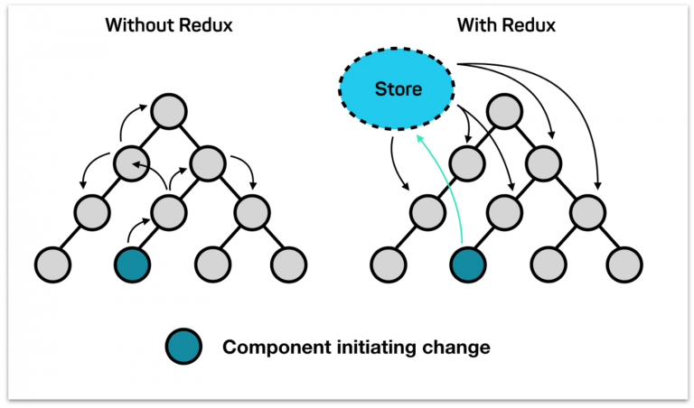
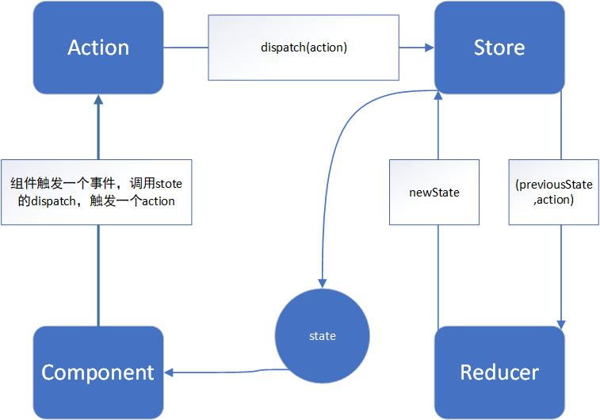
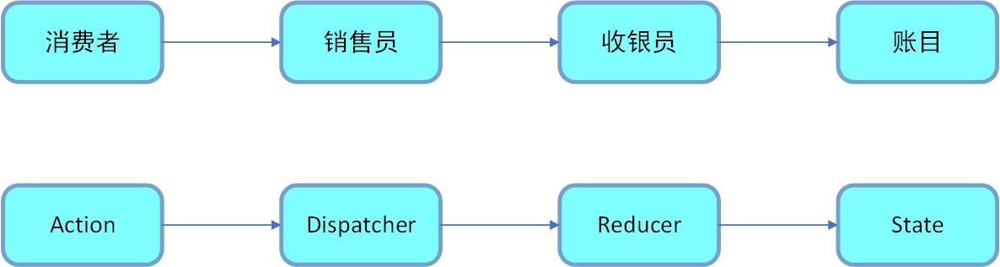
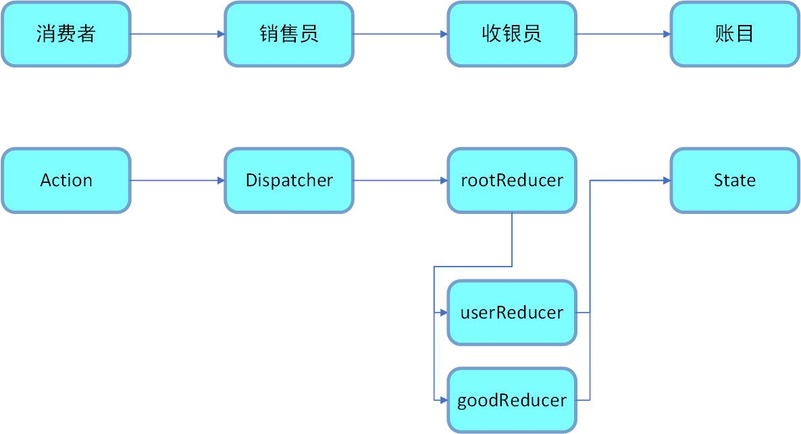

## 状态管理工具的作用

---

1. 用途

- 实现组件之间的数据共享
- 实现数据缓存

2. Redux

- 基于 Flux 思想而诞生一个开源库，它是一套具体的数据解决方案。它是一个状态容器，提供可预测化的状态管理
- redux 要求数据都放在一个公共的存储区，所有组件的共享数据都放在一个公用的存储空间中，组件通过这个存储空间来取数据，一旦存储空间中的数据发生改变，所有相关的组件都能感知到数据的变化并作出相应地操作 



3. 响应原理

- redux 提供了一种 **可预测化的状态管理** 机制，它会将整个应用状态，也就是组件之间需要共享的数据存储到一个地方，它就是 store。store 之中保有一颗状态树 state tree，组件改变 state 地唯一方法是通过调用 store 的 dispatch 方法，触发一个 action，这个 action 被对应的 reducer 处理，从而更新 state。组件通过 dispatch(派发) action(行为) 给 store，而不直接通知其他组件，其他组件可以通过订阅 store 中的状态 state 来刷新自己的视图 



4. action

- action 是行为信息的抽象，对象类型，它描述发生了什么。该对象必须有一个 type 属性，对于对象里面的其他内容，`redux` 不做限制

```js
// action
{
      type:'ACTION_TYPE',
      payload, // 负荷，用于承载action携带的数据
}
```

- createAction，用于创建 action，它只简单地返回 action

```js
function createAction(params) {
  return {
    type: 'ACTION_TYPE',
    payload, // 负荷，用于承载action携带的数据
  };
}
```

5. state

- state 是被托管的数据，也就是每次触发监听事件，我们要操作的数据

6. reducer

- 用于控制 state 改变的函数。action 描述发生了什么，但是并不知道相应地 state 该怎样变化，对于不同的 action，相应地 state 变化是用 reducer 来描述的。
- reducer 接收两个参数，第一个是 state，第二个是 action，并返回计算之后新的 state。reducer 必须是一个纯函数，对于相同的输入 (state、action)，一定会返回相同的新的 state
- 纯函数没有任何副作用，并且相同的输入，reducer 函数无论执行多少遍始终会返回相同的输出（newState），因此通过 reducer 函数很容易推断出 state 的变化

```js
lei initState={
  msg:'hello world'
}
function reducer(state=initState,action){
  let newState=JSON.parse(JSON.stringify(state))
  switch (action.type){
        case 'action_type_one':
              newState.msg=action.payload
              return newState
        default:
              return newState
  }
}
// 原始数据 state=initState 并不会改变，新的 newState 是一个最新的快照
```

7. store

- store 负责将 state、action、reducer 整合在一起

```js
{
  createStore(rootReducer), // 用于创建根store
    combineReducers({ user: userReducer, home: homeReducer }), // 用于整合多个reducer
    bindActionCreators,
    applyMiddleware,
    compose,
    __DO_NOT_USE_ActionTypes;
}
```

- 根 store 的作用有很多，通常负责托管应用的 state、允许通过 store.getState() 方法访问到托管的 state、允许通过 store.dispatch() 方法触发 acton 更新state、允许通过 store.subscribe() 注册监听函数监听每一次 action 触发、允许注销通过 store.subscribr() 方法注册的监听函数

```js
// 注册监听函数
const unsubscribe=store.subscribe(()=>{...})
// 注销监听函数
unsubscribe()
```


---

## Redux 的使用

---

1. 创建 reducer

- 可以使用一个单独的 reducer，也可以将多个 reducer 合并为一个 reducer。redux 提供了 combineReducers({user:userReducer,home:homeReducer}) 方法了来让我们可以合并多个 reducer
- action 发出命令后将 state 放入加工函数 reducer 中，对 state 进行加工处理，返回新的 state
- reducer 是一个纯函数，也就是说不能在 reducer 中进行异步操作。纯函数指的是给固定的输入，就一定有固定的输出且不会有任何副作用），即 state 是一定的 action 是一定的那么返回的数据一定是固定的

2. 创建 action

- 用户是接触不到 state，只能由 view 触发，因此，这个 action(行为) 可以理解为一种指令，需要发出多少动作就有多少指令
- action 是一个对象，必须有一个叫 type 的参数，用于定义 action 类型

3. 创建 store

- 使用 createStore 方法创建 store，提供 dispatch、subscribe、getState 等方法

4. reduce 设计和使用三个原则

- store 必须是唯一的，单一数据源可以让整个应用的 state 变得方便维护、追踪炖好修改
- 只有 store 能够改变自己的内容（并不是 reducer 改变数据，reducer 只是生成了一个数据给 store，store 拿到了 reducer 返回的数据来进行更新，所以只能在 reducer 中拷贝一份旧的 state 然后拿新的数据来改，绝对不能够 state 直接进行修改）

---

## 相关 API 讲解

---

1. combineReducers

- 当项目规模变大，业务场景越来越复杂时，state 的结构也会变得越来越复杂而且庞大。如果我们只通过一个 reducer 来计算 state 的变化必然会让我们的业务处理变得臃肿。此时我们可以将 state 独立的数据分离出来，单独用一个 reducer`来计算，然后使用 combineReducer 合入 state 中

```js
import { combineReducer, createStroe } from 'redux';

const rootReducer = combineReducers({
  user: userReducer,
  good: goodReducer,
});

const store = createStore(rootReducer);
```



---

## react-redux

---

1. Redux 官方提供的 react 绑定库

- 可以将 store 集成到 React 的组件顶层中，因此，也就是顶层 props，这样每个子组件都能访问 props 了

2. Provider

- 将顶层组件包括在 `react-redux` 提供的 `顶级组件` Provider 中，这样，位于顶层组件中的其他子组件就在 `react-redux` 的控制之下了，但是 `store` 需要作为全局数据注入到 `Provider` 组件中去

```js
// main.js
ReactDOM.render({
  <App />,
  document.getElementById("#root")
})
```

```js
// App.js
function App(){
  <Provider store={store}>
    <div className="App">
      {/**  */}
    </div>
  <Provider>
}
```

- `Provider` 可以让所有组件都能够访问到 `Redux` 中的数据

3. connect

- 语法：connect(mapStateToProps,mapActionsToProps)(Component)
- mapStateToProps：用于将 `redux` 中的数据映射到 `react` 的 `props` 中去，后续我们可以在被注入了 `state` 的组件中直接使用 `props.xxx/函数组件` 或 `this.props.xxx/类组件` 访问 `state`

```js
function mapStateToProps(state) {
  return {
    msg: 'hello world',
    count: 0,
  };
}
// 将state中的某个数据映射到props中
```

- mapActionsToProps：类似的概念，将 `(dispach(action))` 映射到 `props` 中

```js
function mapActionsToProps(){
  return(
    changeCount:()=>{
      dispatch({
        type:"add",payload
      })
    }
  )
}
// payload用于传递参数
```

4. useSelector

- 用于从 `redux` 的 `store` 对象中提取数据 `state`，这个方法可能在任何时候执行多次，因此需保持这个 `selector` 是一个纯函数
- 用于替代之前的的 `connect` 中的 `mapStateToProps` 参数的概念，`useSelector` 会订阅 `store`，当 `dispatch` 一个 `action` 时，会运行 `selector`

5. `useSelector` 与 `mapStateToProps` 的差异

- `selector` 会返回任何值作为结果，并不仅仅是对象，`selector` 返回的结果，会作为 `useSelector` 的结果
- 当 `action` 被 `dispatch` 时，`useSelector` 会对前一个 `selector` 的结果值和当前结果值进行浅比较。如果不同，就会被 `re-render`

```js
import React from 'react';
import { useSelector } from 'react-redux';
export const CounterComponent = () => {
  const count = useSelector((state) => state.count);
  return <div>{count}</div>;
};
```
---

## redux 实例

---

1. 安装依赖

```bash
npm install redux react-redux -S
```

2. 创建 reducer

```js
// store/reducer.js
import { CHANGE_INPUT_VALUE, ADD_ITEM, DEL_ITEM } from './actionTypes';

const defaultState = {
  list: [1, 2, 3],
  inputValue: '',
};

export default (state = defaultState, action) => {
  if (action.type === CHANGE_INPUT_VALUE) {
    const newState = JSON.parse(JSON.stringify(state));
    newState.inputValue = action.value;
    console.log(newState.inputValue);
    return newState;
  }

  if (action.type === ADD_ITEM) {
    const newState = JSON.parse(JSON.stringify(state));
    newState.list.push(newState.inputValue);
    newState.inputValue = '';
    // 返回数据给store来替换
    return newState;
  }

  if (action.type === DEL_ITEM) {
    const newState = JSON.parse(JSON.stringify(state));
    newState.list.splice(action.index, 1);
    return newState;
  }

  return state;
};
```

3. 创建 store

```js
// src/store/index,js
import { createStore } from 'redux';
// 用于创建store，使用了createStore这个方法，这个方法接收reducer
import reducer from './reducer';

const store = createStore(reducer);

export default store;
```

4. 创建 actionType

```js
// 用于定义action常量
export const CHANGE_INPUT_VALUE = 'input-value-changed';
export const ADD_ITEM = 'add-item';
export const DEL_ITEM = 'idel-item';
```

5. 创建 action 生成器

```js
import { ADD_ITEM, CHANGE_INPUT_VALUE, DEL_ITEM } from './actionTypes';

export const getInputChangeAction = (value) => ({
  type: CHANGE_INPUT_VALUE,
  value,
});

export const getAddItemAction = () => ({
  type: ADD_ITEM,
});

export const getDelItemAction = (index) => ({
  type: DEL_ITEM,
  index,
});
```

6. 将 store 注入到顶层 props 中

```js
// App.js
import React from 'react';
import store from '@/src/store/index';
import { Provider } from 'react-redux';
import TodoList from '@/src/components/test';
function App() {
  <Provider store={store}>
    <div className="App">
      <TodoList />
    </div>
  </Provider>;
}

export default App;
```

7. 在组件中使用 store

```js
import React, { Component, Fragment } from 'react';
import 'antd/dist/antd.css';
import { List, Input, Button } from 'antd';
import store from './store';
import { getInputChangeAction, getAddItemAction, getDelItemAction } from './store/actionCreator';

class TodoList extends Component {
  constructor(props) {
    super(props);
    this.handleInputChange = this.handleInputChange.bind(this);
    this.handleStoreChange = this.handleStoreChange.bind(this);
    this.handleAddItem = this.handleAddItem.bind(this);
    // 从store中获取初始数据
    this.state = store.getState();
    // 监听store的改变然后赋给state
    store.subscribe(this.handleStoreChange);
  }

  render() {
    return (
      <Fragment>
        <Input
          style={{ marginTop: '20px', marginLeft: '20px', width: '300px' }}
          value={this.state.inputValue}
          onChange={this.handleInputChange}
        />
        <Button
          type="primary"
          style={{ marginLeft: '10px', marginTop: '20px' }}
          onClick={this.handleAddItem}
        >
          新增
        </Button>
        <List
          style={{ marginTop: '10px', marginLeft: '20px', width: '350px' }}
          bordered
          dataSource={this.state.list}
          renderItem={(item, index) => (
            <List.Item onClick={this.handleDelete.bind(this, index)}>{item}</List.Item>
          )}
        />
      </Fragment>
    );
  }

  handleAddItem() {
    const action = getAddItemAction();
    store.dispatch(action);
  }

  handleInputChange(e) {
    const action = getInputChangeAction(e.target.value);
    store.dispatch(action);
  }

  handleDelete(index) {
    const action = getDelItemAction(index);
    store.dispatch(action);
  }

  handleStoreChange() {
    this.setState(store.getState());
  }
}

export default TodoList;
```

```js
// @/src/components/Count.js
// 组件订阅store，当store发生变化时，store通知组件更新
//
import React from 'react'
import {connect} from 'react-redux'

function mapStateToProps(store){
  return{
    msg:store.msg,
    count:store.msg
  }
}

function mapActionsToProps(dispatch){
  return{
    changeCount:()=>{
      dispatch({
        type:"increnent"
      })
    }
    changeMsg:(payload)=>{
      dispatch({
        type:"ChangeMsg",payload
      })
    }
  }
}

function Count(props){
  function ChangeCount(){
    props.changeCount()
  }
  function ChangeMsg(){
    props.changeMsg("Hello Jemtine")
  }
  return (
    <div className="Count">
      <span>{props.msg}</span>
      <button onClick={ChangeMsg}>改变msg</button>
      <span>{props.count}</span>
      <button onClick={ChangeCount}>改变count</button>
    </div>
  )
}

export default connect(mapStateToProps,mapActionsToProps)(Count)
```
