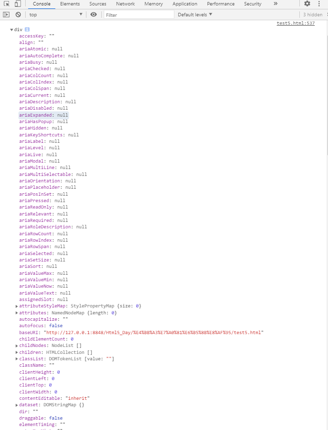
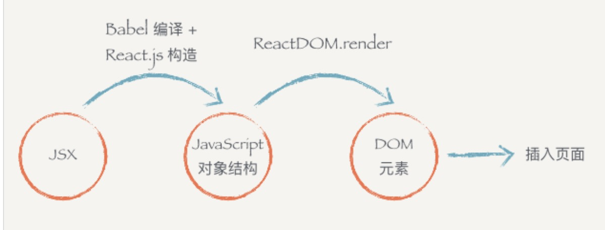
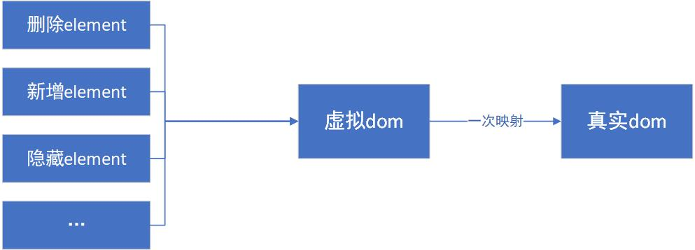

## JSX
---
1. 描述

- _JavaScript XML_，本质上属于一种语法糖 `React.createElement`，并不是一种新的诞生的技术，它是一种 `JavaScript` 的语法扩展
- 用于描述我们的 UI 界面，可以理解为一种渲染数据的模板语言，并且它可以完全和 js 融合在一起使用
- 在 `React` 的组件中，只有引入了 `React` 的模块才能正确识别 `JSX` 代码

```js
import React from 'react';
```

2. 使用方式

- JSX 可以是 `对象`，`变量`，`表达式`

```js
const name = 'jetmine';
const des = 'slex';
function sayAlex(str) {
  return str;
}
const ele = <h1>Hello,{name}</h1>;
const ele1 = <h2>{sayAlex(des)}</h2>;
const ele2 = <h3>{name ? 'React' : name}</h3>;
```

```js
const ele3 = <div tabIndex="0">属性值一</div>;
const ele3 = <div tabIndex={0}>属性值二</div>;
const ele3 = <div tabIndex={num}>属性值三</div>;
```

- 每一个标签都可接收属性，并且 jsx 默认支持所有 html 标签，并且支持所有 html标签 默认的属性，但是为了与类的关键字 class 区分开，html 标签的 class 属性在 jsx 中使用 className 代替

```js
const ele = <div className="index">hello world</div>;
```

- 可以给元素添加 `inline styles` 或者 className 的方式设置样式，但是前者的性能不如后者

```js
/** 
 * 使用 Array.prototype.map 渲染多列数据
*/
import React from 'react';
const data = [1, 2, 3, 4, 5];
const divdata = (
  <div>
    {data.map((item, i) => (
      <div className="num" key={i}>
        {item}
      </div>
    ))}
  </div>
);
export default function (props) {
  return <div>{divdata}</div>;
}
```

```js
/** 
 * 在 jsx 中使用逻辑代码
*/
import React from 'react';
const data = [1, 2, 3, 4, 5];
const isTrue = true;
const divdata = (
  <div>
    {' '}
    {data.map((item, i) => (
      <div className="num" key={i}>
        {item}
      </div>
    ))}
  </div>
);
export default function (props) {
  return <div>{isTrue && divdata}</div>;
}
```

3. JSX 的本质是什么

- 实际上，_JSX_ 的本质就是 **`js对象`**。在 _html_ 中，每一个标签都是一个 js 对象，我们可以通过以下方式创建一个 **`div元素`**

```js
const ele = document.createElement('div');
console.dir(ele);
```



- 可以发现，在 dom 结构中的某一个 div 元素，实质上是一个对象，其实所有的 dom 元素都是一个对象，当我们书写一个标签/元素 `<div></div>` 时，就是 new 了一个该元素的实例 `new div()`。因此，模板语言 `JSX` 本质上是一个 `JS对象` 的语法糖，它能更方便我们的使用
- 在 _React_ 中除了像使用标签去书写 _JSX_ 外，还可以使用类似于 JS 中创建一个元素的形式去创建

```js
// createElement用于创建一个组件的实例
// hello.js
import React from 'react';
const ele = React.createElement(
  'h1',
  { className: 'box' },
  'Hello World',
  React.createEleme('a', { href: 'https://jetmine.cn' }, '点击前往'),
);
```

```js
const element = {
  type: 'h1',
  props: {
    className: 'box',
    children: ['Hello, world!',{
      type:'a',
      props:{
        href:'https://jetmine.cn',
        children:'点击前往'
      }
    }
  }
};
```

- 它是一种表示元素层级嵌套的树形结构，上面那段代码也使用 `JSX` 的方式书写

```jsx
// JSX
import React from 'react';

const Jump = (
  <div className="box">
    Hello World
    <a herf="https://jetmine.cn">点击前往</a>
  </div>
);

export default () => Jump
```

- 因此，我们可以通过 _JSX_ 将标签对象一一映射到 _html_ 的标签对象中，通过这样的方式，_React_ 帮助我们将 _JSX_ 渲染到 _html_ 的文档中
- 再思考一下，如何用 `JavaScript` 来表现一个 dom 元素的结构

```html
<div class="box" id="content">
  <div class="title">Hello</div>
  <button>Click</button>
</div>
```

- 上面我们知道了，每个 dom 元素的结构都可以用 js 的对象来表示，而每个 dom 元素包含的信息其实只有三个：**标签名**、**属性**、**子元素**

```js
/** 
 * 上面的html用JavaScript对象表示
*/
{
  tag: 'div',
  attrs: { className: 'box', id: 'content'},
  children: [
    {
      tag: 'div',
      arrts: { className: 'title' },
      children: ['Hello']
    },
    {
      tag: 'button',
      attrs: null,
      children: ['Click']
    }
  ]
}
```

- 可以发现，html 的信息和 js 所包含的结构和信息其实是一样的，我们可以用 js对象 来描述所有能用 js 表示的 ui 结构
- React.createElement 会构建一个 js 对象来描述你的 html 结构的信息，包括 `标签名/组件的类型`、`传给组件的属性` 以及 `子元素`。当第一个参数是组件的时候，第一个参数是作为变量传入的, 可以想像的是, `React.createElement` 内部有一个简单的判断，如果传入的是组件的话, 内部还会调用 `React.createElement` 方法。会返回一个 react 元素，该 元素 带有 `props`、`refs`、`type`

```js
import React from 'react';
Test = React.createElement(Test1);
```

4. 虚拟 dom 



- 我们可以发现，jsx 模板与 html 模板具有极为相似的特性，借助这样的特性，react 帮助我们将 jsx 渲染到页面上。但是实际上，jsx 是不同于 html 的东西，jsx 是虚拟 dom 的前置状态，当 jsx 被 render 以后，才会生成虚拟 dom
- render 方法的返回值描述了我们想要在屏幕上看到的内容，它返回了一个 react 元素

```js
<div />
```

```js
// 被编译为
React.createElement('div', { className: '' });
```

5. 为什么会出现虚拟 dom

- dom 操作是一件成本很高的事情，相对于页面性能优化来说，对于浏览器而言，每一次的 dom 操作都伴随大量的计算，当页面需要的操作不断变得复杂，每一次操作需要改动的元素变得更多时，浏览器的压力也会越来越大
- 虚拟 dom 帮帮助我们收集短时间来的多次改动，并汇总成一次改动，这就是虚拟 dom 的批处理能力。同时，结合 React 中虚拟 dom 的 diff 算法，将本来应该由浏览器来做的事，分担给 js 来计算，使浏览器承受的压力更小



- react 会将元素和它的子元素与它们之前的状态进行比较，并只会进行必要的更新来使 dom 达到预期的状态，也就是说，它只会更新实际改变了的内容

6. 三种操作 dom 的思路对比

- 直接操作真实 dom 并进行创建和替换。state + jsx --> 数据与模版结合，直接生成真实 dom 结构 --> state 更新 --> 数据+模板相结合，生成真实的DOM，替换原始的 dom。这种方式在于每一次 state 的更新，都会生成一个真实的 dom 结构对老的 dom 结构进行全量替换，反复的生成或替换会非常消耗性能

- 操作真实 dom，但比对 dom 上变化地元素进行部分更新。state + jsx --> 数据与模版结合，直接生成真实 dom 结构 --> state 更新 --> 数据+模板相结合，生成真实的 dom，并不直接替换原始的 dom --> 新的 dom 与原始的 dom 作对比，找差异（性能损耗大）--> 通过 diff 找到哪些 dom 被更新了，只将新的部分替换老的部分。这种方式的缺陷是每一次修改 state 依然会生成一个真实地 dom 片段，虽然并不直接替换整个 dom 结构，但在比对上会消耗过多性能

- react 的思路其实和上面的第二种是类似的，只不过它将变化生成的真实 dom 改为了生成虚拟 dom，并且 diff 也发生在虚拟 dom 结构上，这样做的好处是去除了 state 变化对真实DOM的创建和对比，而创建和对比的是 js 对象/虚拟 dom，从而实现了极大的性能飞跃

7. 其他特性

- 防注入攻击：我们可以安全的在 jsx 当中插入用户输入内容。react 在渲染所有输入内容之前，默认会进行转义。它可以确保在你的应用中，永远不会注入那些并非自己明确编写的内容。所有的内容在渲染之前都被转换成了字符串。这样可以有效地防止 `XSS（cross-site-scripting, 跨站脚本）` 攻击

- *keys*：使用循环的时候，react 利用 key 来识别组件，它是一种身份标识，一般兄弟之间需要 key 是唯一，但不用全局唯一，需要避免使用 索引值 作为 key

- *diff 算法*：用于比较原始虚拟 do m 和新的虚拟 dom 的区别，也就是两个 JS 对象的比较。它是同级比较，假设第一层两个虚拟 dom 节点不一致，就不会往下比了，就会将原始页面虚拟 dom 全部删除掉，然后用新的虚拟 dom 进行全部的替换，虽然这有可能有一些性能的浪费，但是由于同层比对的算法性能很高，因此又弥补了性能的损耗
