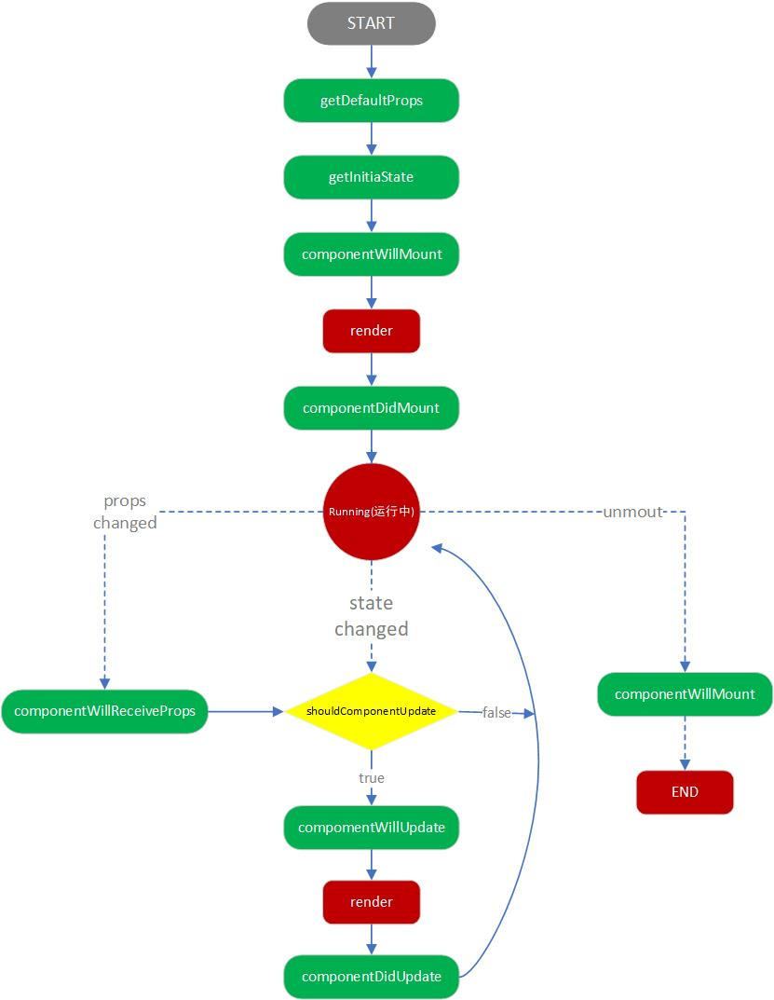
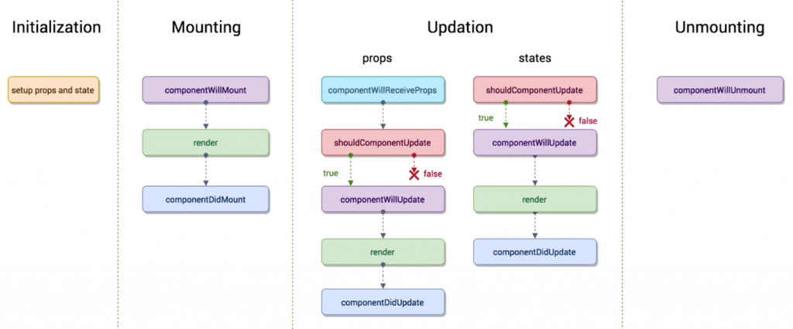

## 内部状态

---

1. state

- 类似于 props，但是 state 是私有的，且完全受控于当前组件，除了拥有 state 的组件，其他组件都无法访问
- state 与 props 作为 react 中有特殊含义的属性，并不一定要求我们将数据存放在其中，我们可以将不参与数据流的额外字段添加到 class 中作为实例属性而存在

```js
this.data = {};
```

- 任何一个 _state_ 发生变化时，整个函数组件其实都是被完全执行了一遍的，并且除了 _state_ 之外，多次的执行之间没有任何关系
- 因此，在考虑一个场景的实现时，我们首先要考虑这个组件有哪些状态，状态的变化是由什么触发的，从而将整个功能串联起来

2. class 组件中使用 state

- class 组件应始终使用 props 参数来调用父类的构造函数

```js
class TestComponent extends React.Component {
  constructor(props) {
    super(props);
    this.state = {};
  }
  render() {
    return <div>textcomponent</div>;
  }
}
```

- 每次组件更新时，render 方法都会被调用，但只要在相同的 dom 节点中渲染某个组件，就仅有一个该组件的 class 实例被创建使用

3. 异步更新的 state

- 不要直接修改 state，而应该使用 setState。出于对性能的考虑，react 会将短时间内多个 state 的更新，合并为一次更新，也就是多个 setState 的调用合并为一个调用
- state、props(可能是父组件的state)可能会异步更新，因此不要依赖它们的值来更新下一个状态，可以使用在一个函数中返回一个对象或值的形式去更新 state

```js
this.setState(function (state, props) {
  return {
    count: state.count + props.state,
  };
});
```

4. 状态提升

- 当多个组件需要反映相同的变化数据时，这时我们可以将共享状态提升到最近的共同父组件中
- 也就是说，当多个组件需要共享 state 时，我们可以将共享的 state向上移动到他们最近的共同父组件中，便可实现共享 state，这就是通俗意义上上的状态提升

```js
// 父组件
import React from 'react';
import StateBotherOne from './StateUp/StateBotherOne';
import StateBotherTwo from './StateUp/StateBotherTwo';

class TestStateUp extends React.Component {
  constructor(props) {
    super(props);
    this.state = {
      totalstate: 'default value',
    };
  }
  handleChange(data) {
    this.setState({ totalstate: data });
    console.log(this.state.totalstate);
  }
  render() {
    return (
      <div style={{ width: '200px', height: '200px', border: '1px solid black' }}>
        <p>同一个父组件</p>
        <StateBotherOne
          totalstate={this.state.totalstate}
          onChangeState={this.handleChange.bind(this)}
        />
        <StateBotherTwo totalstate={this.state.totalstate} />
      </div>
    );
  }
}

export default TestStateUp;
```

```js
// 子组件一
import React from 'react';

class StateBotherOne extends React.Component {
  constructor(props) {
    super(props);
    this.state = {};
  }
  SonChange(e) {
    this.props.onChangeState(e.target.value);
  }
  render() {
    console.log(this.props);
    return (
      <div>
        <h1>子组件1</h1>
        <h3>{this.props.totalstate}</h3>
        <input onChange={this.SonChange.bind(this)} type="text" />
      </div>
    );
  }
}
export default StateBotherOne;
```

```js
// 子组件二
import React from 'react';

class StateBotherTwo extends React.Component {
  constructor(props) {
    super(props);
    this.state = {};
  }
  render(props) {
    return (
      <div>
        <h1>子组件2</h1>
        <textarea disabled value={this.props.totalstate}></textarea>
      </div>
    );
  }
}
export default StateBotherTwo;
```

```js
// 根组件
import React from 'react';
import ReactDOM from 'react-dom';
import TestStateUp from '../common/TestStateUp';
ReactDOM.render(<TestStateUp />, querySelector('#root'));
```

5. 单向数据流

- **自上而下的数据流**：任何的 state 总是所属于特定的组件，而且从该 state 派生的任何数据或 ui 只能影响树中“低于”它们的组件

6. props, state 与 render 函数关系

- 数据与页面怎么实现互相联动的？当组件的 _state_、_props_ 发生改变时，组件自身的 _render_ 函数就会重新执行
- 并且，当父组件的 _render_ 函数被执行的时候，子组件的 _render_ 函数也会被重新执行一次。也就是父组件重新实例化，包含的子组件也会被重新实例化
- 当绑定的事件改变了 _state_ 或者 _props_，_render_ 函数就会重新执行解析页面，这个时候解析的时候就会使用新的数据，所以页面就会变化

7. 使用 PropsType 与 DefaultProps

- _PropTypes_：可以对属性的类型做校验，父组件向子组件传值的时候进行校验，这样传值不对的时候就会有提示，~~建议传值的时候都做校验更加严谨~~
- _isRequired_ 可用于校验 _props_ 是否为空

```js
import PropTypes from 'prop-types';

TodoItem.propTypes = {
  test: PropTypes.string.isRequired,
  content: PropTypes.string,
  deleteItem: PropTypes.func,
  index: PropTypes.number,
};

TodoItem.defaultProps = {
  test: 'hello world',
};
```

- _DefaultProps_：可以用于给未使用 _isRequired_ 属性的属性设置一个默认值

---

## 生命周期

---

1. 生命周期方法

- 我们可以为 class 组件声明一些特殊的方法，当组件挂载或卸载时就会去执行这些方法，这种方法叫做生命周期方法。这些方法允许我们在组件的特定阶段执行相应地操作，如当组件被销毁时释放所占用的资源等



2. 生命周期钩子函数 



- _render_，是 `React` 组件中使用最多的生命周期函数。每次组件自身状态 _state_ 与传递的属性 _props_ 变化时都会导致 `render` 的执行，用于渲染模板语言 jsx，因此需要通过优化代码逻辑，减少它的执行次数，也是优化 React 程序性能的最常用手段
- _constructor_ 也可以理解为一个生命周期函数，它在组件被创建的时候执行，但它是 _es6_ 的语法

3. 组件挂载的过程

- _componentWillMount_ 在组件即将被挂载到页面的时候自动执行，在渲染之前被执行
- _componentDidMount_ 在组件被挂载到页面之后自动被执行
- _render_ 进行挂载，是必须存在的。在 _state_、_props_ 改变的时候只有 _render_ 会执行，_componentWillMount_ 和 _componentDidMount_ 不会执行，这两个钩子函数只会在 **第一次挂载到页面** 的时候被执行

4. 组件更新的过程

- _componentWillReceiveProps_ 被触发需要满足两个条件：① 当一个组件从父组件接收参数；② 如果这个组件第一次存在于父组件中不会执行，如果这个组件之前已经存在于父组件中，才会执行
- _shouldComponentUpdate_ 在组件即将被更新之前会执行。比如我们可以防止父组件 _render_ 时，子组件不必要的 _render_

```js
shouldComponentUpdate(nextProps,nextState){
    if(nextProps.content !== this.props.content){
        return true
    }
    return false
}
```

- _componentWillUpdate_ 在组件被更新之前会自动执行，在 _shouldComponent_ 返回 `true` 之后才会执行
- _componentDidUpdate_ 在组件被更新完成之后被执行

5. 组件销毁的过程

- _componentWillUnmount_：当这个组件即将被从页面中剔除的时候执行
