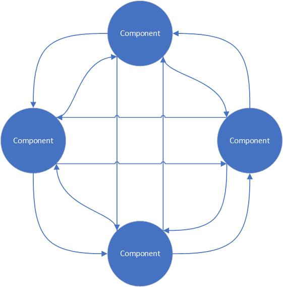
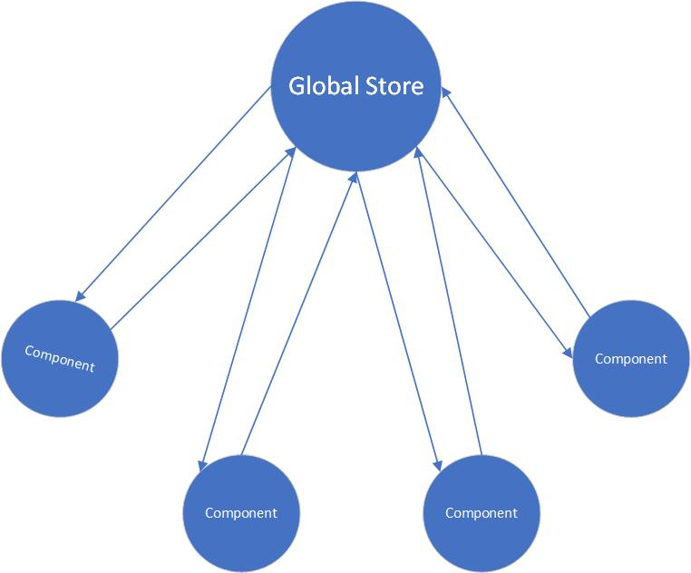
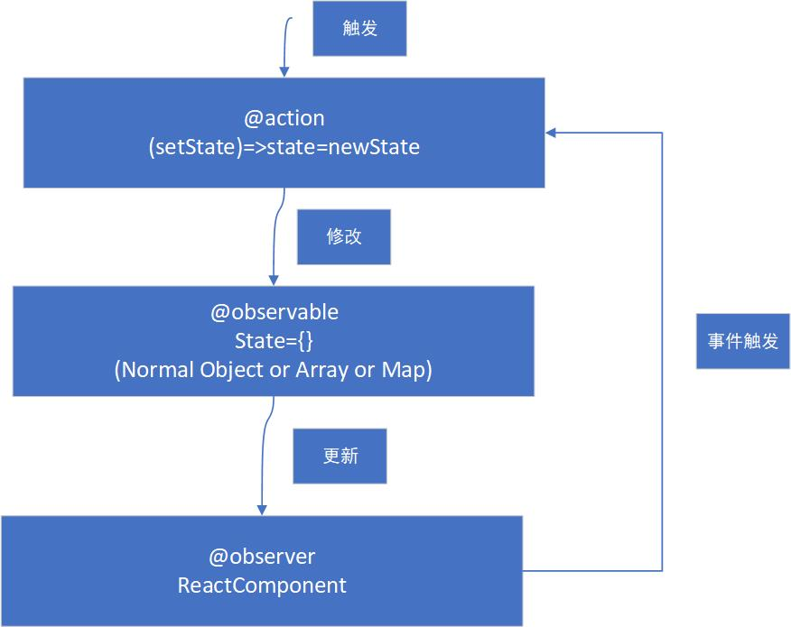

## 为什么需要状态管理

---

1. 单向数据流

- 在初学 react 之时，并没有使用额外的工具来做状态管理，而是使用 react 的单向数据流 props 与 组件内部的 state 的更新来做 UI 以及组件状态的变化管理。只要 props 或是 state 变化，react 就会重新 render 相应地组件
- 单项的数据流动用于处理一些复杂度不高的项目是够用的，但随着项目规模的增大，react 只提供了在内部组件修改状态的接口 setState，导致数据、业务逻辑和视图层耦合在组件内部。因此，使用 props + state 的方式显然已经不利于我们维护和扩展组件的状态

2. 项目规模增大导致的问题

- **_组件之间通信的成本提高_**。react 采用了单向数据流，但往往实际中的组件的通信不是单向的。子组件想要改变父组件的状态的话，想实现这个逆向的过程，需要父组件通过传递 callback 作为 props 这种方式来进行。但是，组件内的嵌套是不可避免的，此时，就需要将 callback 作为 props 一级一级地传递下去，显而易见，这样做的成本是非常高的
- **_数据流变得模糊_**。在组件间通信的方式，通过传递 props 由将父组件的 state 传递下去，传递 callback(props) 使得子组件能够改变父组件的 state。此时，react 单向数据流在一定程度上就被破坏了，数据流也因此变得模糊复杂
- **_组件变得臃肿_**。当多个组件共享一个 state 时，我们会采取状态提升的方式将 state 提升到共同的父组件中。但是，此时组件的一些特定状态变得很不易于观测，只是为了组件通信而加上去，导致某些组件变得十分臃肿

3. 状态管理的解决方案

- 通过将所有 state 提升到 global store，也就是 全局state，然后使用某种特定方式来获取、更新、修改 state，使整个数据的流向变得更易于管理，如 context 的 provider
- 状态管理，实际上是降低了组件间的耦合度，而制约大型应用可维护性的因素恰好是耦合度
- `props` + `state` 的层级体系与状态管理的层级体系对比





- 此时，状态管理的目的就变得十分明了了，我们的状态也变得可观测的、更好追溯其来源的状态

---

## MOBX

---

1. Mobx 简介

- `Mobx` 的核心概念有四个：observable state、actions、computed、reactions
- observale state：通过 `bservable(state) 定义组件的状态(component state)，包装后的状态是一个可追踪字段 (Observable Data)
- action：通过 `action` 来修改状态 state，一般是将一个方法标记为可以修改 state 的 action
- computed：标记一个可以由 state 派生出新的值并且缓存其输出的 getter



- 利用 `Mobx`，组件状态可以在外部定义，也可在组件内部定义，因此，数据、业务逻辑可以轻易地和视图层分离，提高应用的可扩展性和可维护性
- 另外，由于组件状态可以外部定义，兄弟节点之间的状态同步也变得很容易

2. observable

- `observable` 接口用于定义可观察数据，也就是组件的状态。可以观察到数据的读取、写入，并进行拦截

3. observer

- `observer` 接受一个 `React组件` 作为参数，并将其转变为响应式组件。响应式组件，即当且仅当组件依赖的可观察数据发生改变时，组件才会自动响应，并重新渲染

4. action

- 在 `Mobx` 中是可以直接修改可观察数据，来进行更新组件的，但不建议这样做，因为会使页面状态变得难以维护，所有对可观察数据的修改，都应该在 `action` 中进行

---

### 实例

---

1. 安装依赖

- 安装 `mobx` 与 `mobx-react`

```bash
npm install mobx mbox-react -S
```

- 配置 `babel` 装饰器

```bash
cnpm install babel-plugin-transform-decorators-legacy -D
cnpm install  @babel/preset-env -D
cnpm install babel-plugin-transform-class-properties -D
cnpm install  @babel/plugin-proposal-decorators -D
```

- 配置 `package.json`

```json
"babel": {
    "plugins": [
      [
        "@babel/plugin-proposal-decorators",
        {
          "legacy": true
        }
      ],
      "transform-class-properties"
    ],
    "presets": [
      "react-app",
      "@babel/preset-env"
    ]
    },
```

2. 在根组件中使用 Provider 包裹

```js
// App.js
import React from 'react';
import { Provider } from 'mobx-react';
import store from './store/index/';
function App() {
  return (
    <Provider store={store}>
      <div className="App"></div>
    </Provider>
  );
}
```

3. 创建 mobx-store 数据库

- mobx5 语法，mobx 目前版本为 `mobx6`，使用 `mobx6` 去运行 `mobx5` 的代码可能会出现数据更新组件不渲染的情况，请使用 `mobx6` 的语法书写

```js
import { observable, action, computed, makeObservable } from 'mobx';
class TestData {
  @observable list = [
    { id: 1, text: 'sleep' },
    { id: 2, text: 'running' },
  ];
  @observable count = 0;
  @action addList(payload) {
    this.list.push({
      id: Date.now(),
      text: payload,
    });
  }
  @action changeCount(payload) {
    this.count++;
  }
}
export default TestData;
```

4. 实例化全局 store

```js
// store.js
import TestData from './modules/TestData';
class Store {
  constructor() {
    this.testData = new TestData();
  }
}

export default new Store();
```

5. 在组件中使用

```js
// TestMake
import React, { useState } from 'react';
import { observer, inject } from 'mobx-react';
import { observe } from 'mobx';

@inject('store') // 数据注入
@observer // 转化为响应式组件
class TestMake extends React.Component {
  constructor(props) {
    super(props);
    this.state = {
      text: '',
      count: 'jetmine',
    };
  }
  textChange() {
    let { testData } = this.props.store;
    testData.addList(this.state.text);
  }
  setText(e) {
    this.setState({ text: e.target.value });
  }
  submitList(e) {
    if (e.target.value == '') {
      return;
    }
    if (e.keyCode === 13) {
      let { testData } = this.props.store;
      console.log(testData.list, this.state);
      testData.addList(this.state.text);
      this.setState({ text: '' });
    }
  }
  clickAdd() {
    let { testData } = this.props.store;
    testData.changeLarge(this.state.count);
    console.log(testData);
  }
  render() {
    console.log('this.props.store', this.props.store);
    let { testData } = this.props.store;
    return (
      <div>
        <input
          type="text"
          onChange={this.setText.bind(this)}
          onKeyUp={this.submitList.bind(this)}
        />
        <button onClick={this.textChange.bind(this)}>请求</button>
        <hr />
        <div>
          {testData.list.map((ele, idx) => {
            return <div key={ele.id}>{ele.text}</div>;
          })}
        </div>
        <hr />
        <span>{testData.count}</span>
        <span onClick={this.clickAdd.bind(this)}>点击</span>
      </div>
    );
  }
}

export default TestMake;
```
