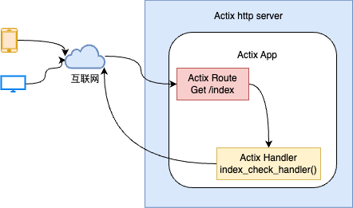
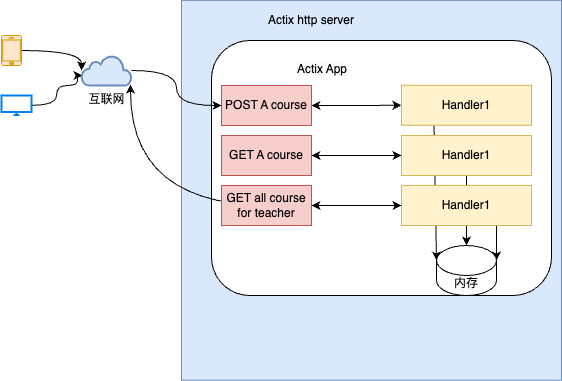

## Actix
---
1. Actix 的基本组件

- web 请求通过网络请求过来，到达 actix http server，它里面有个 actix app，http server 将请求转发到 actix app 里面对应的路由，然后路由会将请求转交给 handler，handler 处理完请求完以后会将响应给客户端
- Actix HTTP Server 实现了 http 协议，它负责应对这些请求，默认情况下它会开启多个线程来处理进来的请求
- Actix 支持两类并发，一：异步 I/O，给定的 OS 原生线程在等待 I/O 时执行其他任务(如侦听网络连接)；二：多线程并行，默认情况下启动 OS 原生线程的数量与系统逻辑 CPU 数量相同

2. 构建 Restful api
- 

