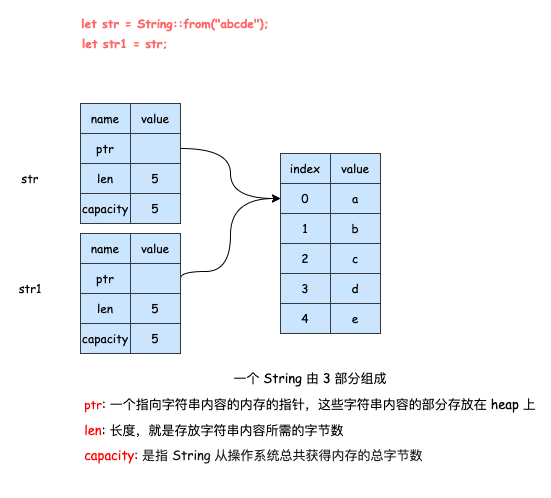
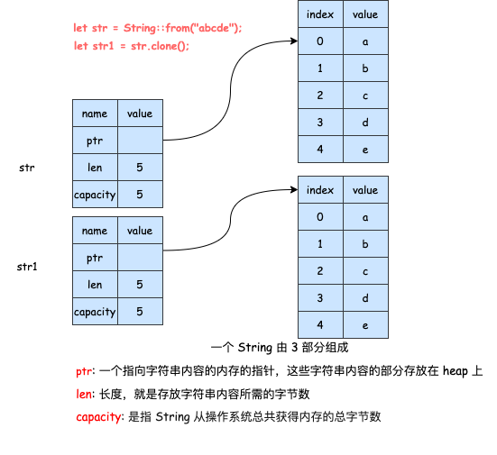

## 所有权
---
1. 所有权规则
- 每个值都有一个变量，这个变量是该值的 *所有者*；每个值同时只能有一个所有者；当所有者超出作用域(scope)时，该值将被删除
2. 变量作用域
- Scope 就是程序中一个项目的有效范围，如下所示

```rust
fn main() {
    // 此处 str 不可用
    let str = "abcde"; // 这行以后 str 可用了，可以对str进行相关操作
    
} // str 作用域到此结束，不再可用
```

- 这里说明了，声明的变量在进入作用域以后就变得有效了，同时该变量会保持自己的有效性直到自己离开作用域为止

3. 可变与不可变性
- rust 中的字符串字面值是不可变的，但我们可能还需要一种动态的字符串值，比如在保存用户的输入到某个变量。这样就出现了另一种字符串类型 String，它在 head 上分配自己所需要的存储空间，能够存储在编译时未知数量的文本(*通过 from 函数从字符串字面值创建 String 类型*)

- [这类的字符串是可以被修改的，与字符串字面值不同，需要区分开，打开链接尝试运行该段代码](https://play.rust-lang.org/?version=stable&mode=debug&edition=2021&gist=bf30ead7a1f85f6991f1e19a9ee18a76)

```rust
fn main() {
   let mut str = String::from("abcde");
   str.push_str("fghijk");
   // 向str后添加一段文本
   println!("{}",str);
}
```
- 为什么 String 类型的值可以修改，而字符串字面值却不能修改?这是因为它们处理内存的方式不同

4. 内存与分配
- 字符串字面值，在编译的时候就知道它的内容了，其文本内容直接被硬编码到最终的可执行文件里，这种速度快、高效，是因为其 *不可变性*
- String 类型，为了支持不可变性，需要在 heap 上分配内存来 **保存编译时未知的文本内容**。其中，操作系统必须在运行时来请求内存(这步通过调用 String::from 来实现)；当用完 String 之后，需要使用某种方式将内存返回给操作系统
- 在拥有 GC 的语言中，GC 会跟踪并清理不再使用的内存；没有 GC，就需要手动识别内存何时不再使用，并调用代码将它返回(如果忘了，那就浪费内存；如果提前做了，变量就会非法；如果做了两次，也是 bug，必须一次分配对应一次释放)
- 在 rust 中，它采用了不同的方式，对于某个值来说，当拥有它的变量走出作用范围时，内存会自动的交还给操作系统(释放，变量走出作用域时，调用 drop 函数释放内存)

5. 变量与数据交互的方式/移动(move)
- 多个变量可以与同一个数据使用一种独特的方式来交互。在下面的例子中，通过 `let y = x` 的操作，会创建一个 x 的副本并将它绑定到 y 上


```rust
fn main() {
    let x = 5;
    let y = x;
    // 整数是已知且固定的简单的值，这两个 5 被压到了 stack 中
}
```
- 存储在 stack 和 heap 上的数据类型会不太一样，拿 String 来举例，当进行赋值操作时，String 的数据会被复制一份给被赋值的变量(在 stack 上复制了一份指针、长度、容量，但并没有复制指针所指向的 heap 上的数据)



- 而当变量离开作用域时，rust 会自动调用 drop 函数，并将变量使用的 heap 内存释放。而当 str、str1 离开作用域时，它们都会尝试释放相同的内存，这就会出现著名的bug -- 二次释放(double free)
- 为了保证内存安全，rust 没有尝试复制被分配的内存，它会让上一个变量失效，也就是上一个变量离开作用域时，rust 不需要释放任何东西

```rust
fn main() {
   let str = String::from("abcde");
   let s2 = s1;
   // 值发生了移动，s1失效，再次借用会报错，因为 String 并没有实现 copy 的接口(trait)
   
   println!("{}",s1);
}
```
- 需要将复制指针、长度、容量与浅拷贝、深拷贝区分开，因为 rust 还让 str1 失效了，这里我们用移动来描述这个行为。rust 不会自动创建数据的深拷贝

6. 变量和数据交互的方式/克隆(clone)
- 如果真想对 heap 上面的数据(如 String)进行深度拷贝，而不是 Stack 上的数据，可以使用 clone 方法

```rust
fn main() {
   let str = String::from("abcde");
   let str1 = str.clone();
   
   println!("{},{}",str1,str);
}
```

- 它会完整地复制 stack 及 heap 上的数据



7. 复制、拷贝、克隆的区别
- 对于 stack 上的数据而言，深拷贝、浅拷贝并没有太多行为上的区别，因此不需要考虑上述的问题
- Copy trait(接口)：可以用于像整数这样完全存放在 stack 上面的类型。如果一个类型实现了 copy 这个 trait，那么旧的变量在赋值后仍然可用
- Drop traint: 如果一个类型或者该类型的一部分实现了 drop trait，那么 rust 不允许让它再去实现 copy trait 了。在标准库中，std::ops::Drop 与 Copy_trait 无法共存于一个类型，因为 Drop 是对堆内存释放的实现，实现 Copy 意味着结构体所有数据都存在栈中，存在栈中就不需要 drop 了
- 任何简单标量的组合类型都可以是 copy 的，而任何需要分配内存或某种资源的都不是 copy 的。其中实现了 copy 的类型有：所有的整数类型、bool、所有的浮点类型、Tuple(需要所有的字段都是可 copy 的才是可 copy 的)

8. 所有权与函数
- 在语义上，将值传递给函数和把值赋给变量是类似的。[**将值传递给函数要么发生移动，要么发生复制**](https://play.rust-lang.org/?version=stable&mode=debug&edition=2021&gist=8b9dcb79552e2eaab42b962913d62c67)

```rust
fn main() {
  let s = String::from("abc");
  let i1 = 5;
	test_move1(s);
  test_move2(i1);

  println!("main：{}",s);
}

fn test_move1 (param:String) {
  println!("testMove2: {}",param);
}

fn test_move2 (param:i32) {
  println!("testMove2:{}",param);
}
```

- 在上面的例子中，`test_move1` 被调用时，值的所有权会从 s 移动到 param，rust会在函数执行完后调用 drop 将内存释放，此后的 s 就失效且不可用了。而对于 `test_move2` 来说，i32 是实现了 copy_trait 的，因此，会自动创建一个 x 的副本并绑定到 param 上，在执行完成后从栈弹出，而原先的 x 仍是可用的

```rust
fn main() {
  let s1 = test_move3();

  let s2 = String::from("cde");
  
  println!("s2 move before: {}",s2);
  // s2 还未移动，这里还没有失效

  let s3 = test_move4(s2);
  // 所有权从 s2 移动到了 s3，这里失效了
}

fn test_move3 () -> String {
  let s = String::from("abc");
  return s;
}

fn test_move4(param:String) -> String {
  return param
}
```
- [**而函数在返回值的过程中，同样也会发生所有权的转移**](https://play.rust-lang.org/?version=stable&mode=debug&edition=2021&gist=20533580249d9024957dce5d168fcdfd)，在上面的例子中，`test_move3` 在调用时会通过返回值将所有权移动给 s1；而 `test_move_4` 在调用时，会将 s2 的所有权移动给 param，在通过返回值的形式移动给 s3
- 一个变量的所有权总是遵循同样的模式：把一个值赋给其他变量时就会发生移动；当一个包含 heap 数据的变量离开作用域时，它的值就会被 drop 函数清理，除非数据的所有权移动到另一个变量上了
- 那如何让函数使用某个值，但不获得其所有权呢？[**可以将传入的变量的所有权通过返回值返回**](https://play.rust-lang.org/?version=stable&mode=debug&edition=2021&gist=67d4927139d09ad07f18f97793161c04)

```rust
fn main () {
  let s1 = String::from("abc");

  let (s2,len) = calculate(s1);
	// 先把 s1 的所有权移动到 calculate 上的参数 s 上，
	// 通过返回的方式将所有权移动到 s2 上

  println!("len:{},value:{}",len,s2);
}

fn calculate(s:String) -> (String,usize) {
  let length = s.len();
	// 获取字符串长度

  return (s,length);
}
```

- 这种做法虽然保留了参数的所有权，但不得不把它作为参数传递进去，然后又作为结果返回，这样的方法显得非常的麻烦，那么有什么更好的方法吗