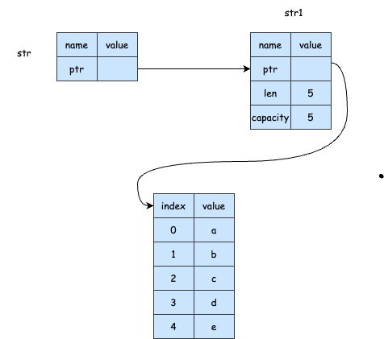

## 引用与借用
---
1. 引用
- 参数的类型是 `&String` 而不是 `String`。& 符号表示引用，它允许你引用某些值而不获得其所有权，[点此查看例子](https://play.rust-lang.org/?version=stable&mode=debug&edition=2021&gist=f0478a0cfc46bf2f6521a3ee23569842)



```rust
fn main () {
  let s1 = String::from("abc");

  let len = calculate(&s1);
  // &s1 表示创建了一个引用，引用到 s1，所有权不会发生移动

  println!("len:{},value:{}",len,s1);
}

fn calculate(s:&String) -> usize {
    // s 表示一个引用String类型的引用，代码执行完时，s 指向的引用不会被 drop，因为不含有所有权
  return s.len()
}
```
2. 借用
- 在上面的例子中，把引用作为函数参数这个行为叫做借用。默认情况下，引用是不可变的，因此，借用的参数是不可被修改的。但我们可以让它变成可变的引用，这样就能对它进行操作了

```rust
fn main () {
  let mut s1 = String::from("abc");

  let len = calculate(&mut s1);

  println!("len:{},value:{}",len,s1);
}

fn calculate(s:&mut String) -> usize {
    s.push_str("edf");
  return s.len()
}
```

- 但是，可变引用有一个重要的限制。在特定的作用域内，对某一块数据，只能有一个可变的引用。这样的好处是可以在编译时防止数据竞争

```rust
fn main () {
  let mut s1 = String::from("abc");

  let s2 = &mut s1;

  let s3 = &mut s1;
  // error: cannot borrow `s1` as mutable more than once at a time

  println!("{},{}",s2,s3);
}
```

- 数据竞争在以下三种情况下会发生：一、两个或多个指针同时访问同一个数据；二、至少有一个指针用于写入数据；三、没有使用任何机制来同步对数据的访问
- 但我们可以通过创建新的作用域，来允许非同时的创建多个可变引用，如下所示

```rust
fn main () {
  let mut s1 = String::from("abc");

  {
    let s2 = &mut s1;
    println!("{}",s2);
  }

  let s3 = &mut s1;

  println!("{}",s3);
}
```

- 而另一个限制是，不可以同时拥有一个可变引用和一个不可变的引用。因为可变引用是可以改变值的，而不可变引用的意图在于值是不变的，一旦允许这两个引用同时存在，一旦可变引用将这个值改变以后，不可变引用的作用就完全失效了

```rust
fn main () {
  let mut s1 = String::from("abc");

  let s2 = &mut s1;

  let s3 = &s1;
  // error: cannot borrow `s1` as immutable because it is also borrowed as mutable

  println!("{},{}",s2,s3);
}
```

3. 悬空引用(Dangling References)
- 一个指针引用了内存中的某个地址，而这块内存可能已经释放并分配给其它人使用了，这个就叫悬空指针。但在 rust 中，编译器可保证引用永远都不是悬空引用，如果你引用了某些数据，编译器将保证在引用离开作用域之前数据不会被销毁

```rust
fn main() {
  let r = dangle();
}

fn dangle() -> &String {
    // expected named lifetime parameter
  let s = String::from("hello");
  return &s;
}
```

- 在上面的代码中，如果编译能通过的话，当 dangle 函数执行完毕后，s 会被销毁，而对它的引用却返回使得它继续有效，这使得引用指向一个被释放的内存地址，这就是悬空指针
- 总结以上的情况，在任何给定的时刻，只能满足以下条件之一：一个可变的引用或者任意数量不可变的引用。另外，引用必须一直有效