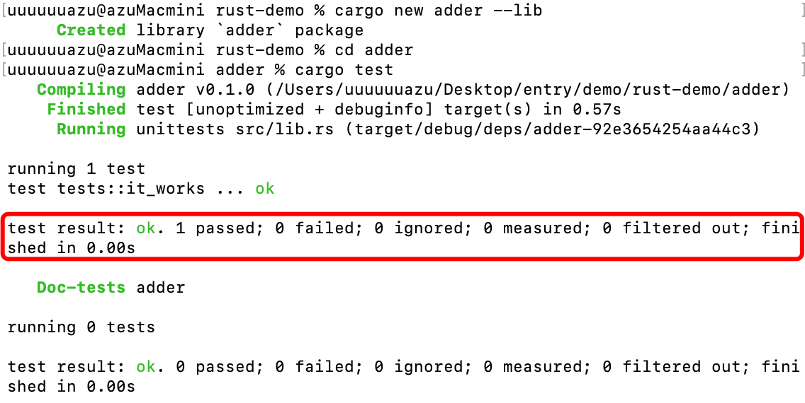
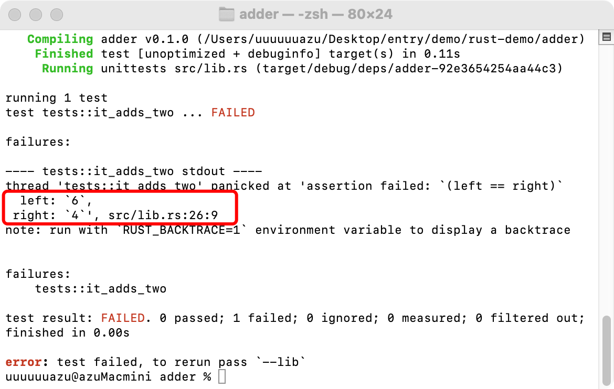

## 测试(函数)
---
1. rust 中的测试
- 在 rust 中，测试就是一个函数，它被验证非测试代码的功能是否和预期的一致。测试函数体通常有三个操作(3a操作)要执行，一：准备(arrange)所需要的数据或状态；二：运行(act)被测试的代码，例如测试某个函数；三：断言(assert)结果是否与预期的一致
- 测试函数就是一个函数，不过它需要使用 test 属性(attribute)来标注。attribute 是一段 rust 代码的元数据，它不会改变被它修饰的代码的逻辑，它只是对代码进行修饰或者标注

2. 运行测试
- 使用 cargo test 命令运行所有测试函数，rust 会构建一个 Test Runner 可执行文件，它会运行标注了 test 的函数，并报告其是否运行成功
- 而当使用 cargo 创建 library 项目的时候，会生成一个 test module，里面会有一个 test 函数。实际上我们可以在项目里添加任意数量的 test module 或 函数

```rs
// 使用 cargo new adder --lib 创建一个库项目
// src/lib.rs
pub fn add(left: usize, right: usize) -> usize {
    left + right
}

// 只有函数加上 #[test] 修饰才是测试函数，并不是 test module，test module 还可以有普通的函数(非测试函数)
#[cfg(test)]
mod tests {
    use super::*;

    #[test]
    fn it_works() {
        let result = add(2, 2);
        assert_eq!(result, 4);
    }
}
```



|关键词|描述|
|---|---|
|test result: ok|表示该项目内所有测试通过|
|passed|通过|
|failed|失败|
|ignored|被忽略掉(运行测试时不运行它)|
|measured|性能测试|
|filtered out|被过滤掉的测试|

- 当测试函数触发了 panic 时就表示失败，每个测试运行在一个新线程，当主线程看见某个测试线程挂掉了，那这个测试就会被标记为失败

```rs
#[cfg(test)]
mod tests {
    #[test]
    fn exploration() {
        assert_eq!(2 + 2,4);
    }

    #[test]
    fn another() {
        panic!("Make this test fail");
    }
}
```

3. 断言(assert)
- assert! 宏，它来自标准库，用来确定某个状态是否为 true。当结果为 true 时，测试通过；当结果为 false 时，会调用 panic!，测试失败
- assert_eq!/assert_ne!: 测试相等性。都来自标准库，判断两个参数是否相等或不等，实际上它们使用的就是 == 和 != 运算符。如果这两个宏断言失败的话，就会自动打印出两个参数的值
- assert_eq/assert_ne 这两个宏使用 debug 格式打印参数，这就要求参数实现了 partialEq 和 Debug trait (所有的基本类型和标准库里大部分都实现了，而对于自定义的 struct 和 enum，就得自己来实现 trait 了)

```rs
pub fn add_two(a:i32) -> i32 {
    a + 2
}

#[cfg(test)]
mod tests {
    use super::*;

    #[test]
    fn it_adds_two() {
        assert_eq!(4,add_two(2));
    }
}
```



4. 自定义错误信息
- 可以向 assert!、assert_eq!、assert_ne! 添加可选的自定义消息，这些自定义消息和失败消息都会打印出来
- assert!: 第一参数必填，自定义消息作为第 2 个参数；assert_eq! 和 assert_ne!: 前两个参数必填，自定义消息作为第三个参数。自定义消息参数会被传递给 format! 宏，可以使用 {} 占位符

```rs
pub fn greeting(name: &str) -> String {
    format!("Hello {}!",name);
}

#[cfg(name)]
mod tests {
    use super::*;

    #[test]
    fn greetings_contain_name() {
        let res = greeting("Carol");
        assert!(res.contains("Carol"),"Greeting didn't contain name,value was {}",res);
    }
    // 'tests::greetings_contain_name' panicked at 'Greeting didn't contain name,value was Hello'
}
```