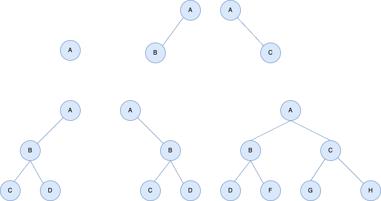
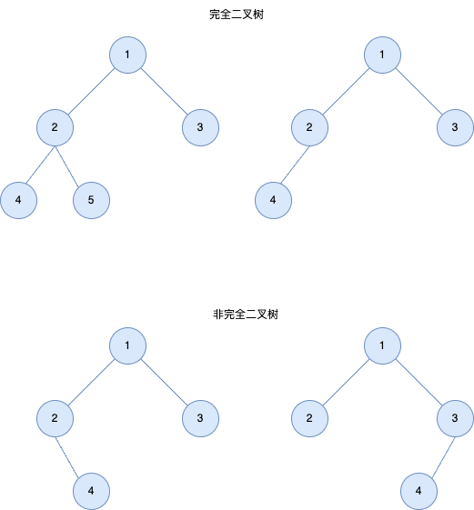
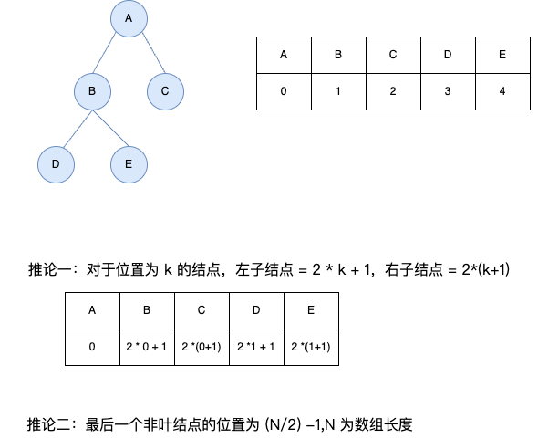

## 二叉树
---
1. 什么是二叉树
- 二叉树是一种特殊的树，由 n 个节点组成。它要么是空集(空二叉树)，要么由一个根结点和两颗互不相交的、分别称为根结点的左子树和右子树的二叉树组成
- 在二叉树里面，每个结点最多有两颗子树，也就是说，树或结点的度最大值为 2，它的取值范围是 0 | 1 | 2。所以二叉树只有五种形态：**空树**、**只有根结点的二叉树**、**只有左子树的二叉树**、**只有右子树的二叉树**、**根结点左右子树都有的二叉树**

2. 特殊二叉树
- **斜树**：树上面的所有的结点都只有一个子结点，并且只往一个方向斜，分为左斜树和右斜树
- **满二叉树**：树中所有的结点都有左子树和右子树，并且所有的叶子结点都在同一层上，这种树称为满二叉树(叶子结点必须在同一层)。非叶子结点的度都是 2，树的深度一样的情况下，满二叉树的结点个数最多、叶子结点最多
- **完全二叉树**：深度为 k 的具有 n 个结点的二叉树，当且仅当其每一个结点都与深度为 k 的完全二叉树中编号为 1-N 的结点一一对应时，称之为完全二叉树

- 完全二叉树用数组来表示特别的方便，如下所示

