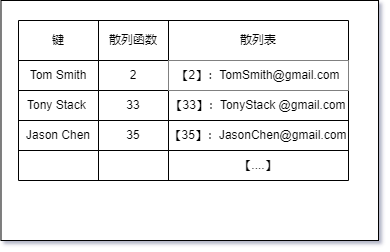

## 字典结构

---

1. 什么是字典

- 我们用 _集合_ 来表示一组互不相同(不重复)的元素，它的存储方式为 `[值,值]`，而在字典中，存储的是 `[键,值]`，也称它为 _映射_、_符号表_ 或 _关联数组_
- 字段常用于计算机中保存对象的引用地址。在 _chrome/开发者工具/memory_ 中，使用快照功能，就可以看到内存中的一些对象和它们对应的地址引用

2. 字典结构

- 首先创造字典的结构

```js
const defaultToStr = (item) => {
  if (item === null) {
    return 'NULL';
  } else if (item === undefined) {
    return 'UNDEFINED';
  } else if (typeof item === 'string' || item instanceof String) {
    return item;
  }
  return item.toString();
  // 如果item是一个其他类型的值，它需要实现toString方法
};

// 用于存储字段的value
class ValuePair {
  constructor(key, value) {
    this.key = key;
    this.value = value;
  }
  toString() {
    return `[#${this.key}:${this.value}]`;
  }
}

class Dictionary {
  constructor(toStrFn = defaultToStr) {
    this.toStrFn = toStrFn;
    this.table = {};
    // 字典的存储形式为 [key] = {key,value}
  }
}
```

- 要注意一点的是，`es6` 中的 `Map` 结构，它的键是可以为任意类型，并且不会被转化为字符串(而 `Object` 会转化为字符串)
- 接下来，为字典实现一些相应地方法
- `hasKey(key)`：如果某个键值存在于字典中，返回 `true`，否则返回 `false`

```js
hasKey(key){
  return this.table[this.toStrFn(key)] != null
}
```

- `set(key,value)`：向字典中添加新元素。如果 `key` 已经存在，那么对应的 `value` 会被新值替换

```js
set(key,value){
  if(key != null && value !=null){
    const dictKey = this.toStrFn(key);
    this.table[dictKey] = new ValuePair(key,value);
    return true
  }
  return false
}
```

- `remove(key)`：从字典中删除一个值

```js
remove(key){
  if(this.hasKey(key)){
    delete this.table[this.toStrFn(key)];
    return truel
  }
  return false;
}
```

- `get(key)`：从字典中检索某个值

```js
get(key){
  const valuePair = this.table[this.toStrFn(key)];
  return ValuePair == null ? undefined ? valuePair?.value
}
```

- `keyValues()`：返回字典中的所有 `valuePair` 对象

```js
keyValues() {
  return Object.values(this.table)
}
```

- `keys()`：返回字典中用于识别值的所有(原始)键

```js
keys(){
  return this.keyValues().map(valuePair => valuePair.key)
}
```

- `values()`：返回一个字典包含的所有值构成的数组

```js
values(){
  return this.keyValues().map(valuePair => valuePair.value)
}
```

- `forEach(callBackFn)`：迭代字典中每个值，并将它们作为参数传递给一个回调函数

```js
forEach(callBackFn){
  const valuePairs = this.keyValues();
  for(let i=0;i<valuePairs.length;i++){
    const result = callBackFn(valuePairs[i].key,valuePairs[i].value)
    if(result === false){
      break;
      // 程序返回了false，将跳出正在迭代的循环
    }
  }
}
```

- `clear()`：清空字典内容

```js
clear(){
  this.table = {}
}
```

- `size()`：返回字典中的值的个数

```js
size(){
  return this.keys().length
}
```

- `isEmpty()`：校验字典是否为空

```js
isEmpty(){
  return this.size() === 0
}
```

- `toString()`：以字符串形式输出字典的所有值

```js
toString(){
  if(this.isEmpty()){
    return ''
  }
  const valuePairs = this.keyValues();
  let objString = `${valuePairs[0].toString()}`;
  for(let i=1;i<valuePairs.length;i++){
    objString +=`${objString},${valuePairs[i].toString()}`
  }
  return objString
}
```

---

## 散列表结构

---

1. 散列算法

- 可以尽可能快地在数据结构中找到一个值。在之前的数据结构中，需要迭代整个数据结构来找到它。而使用散列函数的话，就知道值地具体位置，因此可以快速找到它
- 散列函数的作用就是给定一个键值，返回值在表中的地址，它属于字典地一种实现。它还可以用来表示对象，在 `js` 内部就是用散列表来表示每个对象

2. 创建散列表

- 先来搭建散列表的骨架

```js
class HashTable {
  constructor(toStrFn = defaultToStr) {
    this.toStrFn = toStrFn;
    this.table = {};
  }

  hashCode(key) {
    return this.loseloseHashCode(key);
  }

  loseloseHashCode(key) {
    if (typeof key === 'number') {
      return key;
    }
    const tableKey = this.toStrFn(key);
    let hash = 0;
    for (let i = 0; i < tableKey.length; i++) {
      hash += tableKey.charCodeAt(i);
      // 获取每个字符的ASCII值
    }
    return hash % 37;
    // 任意数除法规避操作数超过数字变量最大表示范围
  }
}
```

- `put(ket,value)`：将键和值加入散列表

```js
put(ket,value){
  if(key != null && value != null){
    const position = this.hashCode(key);
    this.table[position] = new ValuePair(key,value);
    return true;
  }
  return false
}
```

- `get(key)`：从散列表中获取一个值

```js
get(key){
  const ValuePair = this.table[this.hashCode(key)];
  return ValuePair == null ? undefined : ValuePair?.value
}
```

- `remove(key)`：从散列表中删除一个值

```js
remove(key){
  const hash = this.hashCode(key);
  const valuePair = this.table[hash];
  if(valuePair != null){
    delete this.table[hash];
    return true
  }
  return false
}
```

3. 散列表测试

```js
const hashTable = new HashTable();
hashTable.put('Tom Smith', 'TomSmith@gamil.com');
hashTable.put('Tony Stack', 'TonyStack@gamil.com');
hashTable.put('Jason Chen', 'JasonChen@gamil.com');
```


