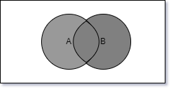
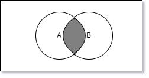
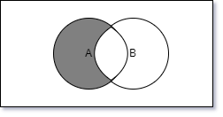
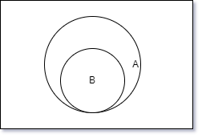

## 构建数据集合

---

1. 什么是集合

- _集合_ 是由一组无序且唯一(不能重复) 的项组成的，此种数据结构使用了与有限集合相同的数学概念。在数学中，集合是一组不同对象的集(类比成没有任何重复元素，也没有顺序概念的数组)
- 例如一组由大于等于 0 的整数组成的集合：`N = {0,1,2,3,4,5,……}`；24 和 29 之间的素数集合，由于此区间没有素数，因此其集合也被称为 _空集_，即不包含任何元素的集合

2. 创建集合类

- _ES6_ 有可用的集合类 `set`，这里依据它设置相应的方法和属性

```js
class _Set {
  constructor() {
    this.items = {};
  }
}
```

- `has(element)`：如果元素存在集合中，返回 `true`，否则返回 `false`

```js
has(element){
  return Object.prototype.hasOwnProperty.call(this.items,element)
}
```

- `add(element)`：如果集合中已经有了这个元素，返回 `false`，否则将元素添加到集合中并返回 `true`

```js
add(element){
  if(!this.has(element)){
    this.items[element] = element;
    return true
  }
  return false;
}
```

- `delete(element)`：从集合中移除一个元素

```js
delete(element){
  if(this.has(element)){
    delete this.items[element];
    return true;
  }
  return false
}
```

- `clear()`：移除集合中的所有元素

```js
clear(){
  this.items = {}
}
```

- `size()`：返回集合中有多少元素

```js
size(){
    // return Object.keys(this.items).length
  let count = 0;
  for(let key in this.items){
    if(this.items.hasOwnProperty(key)){
        count ++
    }
  }
  return count;
}
```

- `values()`：返回集合中的所有元素

```js
values(){
    //   return Object.values(this.items)
  let values = [];
  for(let key in this.items){
    if(this.items.hasOwnProperty(key)){
      value.push(key)
    }
  }
  return values
}
```

- 完整的集合类创建完成

```js
class _Set {
  constructor() {
    this.items = {};
  }

  has(element) {
    return Object.prototype.hasOwnProperty.call(this.items, element);
  }

  add(element) {
    if (!this.has(element)) {
      this.items[element] = element;
      return true;
    }
    return false;
  }

  delete(element) {
    if (this.has(element)) {
      delete this.items[element];
      return true;
    }
    return false;
  }

  clear() {
    this.items = {};
  }

  size() {
    // return Object.keys(this.items).length
    let count = 0;
    for (let key in this.items) {
      if (this.items.hasOwnProperty(key)) {
        count++;
      }
    }
    return count;
  }

  values() {
    //   return Object.values(this.items)
    let values = [];
    for (let key in this.items) {
      if (this.items.hasOwnProperty(key)) {
        value.push(key);
      }
    }
    return values;
  }
}
```

3. 集合运算

- _并集_：对于给定的两个集合，返回一个包含两个集合中所有元素的新集合。即 `A∪B`，数学定义为 `A∪B = {x|x∈A∨x∈B}`，意思是元素 x 存在于 A 中，或存在于 B 中 

```js
union(otherSet){
  const unionSet = new _Set();
  this.values().forEach(value => unionSet.add(value));
  // 将集合A中的所有元素添加到新集合中
  otherSet.values().forEach(value => unionSet.add(value));
  // 将集合B中的所有元素添加到新集合中
  return unionSet;
}
```

```js
// 低版本浏览器处理方式
union(otherSet){
  const unionSet = new _Set();
  let values = this.values();
  for(let i=0;i<values?.length;i++){
    unionSet.add(values[i])
  }
  // 将集合A中的所有元素添加到新集合中
  values = otherSet.values();
  for(let i=0;i<values?.length;i++){
    unionSet.add(values[i])
  }
  // 将集合B中的所有元素添加到新集合中
  return unionSet;
}
```

- _交集_：对于给定的两个集合，返回一个包含两个集合中共有元素的新集合。即 `A∩B`，数学定义为 `A∩B = {x|x∈A∧x∈B}`，意思是元素 x 存在于 A 中，并且存在于 B 中 

```js
intersection(otherSet){
  const intersectionSet = new _Set();
  const values = this.values();
  const otherValues = otherSet.values();

  let less_set = otherValues;
  // 表示元素更小的集合
  let more_set = values;
  // 表示元素更多的集合

  if(otherValues.length - values.length > 0){
    // 判断集合元素的长度
    more_set = otherValues;
    less_set = values;
  }

  less_set.forEach(value => {
    if(more_set.includes(value){
      intersectionSet.add(value)
    })
  });

  return intersectionSet;

}
```

- _差集_：对于给定的两个集合，返回一个包含所有存在于 A 集合而不存在 B 集合的元素的新集合。即 `A - B`，数学定义为 `A-B = {x|x∈A∧x∉B}`，意思是元素 x 存在于 A 中，并且不存在于 B 中 

```js
difference(otherSet){
  const differenceSet = new _Set();

  this.values().forEach(value => {
    if(!otherSet.has(value)){
      differenceSet.add(value)
    }
  })

  return differenceSet;
}
```

- _子集_：验证一个给定集合是否是另一集合的子集。即 `A⊆B`，数学定义为 `A⊆B = {x|∀x∈A => x∈B}`，意思是对于集合 A 中的每一个元素 x，都存在于集合 B 中 

```js
isSubsetOf(otherSet){
  if(this.size() > otherSet.size()){
    // 若集合A的大小大于集合B，那么不满足A⊆B
    return false
  }

  let isSubSet = true;
  this.values().every(value => {
    if(!otherSet.has(value)){
      isSubSet = false;
      return false
    }
    return true
  })

  return isSubSet;
}
```

4. es6 中的 Set

- 我们可以使用 `es6` 新增的数据类型 `Set` 来进行集合运算

```js
// 并集
const union = (setA, setB) => {
  const unionSet = new Set();
  setA.forEach((value) => unionSet.add(value));
  setB.forEach((value) => unionSet.add(value));
  return unionSet;
};

// new Set([...setA,...setB])
```

```js
// 交集
const intersertion = (setA, setB) => {
  const intersertionSet = new Set();
  setA.forEach((value) => {
    if (setB.has(value)) {
      intersertionSet.add(value);
    }
  });
  return intersertionSet;
};

// new Set([...setA].filter(value => setB.has(value)))
```

```js
// 差集
const difference = (setA, setB) => {
  const differenceSet = new Set();
  setA.forEach((value) => {
    if (!setB.has(value)) {
      differenceSet.add(value);
    }
  });
  return differenceSet;
};

// new Set([...setA].filter(value => !setB.has(value)))
```

5. 多重集或袋

- 集合数据结构不允许存在重复的元素，但是数学中有一个 _多重集_ 的概念，它允许我们向集合中插入之前已经添加过的元素，可以用于计算集合中元素的出现次数
