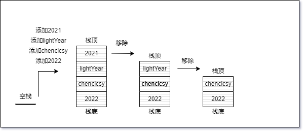
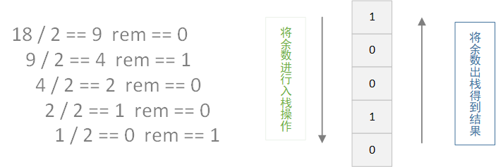

## 栈

---

1. 栈是什么

- 它是一种有序的集合，遵循 `后进先出` 原则，也就是 `LIFO`。在 `栈` 中新添加或待删除的元素都保存在栈的同一端，称之为 `栈顶`，另一端称之为 `栈底`。一般来说，新元素都靠近栈顶，旧元素都靠近栈底
- 在 `js` 中，栈也被应用在 `方法调用` 中的函数调用栈中，还有浏览器的历史记录中
- 单调栈：指栈中的元素必须是按照升序排列的栈或者降序排列的栈。其中又将升序排列的栈称为 **递增栈**，降序排列的栈称为 **递减栈**


2. 基于数组的栈

- 我们可以基于 `JavaScript` 中的数组这一数据结构来创建一个栈的类，使它遵循 `LIFO` 原则，它需要满足以下一系列方法

| 方法          | 作用                                          |
| ------------- | --------------------------------------------- |
| push(element) | 添加一个或多个元素至栈顶                      |
| pop           | 移除并返回栈顶的元素                          |
| peek          | 将栈顶的元素返回，但不对栈做任何修改          |
| isEmpty       | 判断栈是否为空，为空返回 true，否则返回 false |
| clear         | 移除栈中的所有元素                            |
| size          | 返回栈中的元素个数                            |

- 接下来对这个栈类进行相关的方法定义，首先我们先创建一个基于数组的栈类

```js
class Stack {
  constructor() {
    this.items = [];
  }
}
```

- `push`：此方法负责往栈中添加元素到栈顶，也就是栈的末尾

```js
push(element){
   this.items.push(element)
}
```

- `pop`：此方法用于移除栈顶的元素，栈顶的元素一般是最后添加进去的元素

```js
pop(){
   return this.items.pop()
}
```

- `peek`：此方法用于返回栈顶的元素

```js
peek(){
   return this.items[this.items.length - 1]
}
```

- `isEmpty`：此方法用于判断栈是否为空，为空则返回 `true`，否则返回 `false`

```js
isEmpty(){
   return this.items.length === 0
}
```

- `size`：此方法用于返回栈的长度

```js
size(){
   return this.items.length
}
```

- `clear`：此方法用于清空栈，移除栈中的所有元素

```js
clear(){
   this.items = []
}
```

- 这样一来，一个基于 `JavaScript` 数组的栈就创建好了，大部分方法的时间复杂度都是 O(n)，以下是这个完整的栈类

```js
class Stack {
  constructor() {
    this.items = [];
  }
  push(element) {
    this.items.push(element);
  }
  pop() {
    return this.items.pop();
  }
  peek() {
    return this.items[this.items.length - 1];
  }
  isEmpty() {
    return this.items.length === 0;
  }
  size() {
    return this.items.length;
  }
  clear() {
    this.items = [];
  }
}
```

- 我们使用创造好的栈，来进行一些操作

```js
const stack = new Stack();

stack.isEmpty(); // true

stack.push('2022');

stack.push('chencicsy');

stack.push('lightYear');

stack.push('2021');

stack.pop();

stack.pop();
```



3. 基于对象的栈

- 数组作为一个有序的集合，保证了元素有序的排列的同时，也会占用更多地内存空间。因此，能不能使这个栈在直接获取元素的时候，占用更少的内存空间，并且仍然按我们的方式去排列元素
- 接下来对这个栈类进行相关的方法定义，首先我们先创建一个基于对象的栈类，注意这个版本对栈的某些操作需要对栈的长度进行改变

```js
class Stack {
  constructor() {
    this.items = {};
    this.count = 0;
  }
}
```

- `push`：此方法负责往栈中添加元素到栈顶，也就是栈的末尾，但是基于对象的版本只允许我们一次添加一个元素

```js
push(element){
   this.items[this.count] = element;
   this.count++
}
```

- `pop`：此方法用于移除栈顶的元素，栈顶的元素一般是最后添加进去的元素

```js
pop(){
   if(this.isEmpty()){
      return undefined
   }
   this.count--
   const res = this.items[this.count]
   delete this.items[this.count]
   return res
}
```

- `peek`：此方法用于返回栈顶的元素

```js
peek(){
   if(this.isEmpty()){
      return undefined
   }
   return this.items[this.count-1]
}
```

- `isEmpty`：此方法用于判断栈是否为空，为空则返回 `true`，否则返回 `false`

```js
isEmpty(){
   return this.count === 0
}
```

- `size`：此方法用于返回栈的长度

```js
size(){
   return this.count
}
```

- `clear`：此方法用于清空栈，移除栈中的所有元素

```js
clear(){
   this.items = {}
   this.count = 0
}
```

```js
// 或者这一种
clear(){
   while(!this.isEmpty()){
      this.pop()
   }
}
```

- `toString`：自定义的该方法，用于将栈中的元素按栈底到栈顶的顺序打印出来

```js
toString(){
   if(this.isEmpty()){
      return ''
   }
   let stackstring = '' + this.items[0]
   for(let i=1;i<this.count - 1;i++){
      stackstring += this.items[i]
   }
   return stackstring
}
```

- 基于对象的栈就创建完毕了，但是有一个需要考虑的问题是，当栈中的元素为 `undefined` 时，有一些方法可能需要改进

```js
class Stack {
  constructor() {
    this.items = {};
    this.count = 0;
  }
  push(element) {
    this.items[this.count] = element;
    this.count++;
  }
  size() {
    return this.count;
  }
  isEmpty() {
    return this.count === 0;
  }
  pop() {
    if (this.isEmpty()) {
      return undefined;
    }
    this.count--;
    const res = this.items[this.count];
    delete this.items[this.count];
    return res;
  }
  peek() {
    if (this.isEmpty()) {
      return undefined;
    }
    return this.items[this.count - 1];
  }
  clear() {
    this.items = {};
    this.count = 0;
  }
  toString() {
    if (this.isEmpty()) {
      return '';
    }
    let stackstring = '';
    for (let i = 0; i <= this.count - 1; i++) {
      stackstring += this.items[i] + ',';
    }
    return stackstring.slice(0, stackstring.length - 1);
  }
}
```

4. 基于 weakmap 的栈

- 基于对象或数组的栈都存在一个问题，它们的栈中的元素可以很轻易的被篡改，甚至于不遵循 `LIFO` 的原则，因此，需要确保某一些属性是私有的

```js
const items = new WeakMap();

class Stack {
  constructor() {
    items.set(this, []);
  }
  push(element) {
    const arr = items.get(this);
    arr.push(element);
  }
  pop() {
    const arr = items.get(this);
    const res = items.pop();
    return res;
  }
  // ...
}
```

- 但是这种方式的栈存在一个问题，虽然实现了属性的私有，但私有属性却无法被子类继承

5. 基于 ECMAScript 类属性的提案

- 该提案是即将被添加到规范中的 `JavaScript` 提案，为私有属性和方法提供语言级支持。以 `#` 的方式去定义一个私有属性，并且它们只在类的内部可被访问，我们无法从外部或从继承的类中访问它

```js
class Stack {
  constructor() {}
  #items = {};
  #count = 0;
  push(element) {
    this.#items[this.#count] = element;
    this.#count++;
  }
  size() {
    return this.#count;
  }
  isEmpty() {
    return this.#count === 0;
  }
  pop() {
    if (this.isEmpty()) {
      return undefined;
    }
    this.#count--;
    const res = this.#items[this.#count];
    delete this.#items[this.#count];
    return res;
  }
  peek() {
    if (this.isEmpty()) {
      return undefined;
    }
    return this.#items[this.#count - 1];
  }
  clear() {
    this.#items = {};
    this.#count = 0;
  }
  toString() {
    if (this.isEmpty()) {
      return '';
    }
    let stackstring = '' + this.#items[0];
    for (let i = 1; i <= this.#count - 1; i++) {
      stackstring += this.#items[i];
    }
    return stackstring.slice(0, stackstring.length - 1);
  }
}
```

6. 进制转换问题

- 在实际应用中，栈可以用来存储访问过的任务或路径、撤销的操作等。以二进制为例，再将一个 `十进制数` 转化为 `二进制数` 时，会除二对商取整 

```js
function baseconvert(num) {
  const remStack = new Stack();
  let number = num;
  let rem;
  let resStr = '';

  while (number > 0) {
    rem = Math.floor(number % 2);
    remStack.push(rem);
    number = Math.floor(number / 2);
  }
  while (!remStack.isEmpty()) {
    resStr += remStack.pop();
  }
  return resStr;
}

baseconvert(18); // 10010
baseconvert(10); // 1010
```

- 以上是二进制的转换算法，再通过将它升级为将十进制转换为多进制的算法，有一些进制它的余数是不同的

| 进制转换 | 余数             |
| -------- | ---------------- |
| 8        | 0,1,2,3,4,5,7    |
| 16       | 0-...A,B,C,D,E,F |
| ...      | ...              |

```js
function baseconvert(num, base) {
  const remStack = new Stack();
  let number = num;
  let basedigits = '0123456789ABCDEFGHIJKLMNOPQRSTUVWXYZ';
  let rem;
  let resStr = '';

  if (base < 2 || base > 36) {
    return '';
  }

  while (number > 0) {
    rem = Math.floor(number % base);
    remStack.push(rem);
    number = Math.floor(number / base);
  }
  while (!remStack.isEmpty()) {
    resStr += basedigits[remStack.pop()];
  }
  return resStr;
}
```
