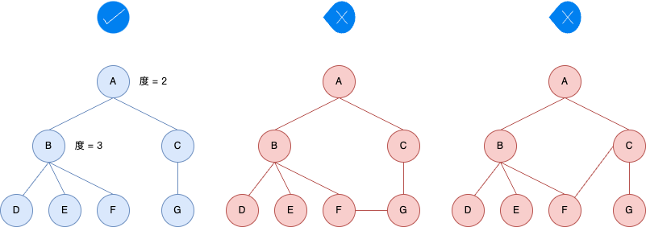
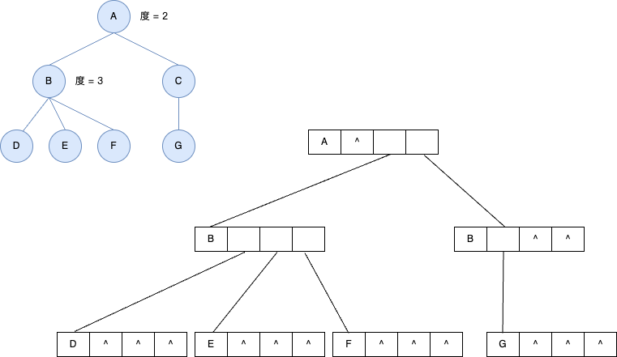
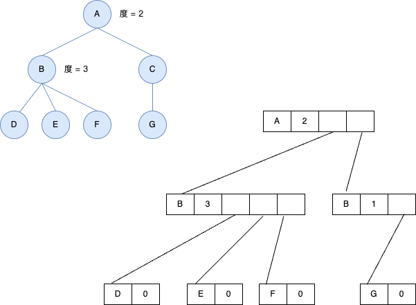
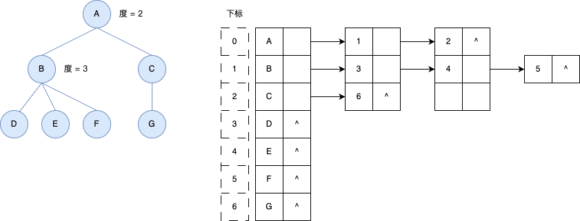
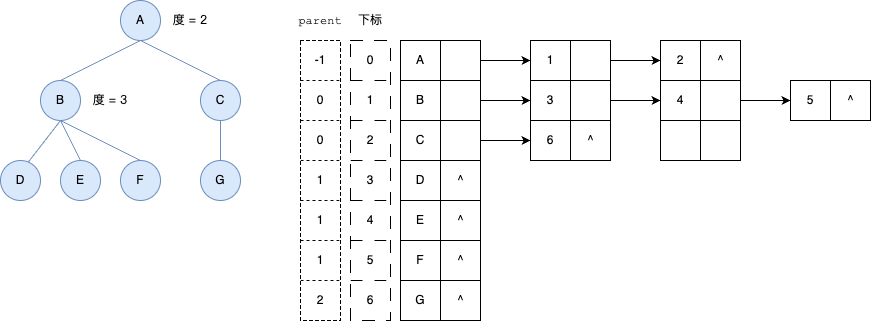

## 树
---
1. 什么是树
- 数组和链表可以看作是一根线给串起来了，元素与元素之间是一种相邻的、线性的关系。而在现实生活中，还有很多一对多的关系要处理。而树就是这样一种数据结构，它是 n (n>=0) 个节点的有限集。n = 0 时称为空树，在任意一颗非空树中，有且仅有一个特定的称为 根(root) 节点；当 n > 1 时，其余结点可被分为 m 个互不相交的有限集。其中每一个集合本身又是一棵树，并且称为根的子树

- 结点中每一个结点所拥有的子树的数量被称为该结点的度。如果结点度为 0，一般这个结点就是最底层的结点，把它称作叶子结点或者终端结点；度不为 0 的结点称为非终端结点、分支结点。树的度为**一个树的范围内各个结点的度之中的最大值**
- 树的深度(高度)表示的是树的层次，比如上图中树的深度就是 4

2. 树的存储
- **双亲表示法**：在树中，除了根结点以外，其余的结点是不一定有孩子结点的，中间结点会有孩子，但叶子结点就没有孩子。所以我们可以表示为除了结点附加的数据以外，还可以附加一个值来指明它的双亲结点的位置(根结点不存在双亲结点，值一般为 -1)
- 它的缺点是如果要找某结点的孩子结点，就必须遍历整个表

|编号|data|parent|
|---|---|---|
|0|A|-1|
|1|B|0|
|2|C|0|
|3|D|1|
|4|E|1|
|5|F|1|
|6|G|2|

- **孩子表示法**：双亲表示法是由孩子指向双亲，孩子表示法是由双亲指向孩子。树是存在度的，用孩子表示法的时候，统一将每个结点的最大值设为树的度

- 但是这种方法如果树的度很大的话，是很浪费空间的，因为有很多结点的指针域都是空的，都是没用上的。所以就出现了孩子表示法的另一种模式，将每个结点的度保存下来，有多少度就分配多少个指针域

- **孩子表示法(顺序存储)**：将所有的结点编号，然后放到一个顺序存储里面去，将每一个孩子用单链表链接起来。这样可以很方便的寻找所有的孩子结点，只需要遍历链表即可

- 但是它对于寻找某结点的双亲结点或者兄弟节点很不方便，那我们可以将双亲表示法与孩子表示法结合起来

- 上面的表示法是从双亲和孩子的角度出发来考虑的，如果要从树的兄弟的角度来考虑呢？就可以以 「data,firstchild,rightslibling」的方式来表示