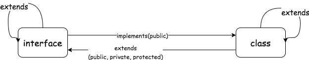

## 类类型

---

1. 继承
- 使用 extends 继承一个 _父类/超类_，继承的类叫做 _子类/派生类_。它与 es6 的继承模式相似

```ts
class Animal {
  constructor(name:string){
    this.name = name
  }
  name: string;
  speak(){}
}

class Dog extends Animal {
  constructor(name:string,sound:string){
    super(name);
    this.sound = sound;
  }
  sound:string;
}

class Cat extends Animal {
  printName(){
    return this.name
  }
}

/** 
 * extends与es6的实现一致，如果不需要扩展多余的属性
 * 可以不手动调用constructor
*/
```
- 父类和子类的类型是互相兼容的。不同的类型需要比较成员的类型，其中静态成员不参与比较，私有成员会参与比较

2. 成员修饰符
- _public_：修饰的是在任何地方可见、公有的属性或方法，默认情况下类的成员会附加 public 修饰符

```ts
class User {
  private name: string = 'Bily';
  protected id: number;
  age: number;
  constructor(name: string, age: number, id: number) {
    this.age = age;
    this.name = name;
    this.id = id;
  }

  getPrivate() {
    return this.name;
  }
}
```

- _private_：修饰的是仅在同一类中可见、私有的属性或方法，**只能在类的本身被访问，而不能在类的实例或其派生类中被访问**。但是它仅仅代表静态类型检测层面的私有属性，也就是说，当我们强制忽略 _ts_ 的类型检查错误，转译后的 js 是可以获取到私有属性的，这是因为 js 并不支持真正意义上的私有属性

```ts
class Person extends User {
  getFaPrivate() {
    return this.name;
    // Property 'name' is private and only accessible within class 'User'.
  }
}
```

- 私有属性与 es6 类似，你无法在派生类中或类的实例中直接访问它，但是我们可以将它设置成 **访问器属性** 或者访问父类原型上的方法，以达到在派生类中访问私有属性的目的

```ts
class User {
  // ...
  get accessProp() {
    return this.name;
  }
  getPrivateProp() {
    return this.name;
  }
}

class Person extends User {
  getFaPrivate() {
    return this.accessProp;
    // return this.getPrivateProp()
    // 不会提示错误
  }
}
```

- _protected_：修饰的是仅在类自身及子类(派生类)中可见、受保护的属性或方法，但不允许实例对象访问。私有属性和受保护的属性都不允许使用实例直接访问，但受保护的属性可以在派生类中被访问

```js
class Person extends User {
  getFaPrivate() {
    return this.id;
    // 不会提示错误
  }
}

let p1 = new Person('Bob', 18, 123456);

p1.name;
// Property 'name' is private and only accessible within class 'User'.

p1.id;
// Property 'name' is private and only accessible within class 'User'.
```

- 我们还可以使用 protected 将类设置为一个基类，它不能被实例化，只允许它的派生类实例化
```ts
class Animal {
  protected constructor(name:string){
    this.name = name
  }
  name: string;
  speak(){}
}

class Dog extends Animal {
  constructor(name:string,sound:string){
    super(name);
    this.sound = sound;
  }
  sound:string;
}

let dog1 = new Dog('dog','wangwangwang')
// ok

let cat = new Animal('cat');
/** 
 * Constructor of class 'Animal' is protected and only accessible within the class declaration.
 */
```

- _readonly_：只读修饰符，被修饰的成员属性在初始化后不可被更改

```ts
class User {
  // ...
  protected readonly id: number;
  setPrivateProp() {
    this.id = 1111;
    // Cannot assign to 'id' because it is a constant or a read-only property.
  }
}
```
- 除了可以用来修饰类的成员属性，还可以用于修饰构造函数中的实例属性
```ts
class Animal {
  protected constructor(public name:string){
    this.name = name
  }
  // name: string;
  speak(){}
}
// ok
```

- _get/set_：存取器，可以拦截属性的存取过程，并自定义一些相关的处理逻辑
- _static_：定义类的静态属性，只能通过类的形式去访问，它不依赖于实例，同样会被派生类继承，它与 js 中的 static 的功能是一致的

3. 抽象类
- 抽象的意思就是 **该类只能被继承而不能被实例化**，可以使用抽象类定义派生类需要实现的属性和方法、其他被继承的默认属性和方法
- 派生类继承抽象类时，需要对其中所有的抽象成员进行实现，否则会提示错误

```ts
abstract class Person {
  name: string;
  abstract age: number;
  abstract height: number;
  abstract id: number;
  abstract setId(id: number): void;

  sayhi(): string {
    return `HI,i m ${this.name}`;
  }
}

let person = new Person();
/**
 * ts error
 * Cannot create an instance of an abstract class.
 */
```

```ts
class p1 extends Person {
  age: number;
  height: number;
  id: number;
  constructor(age: number, height: number, id: number, name: string) {
    super();
    this.name = name;
    this.age = age;
    this.height = height;
    this.id = id;
  }
  setId(id: number) {
    this.id = id;
  }
}
```

- 可以认为抽象类是一种特殊的接口，它定义了实现某类的接口。我们还可以将某些属性或者方法定义为抽象修饰，这样子类中可以有不同的实现，基类中只提供其类型实现

```ts
abstract class Person {
  abstract name: string;
  // 定义一个string类型的name属性
  abstract speak(str:string):string
}

class user extends Person {
  constructor(name:string){
    super()
    this.name = name;
  }
  name:string = 'user';
  speak(str:string){
    return `${this.name} is say ` +str
  }
}

/** 
 * 对抽象类继承并实现其中的抽象属性
 * class user extends Person {
    name:string = 'user';
    speak(str:string){
      return `${this.name} is say ` +str
    }
  }
  * ok
*/
```

4. implements
- 可使用该关键字来使 _class_ 继承 _interface_ 定义的接口形状，用于约束类的属性和方法，需要实现接口的完整形状

```ts
interface Person {
  talk(what: string): void;
  name: string;
}

interface Work {
  earn(money: number): void;
}

class Child implements Person {
  name: string;
  constructor(name: string) {
      this.name = name;
  }
  talk(what) { }
}

// 继承多个接口
class Human implements Person, Work {
  name: string;
  constructor(name: string) {
      this.name = name;
  }
  talk(what) { }

  earn(money) { }
}

let child1: Child = {
  name:"tom",
  talk: function (what) { },
}

let child2 = new Child("bob");
```
- 接口(interface)只能约束类的公有成员，而并不能约束构造函数以及其他的私有属性、受保护属性等。从上面能够看出，接口的继承可以抽离出可重用的接口，也可以将多个接口合并为一个接口



```ts
class Person {
  name: string;
  private id: string;
  protected address: string;

  constructor(name:string, id:string, address:string) {
    this.name = name;
    this.id = id;
    this.address = address;
  }

  printlnAddress() {
    return this.address
  }
}

interface PersonInter extends Person {};
/** 
 * type PersonInter = { name: string; printlnAddress: () => string; }
*/
