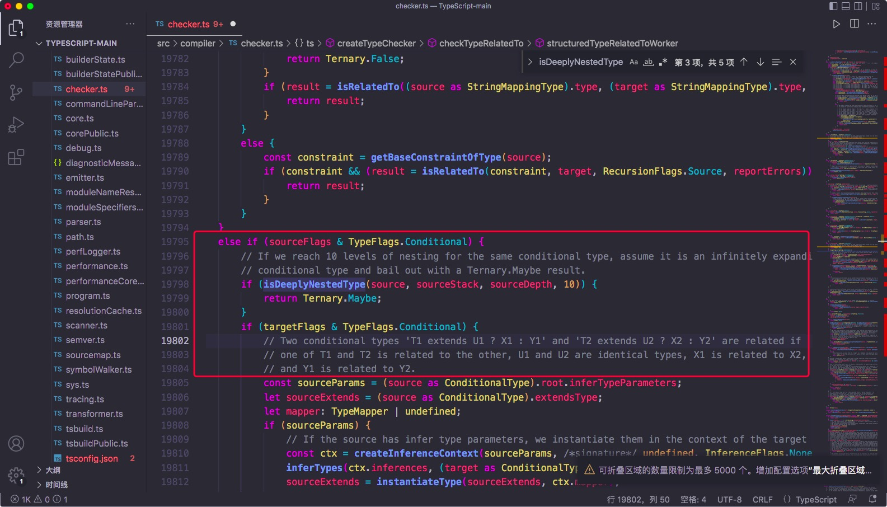

## 特殊类型的特性
---
1. isAny
- 怎么判断一个类型是否是 any 类型，这需要根据它的特性来，**any 类型与任何类型的交叉都是 any**

```ts
type A = 1 & any;
```

```ts
/** 
 * 这里的 string 和 number 可以换成任意两个不相同的类型
 * type isAny<T> = 1 extends (2 & T) ? true : false
 */
type isAny<T> = string extends (number & T) ? true : false;

type res = isAny<any>
```
- 此外，any 在条件类型中比较特殊，如果左边的类型参数为 any，会返回 trueType 和 falseType 的合并

```ts
type VerifAny<T> = T extends number ? 1 : 2;

type VerifAny1<T> = T extends number ? true : false;

type Verif1 = VerifAny<any>;
/** type Verif1 = 1 | 2 */

type Verif2 = VerifAny1<any>;
/** type Verif2 = boolean */
```

2. isEqual
- 判断两个类型是否相同，之前的 isEqual 是这样的
```ts
type IsEqual<A,B> = (A extends B ? true : false) & (B extends A ? true : false)

type res1 = isEqual<any,2>;
/**
 * 对于 any 类型的判断会出现误差
 * 这里结果应是 false，但实际为 true
 */
```
- 这是因为 any 可以是任意类型，任意类型也可以是 any，所以上面的方式无法判断出 any

```ts
/** ts对这种形式的类型做了特殊处理 */
type IsEqual<A,B> = (<T>() => T extends A ? 1 : 2) extends (<T>() => T extends B ? 1 : 2) ? true : false
```

- 这种处理方式在于 ts 源码中特殊的处理(checkTypeRelatedTo)，其中有两个都是条件类型的情况的处理



- 上面注释部分的意思是：当两个条件类型 `T1 extends U1 ? X1 : Y1` 和 `T2 extends U2 ? X2 : Y2` 相关的话，那 T1 和 T2 相关、X1 和 X2 相关、Y1 和 Y2 相关，而 U1 和 U2 相等。这里是相关，而不是相等
- 如果是判断相关性，任何类型 extends any 都是 true；any 和 1，判断相关性的话，肯定是 true，但是判断相等的话，就是 false 
- 通过构造两个条件类型判断相关性，就可以利用 extends 右边部分相等的性质来判断两个类型是否 equal

3. isUnion
```ts
/**
 * 这里的分布式条件类型使得 A 被拆分成多个元素进行计算
 */
type isUnion<A,B = A> = A extends A ? [B] extends [A] ? false : true : never
```

4. isNever
- never 的特性是，在条件类型内使用类型参数时，并且传入的是 never 的时候，它会直接返回 never

```ts
type VerifNever<T> = T extends string ? true : false;

type Verif1 = VerifNever<never>;
/** type Verif1 = never */
```

- 意思是当条件类型左边是 never 的时候，就会直接返回 never。所以，不能通过此方式取验证 never，可通过以下方式进行验证

```ts
/**
 * 类似原理
 * type isNever<T> = Record<string,T> extends Record<string,never>? true : false;
 */
type isNever<T> = [T] extends [never] ? true : false;

type Verif2 = isNever<never>;
/** type Verif2 = true; */
```

5. isTuple
- 元组类型也是数组类型，但是它的元素是只读的，元素个数也是固定的。这就是意味着，它的 length 可能会不太一样

```ts
type tupleLen = [1,2]['length'];
/** type tupleLen = 2 */

type arrLen = number[]['length'];
/** type tupleLen = number */
```

- 可以发现，元组类型的 length 的类型是数字字面量；而数组类型的 length 的类型是 number

```ts
type NotEqual<A,B> = (<T>() => T extends A ? 1 : 2) extends (<T>() => T extends B ? 1 : 2) ? false : true;

type isTuple<T> = T extends readonly [...infer R] ? NotEqual<R['length'],number> : false

type tuple1 = isTuple<[]>;
/** type tuple1 = true */

type tuple2 = isTuple<[1,2,3]>;
/** type tuple2 = true */

type tuple2 = isTuple<number[]>;
/** type tuple3 = false */
```

6. 联合转交叉
- 类型之间存在父子关系，更具体的是子类型。例如交叉类型 A & B 是联合类型 A | B 的子类型
- 在这之中，如果 **允许父类型赋值给子类型**，这叫做 **逆变**；如果 **允许子类型赋值给父类型**，就叫做 **协变**
- 而函数参数是有逆变的性质的，也就是如果参数可能是多个类型，参数类型会变成它们的交叉类型

```ts
/**
 * 1. 通过 U extends U 触发联合类型的分布式计算，让每个类型单独传入做计算，最后进行合并
 * 2. 以 U 为参数构造个函数，通过模式匹配提取参数的类型
 */
type UnionToIntersection<U> = (U extends U ? (x:U) => unknown : never) extends (x:infer R) => unknown ? R : never;

type res = UnionToIntersection<{
    a: 1
} | {
    b: 2
}>
/**
 * type res = {
    a: 1;
  } & {
    b: 2;
  }
 */
```

7. getOptional
- 要提取索引类型中的可选索引，可以利用它的特性：可选索引的值为 undefined 和值类型的联合类型。这意味着该属性在类型中可以存在也可以不存在

```ts
/**
 * 需要注意的是，固定索引的值类型为 number | undefined 与 可选索引是不一样的
 * 固定索引是必须存在的，而可选索引是可以不存在的
 */
type Person = {
  name:string;
  address?:string;
  id:number | undefined;
};
/**
 * type Person = {
    name: string;
    address?: string | undefined;
    id:number | undefined;
  }
 */

let p1:Person = {
  name:'xiaoming',
  id:undefined
}
// ok

let p2:Person = {
  name:'xiaoming',
}
/** 
 * Property 'id' is missing in type '{ name: string; }' but required in type 'Person'.(2741)
 */
```
- 那么我们可以将该 key 与对应的值类型一起取出构造一个新的索引类型，再判断 {} 是否满足它的形状即可

```ts
type A = {} extends {name?:string;} ? true : false;
/** type A = true */

type B = {} extends {name:string;} ? true : false;
/** type B = false */
```

```ts
/**
 * pick 是内置的高级类型
 * type Pick1<T,K extends keyof T> = { [P in K]:T[P]}
 * type Pick<T,K> = { [P in keyof T as P extends K ? P : never]:T[P]}
 */
type getOptional<
  T extends Record<string,any>
> = {
  [K in keyof T as {} extends Pick<T,K> ? K : never]:T[K]
};

type Person = {
  name:string;
  address?:string;
  id:number | undefined;
};

type optional1 = getOptional<Person>;
/**
 * type optional1 = {
    address?: string | undefined;
  }
 */
```

8. getRequired
- getOptional 是过滤出所有可选索引组成新的类型，那如何过滤非可选索引的类型呢

```ts
/**
 * 将可选索引过滤掉
 */
type isRequired<
  T,
  K extends keyof T
> = {} extends Pick<T,K> ? never : K;

type getRequired<
  T extends Record<string,any>
> = {
  [K in keyof T as isRequired<T,K>]:T[K]
}

type required1 = getRequired<Person>;
/** 
 * type required1 = {
    name: string;
    id: number | undefined;
  }
 */
```

9. RemoveIndexSignature
- 索引类型中存在索引和索引签名，如何删除其中的索引签名呢

```ts
/** [key:string] 是索引签名，意为可以添加任意个 string 类型的索引 */
type Person = {
  name:string;
  address?:string;
  id:number | undefined;
  [key:string]:any
};
```
- 可以根据索引签名的性质来，索引签名不能构造成字符串字面量类型，因为它没有名字，但其他索引是可以的

```ts
/**
 * 提取出其他索引，过滤掉索引签名
 * 保留字符串字面量类型的索引，否则过滤掉
 */
type isIndexSignature<
  T,K extends keyof T
>= K extends `${infer Str}` ? Str : never;

type RemoveIndexSignature<
  T extends Record<string,any>
> = {
  [K in keyof T as isIndexSignature<T,K>]:T[K]
}

type NonIndexSignature = RemoveIndexSignature<Person>
/**
 * 
  type NonIndexSignature = {
    name: string;
    address?: string | undefined;
    id: number | undefined;
  }
*/
```

10. ClassPublicProps
- 对于 class 来说，keyof 只能拿到 class 的 public 索引，private 和 protected 的索引会被忽略

```ts
class Person {
  constructor(public name:string,public age:number,private id:string) {}
}

type PersonInter = {
  [K in keyof Person]:Person[K]
}
/**
 * type PersonInter = {
    name: string;
    age: number;
  }
 */
```
- 那么，就可以直接利用 keyof 实现过滤 public 类型的索引

```ts
type ClassPublicProps<
  T extends Record<string,any>
> = {
  [K in keyof T]:T[K]
}
```

11. as const
- 一般情况下，ts 的类型推断默认推导出来的类型并不是字面量类型

```ts
const obj = {
  a:1,
  b:'b'
}

/**
 * const obj: {
    a: number;
    b: string;
  }
 */

const arr = [null,0,'',]
/**
 * const arr: (string | number | null)[]
 */
```
- 如果需要利用它的字面量类型，就需要用到 as const，根据 as const 推导出来的类型会带上 reandonly 修饰符，可以通过模式匹配提取

```ts
const obj = {
  a:1,
  b:'b'
} as const;

/**
 * const obj: {
    readonly a: 1;
    readonly b: "b";
  }
 */

const arr = [null,0,'',]  as const;
/**
 * const arr: readonly [null, 0, ""]
 */
```
- const 意味首先是一个常量，也就是字面量值，并且是不可修改的(readonly)。因此能通过 as const 推导出字面量类型
- 模式匹配下，如果不添加 readonly 修饰符可能会导致匹配出错

```ts
type ReverseArr<Arr> = Arr extends [infer First,...infer R] ? [...ReverseArr<R>,First] : Arr;

type arrType = typeof arr;
type arr1 = ReverseArr<arrType>
/**
 * 发现这里并没有出现反转
 * type arr1 = readonly [null, 0, ""]
 */
```

```ts
type ReverseArr<Arr> = Arr extends readonly [infer First,...infer R] ? [...ReverseArr<R>,First] : Arr;

type arrType = typeof arr;
type arr1 = ReverseArr<arrType>
/**
 * type arr1 = ["", 0, null]
 * 反转成功
 */
```