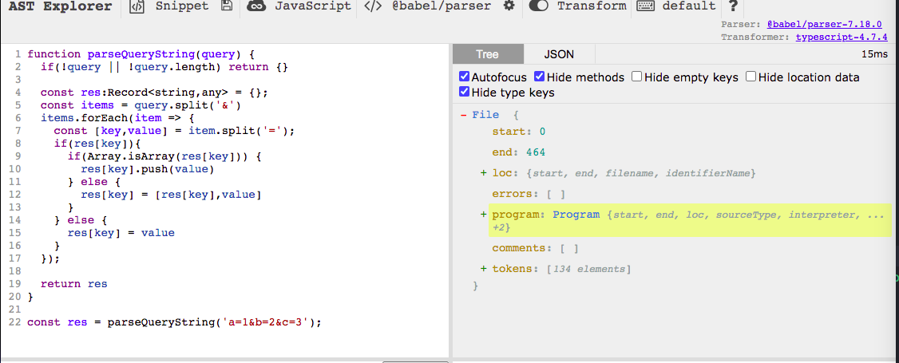
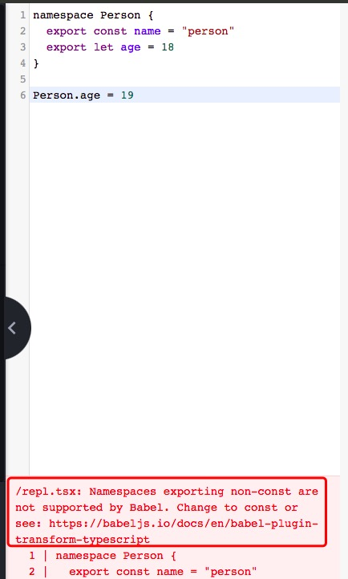

## tsc 的编译流程
---
1. typescript compiler


- 源码首先要经过 Scanner 进行词法分析，拆分成一个个不能细分的单词，称作 token
- token 会经过 Parser 进行语法分析，生成抽象语法树，也就是 Ast(abstract syntax tree)
- 之后对 ast 做语义分析，包括用 binder 进行作用域分析，和用 Checker 做类型检查。如果有类型的错误，就是在 Checker 这个阶段报的
- 如果有 Transformer 插件(tsc 支持 custom transform)，会在 Checker 之后调用，可以对 ast 做各种增删改
- 类型检查通过后就会用 Emitter 把 ast 打印成目标代码，生成类型声明文件 d.ts 以及 sourcemap（作用是映射源码和目标代码的代码位置，这样调试的时候打断点可以定位到相应的源码，线上报错的时候也能根据 sourcemap 定位到源码报错的位置）

2. babel 的编译流程


- 源码先经过 Parser 做词法分析和语法分析，生成 token 和 ast。ast 会做语法分析生成作用域信息，然后会调用 Transformer 进行 ast 的转换。最后调用 Generator 把 ast 打印成目标代码并生成 sourcemap
- babel、typescript compiler 的 ast、token 都可以通过 [astexplorer.net](https://astexplorer.net) 来查看



3. tsc 与 babel 的相似之处
- 编译流程上，babel 的 Parser 对应 tsc 的 Scanner + Parser，都是做词法分析和语法分析，不过 babel 没有细分
- Transform 阶段做语义分析和代码转换，对应 tsc 的 Binder 和 Transformer。不过 tsc 会做类型检查，没有 Checker
- Generator 做目标代码和 sourcemap 的生成，对应 tsc 的 Emitter。只不过因为没有类型信息，不会生成 d.ts 文件
- 那么 babel 除了不会做类型检查和生成类型声明文件外，tsc 做的事情它都能做到

4. 语法支持
- tsc 默认支持最新的 es 规范的语法和一些还在草案阶段的语法，如果想要支持新语法就要升级 tsc 的版本
- 而 babel 是通过 @babel/preset-env 按照目标环境 targets 的配置自动引入需要用到的插件来支持标准语法，对于还在草案阶段的语法需要单独引入 @babel/proposal-xx 的插件支持
- 如果只需要标准语法，tsc 和 babel 都可以；如果需要一些还在草案阶段的语法，tsc 可能很多都不支持，而 babel 可以通过单独引入 @babel/proposal-xx 的插件支持。在语法特性的支持上，babel 更多一些

5. 代码生成
- tsc 生成的代码不会做 polyfill 的处理，如果要做兼容处理需要在入口文件下引入 core-js(全量引入)

```ts
import 'core-js';

Promise.resolve()
```

- babel 中 @babel/preset-env 可以根据 targets 的配置来自动引入需要的插件，引入需要用到的 core-js 模块

```js
require('core-js/modules/es.object.to-string.js')

require('core-js/modules/es.promise.js')

Promise.resolve()
```
- 其中的 babelrc 文件可以如下配置

```json
/**
 * 通过 useBuiltIns 来配置引入方式
 * entry 是在入口处根据 targets 过滤出的所有用到的 core-js
 * usage 则是每个模块按照使用了哪些来按需引入
 */
{
  "presets":[
    [
      "@babel/preset-typescript",
      "@babel/preset-env",
      {
        "targets":"es2022",
        "useBuiltIns":"entry"
      }
    ]
  ]
}
```
- 另外，babel 会注入一些 helper 代码，可以通过 @babel/plugin-transform-runtime 插件抽离出来，从 @babel/runtime 包引入

```json
{
  "presets":[
    [
      "@babel/preset-typescript",
      "@babel/preset-env",
      {
        "targets":"es2022",
        "useBuiltIns":"entry"
      }
    ]
  ],
  "plugins": ["@babel/plugin-transform-runtime"]
}
```
- tsc 生成的代码没有做 polyfill 的处理，需要全量引入 core-js，而 babel 则可以用 @babel/preset-env 根据 targets 的配置来按需引入 core-js 的部分模块，所以生成的代码体积更小

6. babel 不支持某些 ts 语法
- babel 会对每个文件进行单独编译，而 tsc 会将整个项目一起编译，并且处理类型声明文件，做跨文件的类型声明合并(如namespaced和interface进行跨文件合并)
- const enum 不支持，tsc 对常量枚举编译后会直接取用到的值，常量枚举转译的对象会被移除，其中使用过的枚举成员被替换成常量

```ts
// 定义一个常量枚举
const enum Role {
  Repo,
  Developer,
  Maintainer,
  Owner,
  Guest
}

console.log(Role.Repo)
```

```js
/** 
 * 转移成 js 后
 * 编译器会移除常量枚举，这样不会生成任何代码（有关常量枚举的）
*/
console.log(0 /* Repo */);
```
- const enum 是在编译期间把 enum 的引用替换成具体的值，需要解析类型信息，而 babel 并不会解析，所以它会把 const enum 转成 enum 来处理

```js
// 上面的枚举类型经过babel编译成js后
var Role;
(function (Role) {
    Role[Role["Repo"] = 0] = "Repo";
    Role[Role["Developer"] = 1] = "Developer";
    Role[Role["Maintainer"] = 2] = "Maintainer";
    Role[Role["Owner"] = 3] = "Owner";
    Role[Role["Guest"] = 4] = "Guest";
})(Role || (Role = {}));
```
- namespaced 部分支持。不支持 namespaced 的合并，不支持导出非 const 的值

```ts
namespace Person {
  export const name = "person"
}

namespace Person {
  export const name2 = name;
}
```
```js
/**
 * tsc 编译后的代码
 */
"use strict";
var Person;
(function (Person) {
    Person.name = "person";
})(Person || (Person = {}));
(function (Person) {
    Person.name2 = Person.name;
})(Person || (Person = {}));
```

```js
/**
 * babel 编译后的代码
 */
"use strict";

let Person;

(function (_Person) {
  const name = _Person.name = "person";
})(Person || (Person = {}));

(function (_Person2) {
  const name2 = _Person2.name2 = name;
})(Person || (Person = {}));
```
- babel 不会做 namespace 的合并，这里的 name2 就变成了 undefined。此外，tsc 支持在 namespace 中导出非 const 的值，后面还可以对这个值进行修改；而 babel 不支持导出非 const 的值

```ts
/**
 * tsc 编译后的代码
 */
namespace Person {
  export const name = "person"
  export let age = 18
}

Person.age = 19
```



- 原因也是因为不会做 namespace 的解析，而 namespace 是全局的，如果在另一个文件改了 namespace 导出的值，babel 并不能处理。所以不支持对 namespace 导出的值做修改

7. 部分不支持的语法
- export = import = 这种过时的模块语法并不支持

```js
import jQuery = require('jquery')
```

- 在开启 jsx 编译之后，都不支持以 <string> 的方式做类型断言

```ts
let a:unknown = <number>1
/** error */

let b:unknown = 1 as number
```
- babel 编译 ts 代码的优点是可以通过插件支持更多的语言特性，而且生成的代码是按照 targets 的配置按需引入 core-js 的，而 tsc 没做这方面的处理，只能全量引入
- 而且 tsc 因为要做类型检查所以是比较慢的，而 babel 不做类型检查，编译会快很多，虽然也可以通过 --noEmit 来做类型检查不生成代码