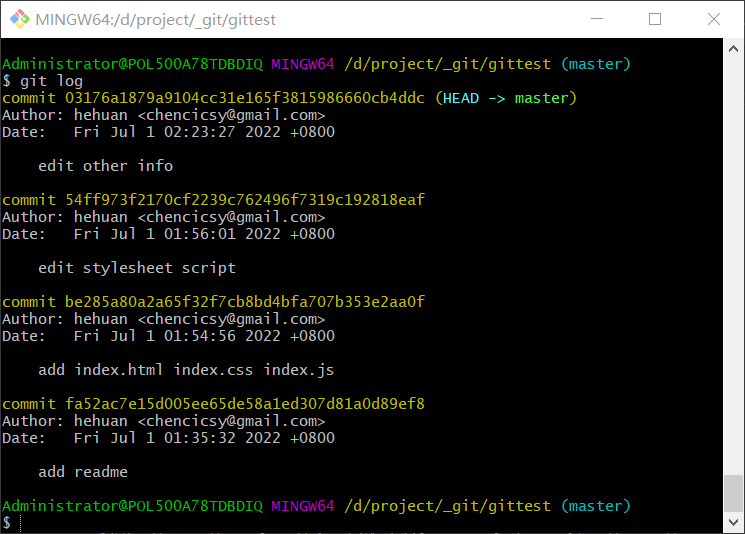
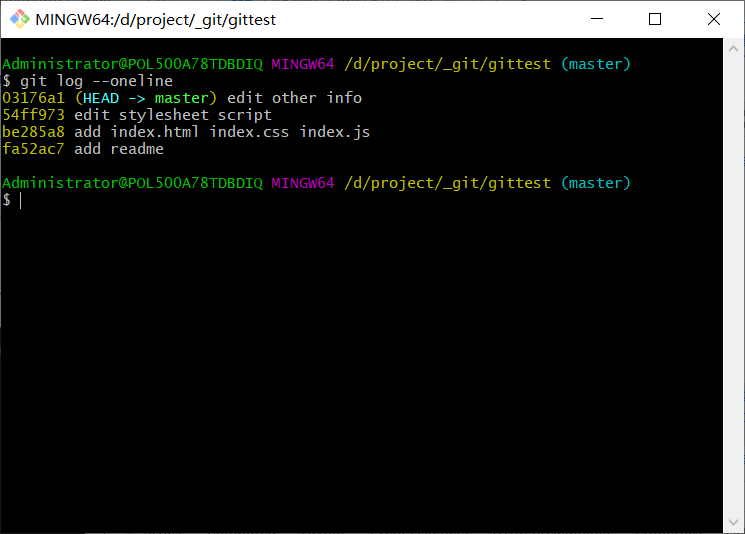
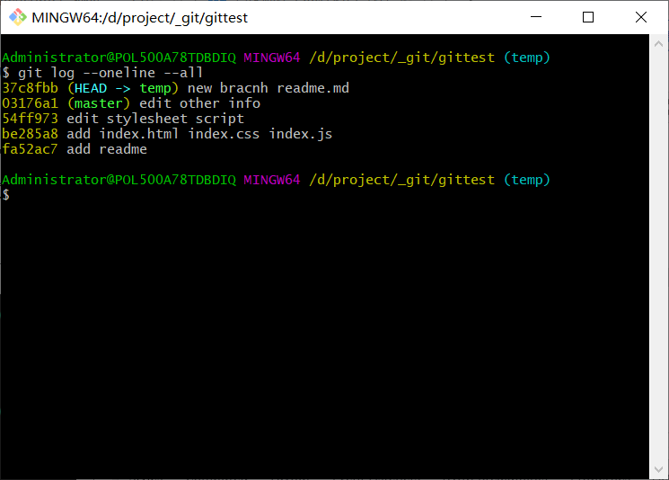
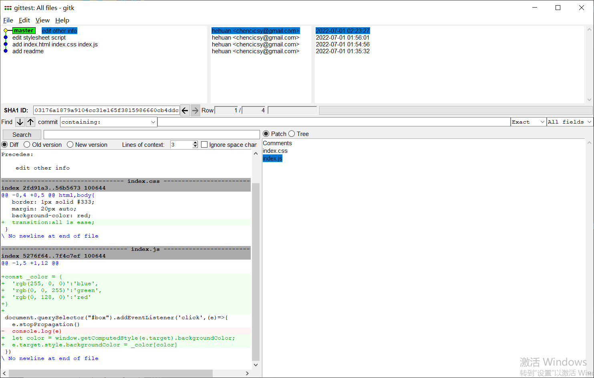

## 分布式管理系统
---

1. 特点
- 从集中式管理系统演变出来，不需要客户端与服务器时刻相连，分布式VCS的客户端和服务器都有完整的版本库；脱离服务端，客户端照样可以管理版本；而像查看历史版本和版本比较等多数操作，都不需要访问服务器，比集中式VCS更能提高版本管理效率

2. git初始配置
- 在开始开发前，为了方便后期的版本管理和控制，我们都会配置我们的用户名和邮箱，通常通过以下命令进行配置

```bash
# 初始化git仓库 git init 'project'
git init 

git config --global user.name 'your_name'
git config --global user.email 'your_email'
```

|配置项|描述|
|---|---|
|git config --local|local表示只对某个仓库有效，默认为local|
|git config --global|global对当前用户所有仓库有效|
|git config --system|system对系统所有登录的用户有效，基本不常用|

- 如果我们需要查看 config 的配置，可以使用 --list 命令

```bash
git config --list --local

git config --list --global

git config --list --system
```

3. 在仓库中添加文件

- 一般来说，我们将一个文件纳入到 git 的管理之下，我们会使用 `git add` 命令将这个文件从 **工作目录/工作区** 添加到 **暂存区**

- 在项目中添加了新文件以后，我们会使用 `git add` 将它添加到 git 的版本管理之下。如果只是在工作区已经被 git 跟踪的文件上进行修改，那么就可以直接使用 `git add -u` 进行统一提交到暂存区

```bash
git add -u
```

- 最后需要修改的文件都提交到暂存区后，将这个变更的集合添加到历史版本中

- 对于某些文件只是进行更改文件名的操作，那么就可以使用以下命令。而不用更改完名字再提交到暂存区

```bash
mv readme readme.md

git add readme.md

git rm readme
```

```bash
# 上述命令合并为一条
git mv readme readme.md
```

4. 查看版本历史

- 使用 `git log` 可以查看最近的版本历史，当前的分支是指向 `master` 的



- 还可以添加选项，`git log --oneline` 提交记录将以一行行的方式呈现，如下所示



- 一般我们的项目下可能不止一个分支，如果我们想一下查看所有分支的版本历史，可以使用 `git log --oneline --all`



5. 图形界面工具

- 除了使用第三方的图形界面工具，还可以使用 git 自带的，在项目下输入命令 `gitk`


