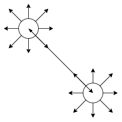

## canvas
---
1. 渐变
- canvasGradient 接口表示渐变的不透明对象，通过 canvas 的上下文对象创建得到，该方法返回一个线性 CanvasGradient 对象。想要应用这个渐变，需要把这个返回值赋值给 fillStyle 或者 strokeStyle。其中分为线性渐变、径向渐变。
- `线性渐变/createLinearGradient(x0, y0, x1, y1)`: 需要指定四个参数，分别表示渐变线段的开始和结束点

```jsx
import React,{useEffect,useRef} from "react";

export default () => {
    const canvascontRef = useRef(null);
    const draw = () => {
        const canvas = document.createElement("canvas");
        canvas.width = 600;
        canvas.height = 400;
        // canvas.style.backgroundColor = "#e0e0e0";

        const ctx = canvas.getContext("2d");

        canvascontRef?.current?.appendChild(canvas);

        // 创建线性渐变
        const gradient = ctx.createLinearGradient(0,0,300,0);
        // 从什么颜色开始渐变
        gradient.addColorStop(0,'red');
        // 到什么颜色结束渐变
        gradient.addColorStop(1,'blue');
        ctx.save();
        ctx.lineWidth = 10;
        // 把线条作为轮廓的颜色
        ctx.strokeStyle = gradient;
        ctx.moveTo(0,0);
        ctx.lineTo(300,0);
        ctx.stroke()
        ctx.restore();
    }

    useEffect(()=>{
        draw()
    },[])

    return <div ref={canvascontRef} className="canvas_container"></div>
}
```

- 给一条折线设置渐变色

```jsx
import React,{useEffect,useRef} from "react";

export default () => {
    const canvascontRef = useRef(null);
    const draw = () => {
        const canvas = document.createElement("canvas");
        canvas.width = 600;
        canvas.height = 400;
        // canvas.style.backgroundColor = "#e0e0e0";

        const ctx = canvas.getContext("2d");

        canvascontRef?.current?.appendChild(canvas);

        ctx.save();
        const gradient = ctx.createLinearGradient(50,50,300,10);
        gradient.addColorStop(0,"red");
        gradient.addColorStop(0.5,"blue");
        gradient.addColorStop(1,"green");

        ctx.beginPath();
        ctx.moveTo(50,50);
        ctx.lineTo(150,10);
        ctx.lineTo(250,50);
        ctx.lineTo(300,10);
        ctx.strokeStyle = gradient;
        ctx.stroke();
        ctx.restore()
    }

    useEffect(()=>{
        draw()
    },[])

    return <div ref={canvascontRef} className="canvas_container"></div>
}
```


- `径向渐变/createRadialGradient(x1,y2,r1,x2,y2,r2)`: (x,y,r) 表示圆的原点和半径，它的渐变方式如下所示



```jsx
import React,{useEffect,useRef} from "react";

export default () => {
    const containerRef = useRef(null);

    const draw = () => {
        const canvas = document.createElement("canvas");
        canvas.width = 600;
        canvas.height = 400;
        // canvas.style.backgroundColor = "#e0e0e0";

        const ctx = canvas.getContext("2d");

        containerRef?.current?.appendChild(canvas);
        // 生成一个渐变对象
        const radialGradient1 = ctx.createRadialGradient(90,90,0,90,90,60);
        // 添加渐变颜色
        radialGradient1.addColorStop(0,"red");
        radialGradient1.addColorStop(0.25,"blue");
        radialGradient1.addColorStop(0.5,"green");
        radialGradient1.addColorStop(0.75,"skyblue");
        radialGradient1.addColorStop(1,"yellow");

        ctx.save();
        ctx.lineWidth = 10;
        // 设置画笔颜色
        ctx.fillStyle = radialGradient1;

        ctx.fillRect(30,30,120,120);
        ctx.restore();

        const radialGradient2 = ctx.createRadialGradient(160,160,0,160,160,60);

        radialGradient2.addColorStop(0,"red");
        radialGradient2.addColorStop(0.5,"skyblue");
        radialGradient2.addColorStop(1,"yellow");

        ctx.save();
        ctx.beginPath();
        ctx.lineWidth = 10;
        ctx.fillStyle = radialGradient2;

        ctx.fillRect(160,160,120,120);
        ctx.restore();

    }

    useEffect(()=>{
        draw()
    },[])

    return <div ref={containerRef}></div>
}
```

- `锥形渐变/createConicGradient(startAngle, x, y)`:startAngle 弧度值(从x轴正向顺时针渐变)，表示从哪个角度开始的，(x,y) 是渐变的圆心

```jsx
import React,{useEffect,useRef} from "react";

export default () => {
    const containerRef = useRef(null);

    const draw = () => {
        const canvas = document.createElement("canvas");
        canvas.width = 600;
        canvas.height = 400;
        // canvas.style.backgroundColor = "#e0e0e0";

        const ctx = canvas.getContext("2d");

        containerRef?.current?.appendChild(canvas);
        // 生成一个渐变对象
        const conicGradient = ctx.createConicGradient(Math.PI / 4,80,80);

        conicGradient.addColorStop(0,"red");
        conicGradient.addColorStop(0.5,"skyblue");
        conicGradient.addColorStop(1,"red");
        ctx.save();
        ctx.beginPath();
        ctx.fillStyle = conicGradient;
        ctx.fillRect(30,30,100,100);
        ctx.restore();
        const conicGradient1 = ctx.createConicGradient(Math.PI / 4,200,200);
        // 添加渐变颜色
        conicGradient1.addColorStop(0,"skyblue");
        conicGradient1.addColorStop(1,"red");
        ctx.save();
        ctx.beginPath();
        ctx.fillStyle = conicGradient1;
        ctx.fillRect(150,150,100,100);
        ctx.restore();
        

    }

    useEffect(()=>{
        draw()
    },[])

    return <div ref={containerRef}></div>
}
```

2. 实现一个五子棋
- 一个五子棋由棋盘和落子组成，我们可以先把棋盘画出来

```jsx
import React,{useEffect,useRef} from "react";

export default () => {
    const containerRef = useRef(null);

    const drawCheckerboard = (ctx,width,height,gridSize) => {
        ctx.save();
        // 绘制竖线
        for(let i = 1;i<width / gridSize;i++) {
            ctx.beginPath();
            ctx.moveTo(gridSize * i,gridSize);
            ctx.lineTo(gridSize * i,width - gridSize);
            ctx.stroke();
        }

        // 绘制横线
        for(let i = 1;i<height / gridSize;i++) {
            ctx.beginPath();
            ctx.moveTo(gridSize,gridSize * i);
            ctx.lineTo(height - gridSize,gridSize * i);
            ctx.stroke();
        }

        ctx.restore();

    }

    const draw = () => {
        const canvas = document.createElement("canvas");
        canvas.width = 800;
        canvas.height = 800;

        const ctx = canvas.getContext("2d");

        containerRef?.current?.appendChild(canvas);

        // 方格大小
        let gridSize = 50;

        // 绘制棋盘外部分割线
        ctx?.strokeRect(30,30,canvas.width - 60,canvas.height - 60);

        // 绘制棋盘
        drawCheckerboard(ctx,canvas.width,canvas.height,gridSize);

    }

    useEffect(()=>{
        draw()
    },[])

    return <div ref={containerRef}></div>
}
```

- 棋盘绘制完了，接下来来绘制棋子以及落子规则。棋子点在某点的网格的宽的一半以内，均应算点在该点上。另外还需要一个变量来存储是黑白棋的情况

```jsx
import React,{useEffect,useRef} from "react";

export default () => {
    const containerRef = useRef(null);

    let isBlack = true;

    const drawCheckerboard = (ctx,width,height,gridSize) => {
        ctx.save();
        // 绘制竖线
        for(let i = 1;i<width / gridSize;i++) {
            ctx.beginPath();
            ctx.moveTo(gridSize * i,gridSize);
            ctx.lineTo(gridSize * i,width - gridSize);
            ctx.stroke();
        }

        // 绘制横线
        for(let i = 1;i<height / gridSize;i++) {
            ctx.beginPath();
            ctx.moveTo(gridSize,gridSize * i);
            ctx.lineTo(height - gridSize,gridSize * i);
            ctx.stroke();
        }

        ctx.restore();
    }

    const drwaChess = (ctx,x,y,gridSize) => {
        const grident = ctx.createRadialGradient(x, y, 0, x, y, gridSize / 2);
        grident.addColorStop(0, isBlack ? "#333" : "#ccc");
        grident.addColorStop(1, isBlack ? "#999" : "#fff");

        ctx.save();
        ctx.beginPath();
        ctx.arc(x, y, gridSize / 2, 0, 2 * Math.PI);
        ctx.fillStyle = grident;
        ctx.fill();
        isBlack = !isBlack;
        ctx.restore();
    }

    const draw = () => {
        const canvas = document.createElement("canvas");
        canvas.width = 800;
        canvas.height = 800;

        const ctx = canvas.getContext("2d");

        containerRef?.current?.appendChild(canvas);

        // 方格大小
        let gridSize = 50;

        // 绘制棋盘外部分割线
        ctx?.strokeRect(30,30,canvas.width - 60,canvas.height - 60);

        // 绘制棋盘
        drawCheckerboard(ctx,canvas.width,canvas.height,gridSize);

        canvas.addEventListener("click",(event) => {
            let {offsetX,offsetY} = event;
            let i = Math.floor((offsetX + gridSize / 2) / gridSize);
            let j = Math.floor((offsetY + gridSize / 2) / gridSize);

            let x = i * gridSize;
            let y = j * gridSize;

            drwaChess(ctx,x,y,gridSize)

        })
    }

    useEffect(()=>{
        draw()
    },[])

    return <div ref={containerRef}></div>
}
```
- 接下来来处理下子的边界问题，另外还需要存储棋盘上的点的落子情况以及可能存在重复落子的情况

```jsx
import React,{useEffect,useRef} from "react";

export default () => {
    const containerRef = useRef(null);

    let isBlack = true;

    // 方格大小
    let gridSize = 50;

    let pieces = [];

    function savePiece(width,height) {
        /** 
         * 0: 无落子
         * 1: 黑子
         * 2: 白子
        */
        for (let i = 0; i < (width / gridSize); i++) {
            pieces[i] = [];
            for (let j = 0; j < (height / gridSize); j++) {
                pieces[i][j] = 0;
            }
        }

        console.log(pieces)
    }

    const drawCheckerboard = (ctx,width,height) => {
        ctx.save();
        // 绘制竖线
        for(let i = 1;i<width / gridSize;i++) {
            ctx.beginPath();
            ctx.moveTo(gridSize * i,gridSize);
            ctx.lineTo(gridSize * i,width - gridSize);
            ctx.stroke();
        }

        // 绘制横线
        for(let i = 1;i<height / gridSize;i++) {
            ctx.beginPath();
            ctx.moveTo(gridSize,gridSize * i);
            ctx.lineTo(height - gridSize,gridSize * i);
            ctx.stroke();
        }

        ctx.restore();
    }

    const drwaChess = (ctx,x,y) => {
        const grident = ctx.createRadialGradient(x, y, 0, x, y, gridSize / 2);
        grident.addColorStop(0, isBlack ? "#333" : "#ccc");
        grident.addColorStop(1, isBlack ? "#999" : "#fff");

        ctx.save();
        ctx.beginPath();
        ctx.arc(x, y, gridSize / 2, 0, 2 * Math.PI);
        ctx.fillStyle = grident;
        ctx.fill();
        isBlack = !isBlack;
        ctx.restore();
    }

    const draw = () => {
        const canvas = document.createElement("canvas");
        canvas.width = 800;
        canvas.height = 800;

        const ctx = canvas.getContext("2d");

        containerRef?.current?.appendChild(canvas);

        // 绘制棋盘外部分割线
        ctx?.strokeRect(0,0,canvas.width,canvas.height);

        // 绘制棋盘
        drawCheckerboard(ctx,canvas.width,canvas.height);

        savePiece(canvas.width,canvas.height);

        canvas.addEventListener("click",(event) => {
            let {offsetX,offsetY} = event;

            if(offsetX < gridSize / 2) return;
            if(offsetY < gridSize / 2) return;
            if(offsetX > (canvas.width - gridSize)) return;
            if(offsetX > (canvas.height - gridSize)) return;

            let i = Math.floor((offsetX + gridSize / 2) / gridSize);
            let j = Math.floor((offsetY + gridSize / 2) / gridSize);

            // 已落子区域不允许再落子
            if (pieces[i][j] !== 0) return;
            
            let x = i * gridSize;
            let y = j * gridSize;

            drwaChess(ctx,x,y);

            pieces[i][j] = isBlack ? 2 : 1;

        })
    }

    useEffect(()=>{
        draw()
    },[])

    return <div ref={containerRef}></div>
}
```
- 接下来就是判断棋盘横向与纵向的连子情况了

```jsx
import React,{useEffect,useRef,useState} from "react";

export default () => {
    const containerRef = useRef(null);

    const [text,setText] = useState("暂无结果");

    let isBlack = true;

    // 方格大小
    let gridSize = 50;

    let pieces = [];

    let isWin = false;

    function savePiece(width,height) {
        /** 
         * 0: 无落子
         * 1: 黑子
         * 2: 白子
        */
        for (let i = 0; i < (width / gridSize); i++) {
            pieces[i] = [];
            for (let j = 0; j < (height / gridSize); j++) {
                pieces[i][j] = 0;
            }
        }

        console.log(pieces)
    }

    const drawCheckerboard = (ctx,width,height) => {
        ctx.save();
        // 绘制竖线
        for(let i = 1;i<width / gridSize;i++) {
            ctx.beginPath();
            ctx.moveTo(gridSize * i,gridSize);
            ctx.lineTo(gridSize * i,width - gridSize);
            ctx.stroke();
        }

        // 绘制横线
        for(let i = 1;i<height / gridSize;i++) {
            ctx.beginPath();
            ctx.moveTo(gridSize,gridSize * i);
            ctx.lineTo(height - gridSize,gridSize * i);
            ctx.stroke();
        }

        ctx.restore();
    }

    const drwaChess = (ctx,x,y) => {
        const grident = ctx.createRadialGradient(x, y, 0, x, y, gridSize / 2);
        grident.addColorStop(0, isBlack ? "#333" : "#ccc");
        grident.addColorStop(1, isBlack ? "#999" : "#fff");

        ctx.save();
        ctx.beginPath();
        ctx.arc(x, y, gridSize / 2, 0, 2 * Math.PI);
        ctx.fillStyle = grident;
        ctx.fill();
        isBlack = !isBlack;
        ctx.restore();
    }

    const checkWin = (i,j,direc) => {
        // 表示左右/上下方向是否还有相同色的棋子
        let [up,down] = [true,true];
        // 记录当前点击的同色棋子的个数
        let [count, target] = [1, 0];
        // 当前棋子的颜色
        let currColor = pieces[i][j];

        while(true) {
            // 如果上下/左右方向都没有同色的棋子，就跳出循环
            if(!up && !down) break;
            // 如果同色棋子数量为5，说明某一方胜出
            if(count >= 5) {
                isWin = true;
                break;
            }

            ++target;

            let upColor = direc === "row" ? pieces[i - target]?.[j] : pieces[i]?.[j - target];
            let downColor = direc === "row" ? pieces[i + target]?.[j] : pieces[i]?.[j + target];

            // 如果还能继续往上或者往下，说明同一行/列的棋子是同色的
            if(up) {
                if(upColor && upColor === currColor) {
                    count++;
                } else {
                    // 往上/左的棋子出现了不一样的色，停止往上/左比较
                    up = false;
                }
            }

            if(down) {
                if(downColor && downColor === currColor) {
                    count++;
                } else {
                    // 往下/右的棋子出现了不一样的色，停止往下/右比较
                    down = false;
                }
            }
        }
    }

    const resetRect = (ctx,width,height) => {
        isBlack = true;
        isWin = false;
        ctx.clearRect(0,0,width,height);

        ctx?.strokeRect(0,0,width,height);

        drawCheckerboard(ctx,width,height);
        savePiece(width,height);
    }

    const draw = () => {
        const canvas = document.createElement("canvas");
        canvas.width = 800;
        canvas.height = 800;

        const ctx = canvas.getContext("2d");

        containerRef?.current?.appendChild(canvas);

        // 绘制棋盘外部分割线
        ctx?.strokeRect(0,0,canvas.width,canvas.height);

        // 绘制棋盘
        drawCheckerboard(ctx,canvas.width,canvas.height);

        savePiece(canvas.width,canvas.height);

        canvas.addEventListener("click",(event) => {
            let {offsetX,offsetY} = event;

            if(offsetX < gridSize / 2) return;
            if(offsetY < gridSize / 2) return;
            if(offsetX > (canvas.width - gridSize)) return;
            if(offsetX > (canvas.height - gridSize)) return;

            let i = Math.floor((offsetX + gridSize / 2) / gridSize);
            let j = Math.floor((offsetY + gridSize / 2) / gridSize);

            // 已落子区域不允许再落子
            if (pieces[i][j] !== 0) return;
            
            let x = i * gridSize;
            let y = j * gridSize;

            drwaChess(ctx,x,y);

            pieces[i][j] = isBlack ? 2 : 1;

            checkWin(i,j,"row");

            !isWin && checkWin(i,j);

            if(isWin) {
                setText(isBlack ? "白棋胜出" : "黑棋胜出");
                resetRect(ctx,canvas.width,canvas.height);
            }

        })
    }

    useEffect(()=>{
        draw()
    },[])

    return <div ref={containerRef}>
        <span>{text}</span>
    </div>
}
```
- 另外还有斜向的连子情况

```js
const checkInclineWin = (i,j,direc) => {
    // 表示左右/上下方向是否还有相同色的棋子
    let [up,down] = [true,true];
    // 记录当前点击的同色棋子的个数
    let [count, target] = [1, 0];
        // 当前棋子的颜色
    let currColor = pieces[i][j];

    while(true) {
        // 如果上下/左右方向都没有同色的棋子，就跳出循环
        if(!up && !down) break;
        // 如果同色棋子数量为5，说明某一方胜出
        if(count >= 5) {
            isWin = true;
            break;
        }

        tatget++:

        let upColor = direc === "straight" ? pieces?.[i - tatget][j - tatget] : pieces?.[i - tatget][j + tatget];
        let downColor = direc === "straight" ? pieces?.[i + target][j + target] : pieces?.[i + target][j - target];

        if(up) {
            if(upColor && upColor === currColor) {
                count++
            } else {
                up = false
            }
        }

        if(down) {
            if(downColor && downColor === currColor) {
                count++
            } else {
                down = false
            }
        }
    }
}
```
- 完整的代码如下

```jsx
import React,{useEffect,useRef,useState} from "react";

export default () => {
    const containerRef = useRef(null);

    const [text,setText] = useState("暂无结果");

    let isBlack = true;

    // 方格大小
    let gridSize = 50;

    let pieces = [];

    let isWin = false;

    function savePiece(width,height) {
        /** 
         * 0: 无落子
         * 1: 黑子
         * 2: 白子
        */
        for (let i = 0; i < (width / gridSize); i++) {
            pieces[i] = [];
            for (let j = 0; j < (height / gridSize); j++) {
                pieces[i][j] = 0;
            }
        }

        console.log(pieces)
    }

    const drawCheckerboard = (ctx,width,height) => {
        ctx.save();
        // 绘制竖线
        for(let i = 1;i<width / gridSize;i++) {
            ctx.beginPath();
            ctx.moveTo(gridSize * i,gridSize);
            ctx.lineTo(gridSize * i,width - gridSize);
            ctx.stroke();
        }

        // 绘制横线
        for(let i = 1;i<height / gridSize;i++) {
            ctx.beginPath();
            ctx.moveTo(gridSize,gridSize * i);
            ctx.lineTo(height - gridSize,gridSize * i);
            ctx.stroke();
        }

        ctx.restore();
    }

    const drwaChess = (ctx,x,y) => {
        const grident = ctx.createRadialGradient(x, y, 0, x, y, gridSize / 2);
        grident.addColorStop(0, isBlack ? "#333" : "#ccc");
        grident.addColorStop(1, isBlack ? "#999" : "#fff");

        ctx.save();
        ctx.beginPath();
        ctx.arc(x, y, gridSize / 2, 0, 2 * Math.PI);
        ctx.fillStyle = grident;
        ctx.fill();
        isBlack = !isBlack;
        ctx.restore();
    }

    const checkWin = (i,j,direc) => {
        // direc : row/col,straight/incline
        // 表示左右/上下方向是否还有相同色的棋子
        let [up,down] = [true,true];
        // 记录当前点击的同色棋子的个数
        let [count, target] = [1, 0];
        // 当前棋子的颜色
        let currColor = pieces[i][j];

        let upColor;
        let downColor;

        while(true) {
            // 如果上下/左右方向都没有同色的棋子，就跳出循环
            if(!up && !down) break;
            // 如果同色棋子数量为5，说明某一方胜出
            if(count >= 5) {
                isWin = true;
                break;
            }

            ++target;

            switch(direc) {
                case "row":
                    upColor = pieces[i - target]?.[j];
                    downColor = pieces[i + target]?.[j];
                    break;
                case "col":
                    upColor = pieces[i]?.[j - target];
                    downColor = pieces[i]?.[j + target];
                    break;
                case "straight":
                    upColor = pieces[i - target]?.[j - target];
                    downColor = pieces[i + target]?.[j + target];
                    break;
                case "incline":
                    upColor = pieces[i - target]?.[j + target];
                    downColor = pieces[i + target]?.[j - target];
                    break;
                default:
                    break;
            }

            // 如果还能继续往上或者往下，说明同一行/列的棋子是同色的
            if(up) {
                if(upColor && upColor === currColor) {
                    count++;
                } else {
                    // 往上/左的棋子出现了不一样的色，停止往上/左比较
                    up = false;
                }
            }

            if(down) {
                if(downColor && downColor === currColor) {
                    count++;
                } else {
                    // 往下/右的棋子出现了不一样的色，停止往下/右比较
                    down = false;
                }
            }
        }
    }

    const resetRect = (ctx,width,height) => {
        isBlack = true;
        isWin = false;
        ctx.clearRect(0,0,width,height);

        ctx?.strokeRect(0,0,width,height);

        drawCheckerboard(ctx,width,height);
        savePiece(width,height);
    }

    const draw = () => {
        const canvas = document.createElement("canvas");
        canvas.width = 800;
        canvas.height = 800;

        const ctx = canvas.getContext("2d");

        containerRef?.current?.appendChild(canvas);

        // 绘制棋盘外部分割线
        ctx?.strokeRect(0,0,canvas.width,canvas.height);

        // 绘制棋盘
        drawCheckerboard(ctx,canvas.width,canvas.height);

        savePiece(canvas.width,canvas.height);

        canvas.addEventListener("click",(event) => {
            let {offsetX,offsetY} = event;

            if(offsetX < gridSize / 2) return;
            if(offsetY < gridSize / 2) return;
            if(offsetX > (canvas.width - gridSize)) return;
            if(offsetX > (canvas.height - gridSize)) return;

            let i = Math.floor((offsetX + gridSize / 2) / gridSize);
            let j = Math.floor((offsetY + gridSize / 2) / gridSize);

            // 已落子区域不允许再落子
            if (pieces[i][j] !== 0) return;
            
            let x = i * gridSize;
            let y = j * gridSize;

            drwaChess(ctx,x,y);

            pieces[i][j] = isBlack ? 2 : 1;

            checkWin(i,j,"row");

            !isWin && checkWin(i,j,"col");

            !isWin && checkWin(i,j,"straight");

            !isWin && checkWin(i,j,"incline");

            if(isWin) {
                setText(isBlack ? "白棋胜出" : "黑棋胜出");
                resetRect(ctx,canvas.width,canvas.height);
            }

        })
    }

    useEffect(()=>{
        draw()
    },[])

    return <div ref={containerRef}>
        <span>{text}</span>
    </div>
}
```