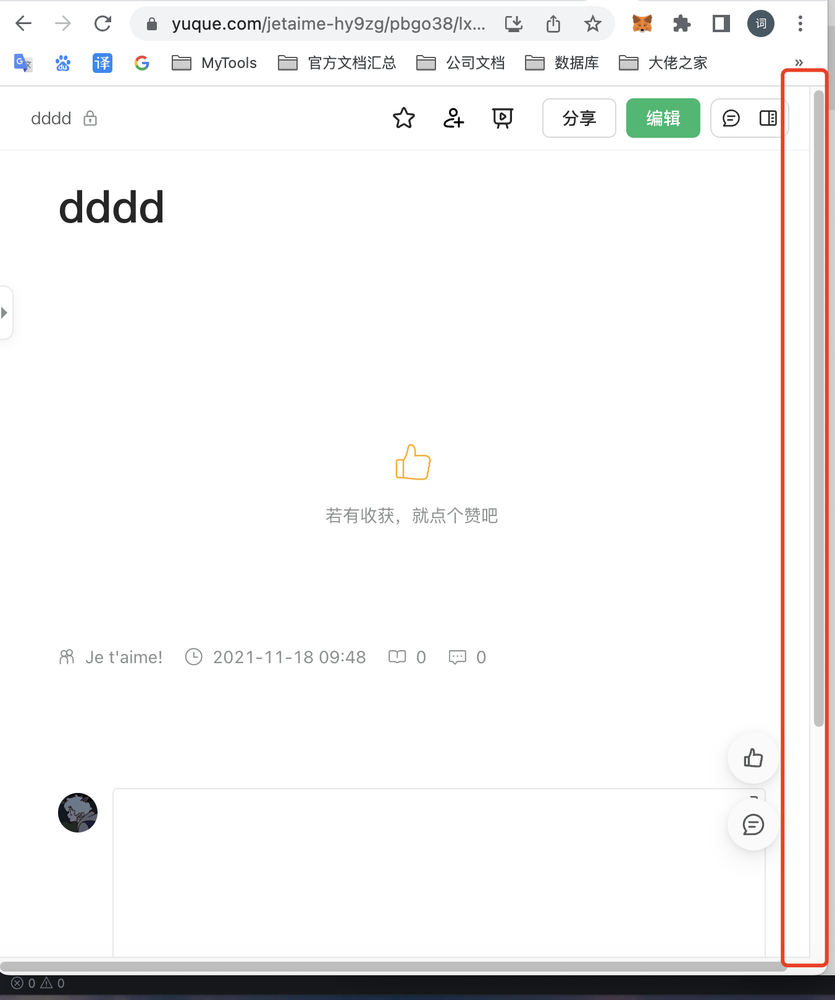
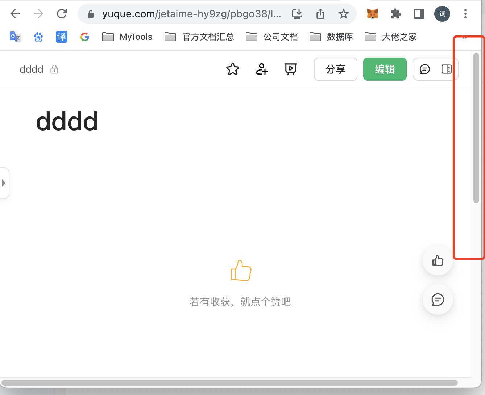

## 视差
---
1. 什么是视差效果
- 当两个物体的变化方向/趋势不一致时，或者说当一个元素在移动时，另一个元素与它移动的方向不一样，就是视差效果，说简单点，就是一个动一个不动；滚动条其实就是一个视察效果
- 滚动条如何实现呢？先来看看什么是 **已知条件**，什么是 **需要求得的条件**。首先整个页面的高度是已知的，其次滚动距离也是知道的，第三个是当前容器的高度也是知道的，其中存在这样一个比例：滚动条的长度 / 滚动区域(滚动条区域)的高度 = 视口(可视区域)的高度 / 整个页面(内容)的高度
- 所以，当滚动条的长度获取到以后，就可以通过这个公式：页面滚动的距离 / 可滚动的高度(内容总高 - 可视区域(视口)高度) = 滚动条滚动的距离 / 可滚动区域的高度(滚动区域高度 - 滚动条的长度)，来计算出页面应该滚动的距离
- 那么，在这种情况下，**滚动条的长度代表的是可视区域的高度**，当可视区域变小后，滚动条也会对应发生变化，如下两张图所示





- 那么，当我们要基于这个公式去实现以滚动条为基础的视差效果时，就需要用到这样一个公式：scrollTop(页面移动了多少) / 内容高度(不精准，可以是可滚动的高度 = 内容总高 - 可视区域的高度) = 滚动距离 / 滚动条区域(滚动条区域总高 - 滚动条高度)。而当拖拽滚动条时，还需要监听滚动条的拖动距离，以此来计算页面的内容应该滚动多少

```html
<html>
    <head>
        <style>
            .parallax {
                width: 300px;
                height: 500px;
                background-color: antiquewhite;
                overflow: hidden;
                position: relative;
            }
            .parallax-scroll {
                width:100px;
                height: 700px;
                background-color: aqua;
                position: absolute;
                top: 0px;

                overflow: hidden;
            }
            .parallax-line {
                width: 8px;
                height: 100%;
                position: absolute;
                right: 0px;
                top: 0px;
                background-color: #f0f0f0;
                display: flex;
                justify-content: center;

            }
            .parallax-line__scroll {
                width: 6px;
                background-color: black;
                height: 0px;
                position: absolute;
                top: 0px;
                cursor: pointer;
                user-select: none;
                border-radius:3px;
            }
        </style>
    </head>
     <body>
        <div class="parallax">
            <div class="parallax-scroll">
            1111
            </div>
            <div class="parallax-line">
                <div class="parallax-line__scroll"></div>
            </div>
        </div>
        <script>
            let mouseMoveListener = null;
            let startX = 0;
            let startY = 0;

            function mouseMove(event) {
                let x = event.pageX - startX - parallax.offsetLeft;
                let y = event.pageY - startY - parallax.offsetTop;
                if(y<=0) y = 0;
                if(y >= maxY) y = maxY;
                contentY = y / (parallaxLine.clientHeight - parallaxLineScroll.clientHeight) * (parallaxScroll.clientHeight - parallax.clientHeight)
                parallaxScroll.style.top = -contentY + 'px';
                parallaxLineScroll.style.top = y + 'px';
            }

            function mouseUp (event) {
                document.removeEventListener("mousemove",mouseMove);
            }

            let parallax = document.querySelector(".parallax");
            let parallaxScroll = document.querySelector(".parallax-scroll");
            let parallaxLineScroll = document.querySelector(".parallax-line__scroll");
            let parallaxLine = document.querySelector(".parallax-line");

            let height = parallax.clientHeight / parallaxScroll.clientHeight * parallaxLine.clientHeight;
            let maxY = parallaxLine.clientHeight - height;
            parallaxLineScroll.style.height = height + 'px';

            parallaxLineScroll.addEventListener("mousedown",(e) => {
                e.stopPropagation()
                startX = e.pageX - parallaxLineScroll.offsetLeft - parallax.offsetLeft;
                startY = e.pageY - parallaxLineScroll.offsetTop - parallax.offsetTop;
                document.addEventListener("mousemove",mouseMove)
            })

            document.addEventListener("mouseup",mouseUp)
        </script>
    </body>
</html>
```

```jsx
import React,{useEffect} from "react";
import "./style/parallax/scroll.scss";
import longImage from "./img/longimg.png"

let mouseupListener = null;
let mousemoveListener = null;
let mousedownListener = null;

class ScrollElement {
    constructor(view, content, scrollArea, scrollLine) {
        this.view = document.querySelector(view);
        this.content = document.querySelector(content);
        this.scrollArea = document.querySelector(scrollArea);
        this.scrollLine = document.querySelector(scrollLine);

        this.scrollLine.style.height = this.content.clientHeight / this.view.clientHeight * this.scrollArea.clientHeight + 'px';
        console.log(this.scrollLine.style,)
        this.maxY = this.scrollArea.clientHeight - this.content.clientHeight / this.view.clientHeight * this.scrollArea.clientHeight;
        this.init()
    }

    mouseMove(event) {
        let y = event.pageY - this.startY - this.content.offsetTop;
        if (y <= 0) y = 0;
        if (y >= this.maxY) y = this.maxY;
        let contentY = y / (this.scrollArea.clientHeight - this.scrollLine.clientHeight) * (this.view.clientHeight - this.content.clientHeight);
        this.scrollLine.style.top = y + 'px';
        this.view.style.top = -contentY + 'px'
    }

    mouseDown(event) {
        event?.stopPropagation();
        this.startY = event.pageY - this.scrollLine.offsetTop - this.content.offsetTop;
        mousemoveListener = this.mouseMove.bind(this);
        mouseupListener = this.mouseUp.bind(this);
        document.addEventListener("mousemove", mousemoveListener);
        document.addEventListener("mouseup",mouseupListener);
    }

    mouseUp (event) {
        document.removeEventListener("mousemove",mousemoveListener);
    }

    init() {
        mousedownListener = this.mouseDown.bind(this);
        this.scrollLine.addEventListener("mousedown", mousedownListener);
    }
}

export default () => {
    useEffect(()=>{
        new ScrollElement(".parallax-view",".parallax",".parallax-scrollArea",".parallax-scrollline");
    },[])

    return <div className="parallax">
        <div className="parallax-view">
            
        </div>
        <div className="parallax-scrollArea">
            <div className="parallax-scrollline"></div>
        </div>
    </div>
}
```

- 以上就实现了一个简易的滚动条的效果(缺少拖动内容滚动移动，可以添加一下)，而像 *颜色变化*、*字体大小的变化*、*旋转角度的变化*、*透明度的变化* 等，都是属于视差效果，只要找到了它们的实现原理，它其实就很好实现

2. 下拉刷新
- 从各大移动端组件库的下拉刷新组件中，可以发现它是有一个视差效果(相对于鼠标的位置拖拽的区域移动得越来越慢)；另一个是拖到一定位置后，文字会发生变化，当释放以后区域弹回去并且真正刷新(**与外界交互完成，例如接口请求等，这个状态的变化由外部控制**)之后才缩回去
- 它相当于是有一个阻力，当鼠标往下拉的时候，拉动的距离越大，阻力越大。而为了与外界交互，需要向组件内部传递和提供一个调用的方式