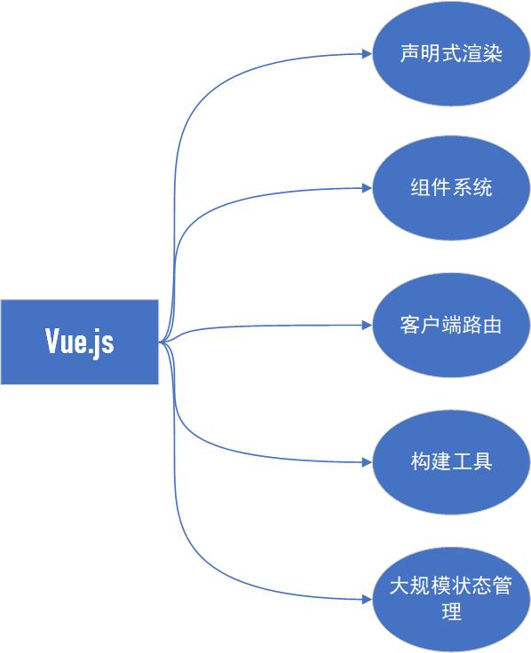
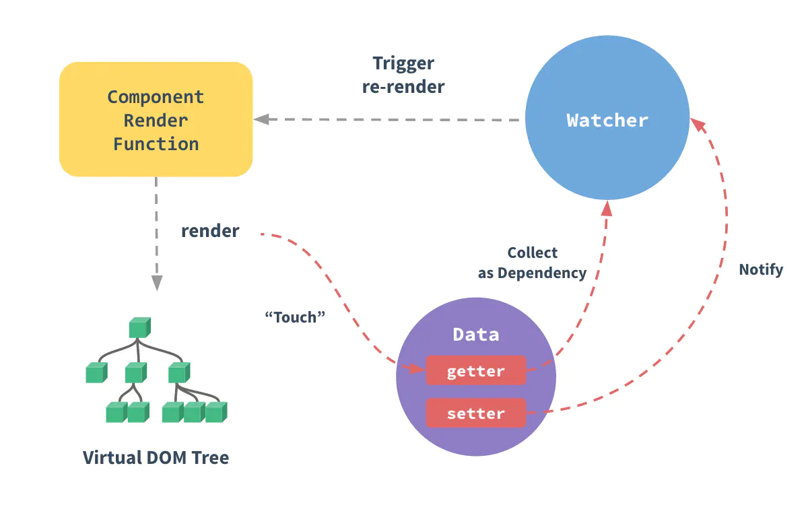
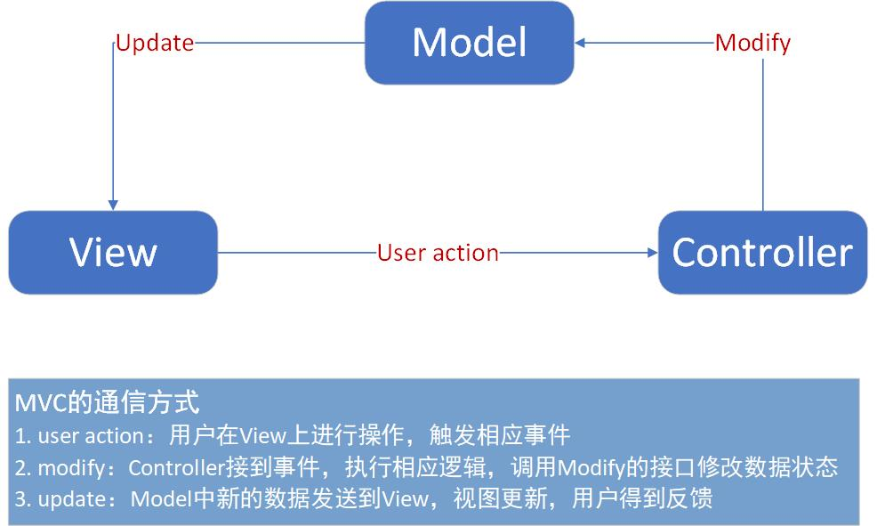
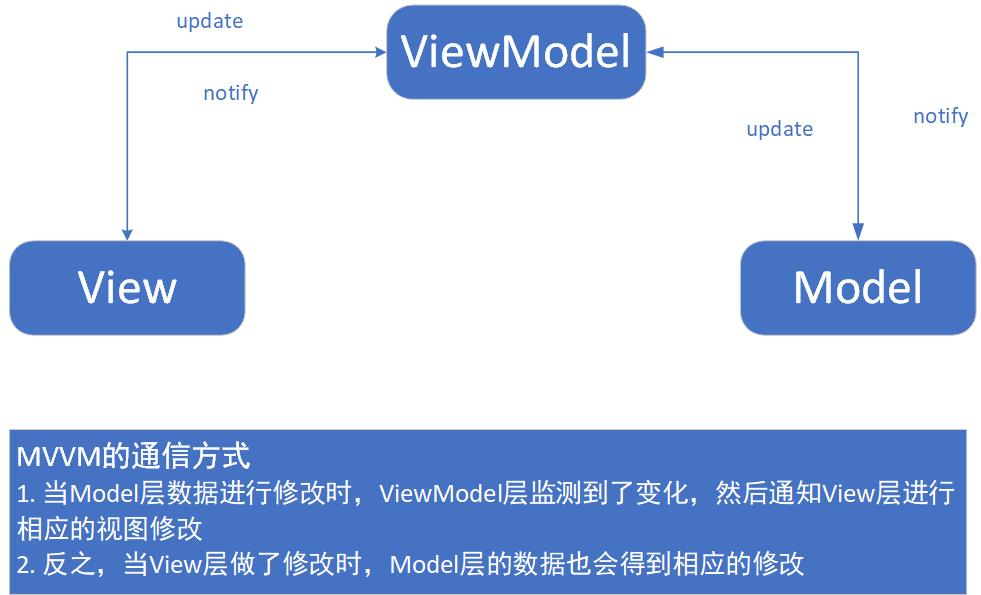
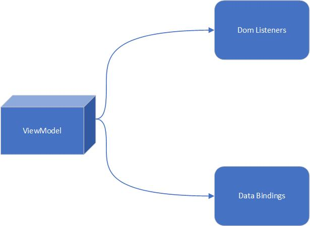
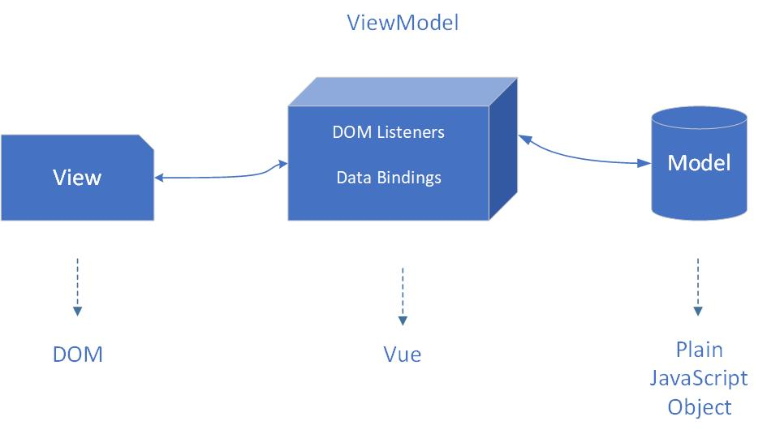
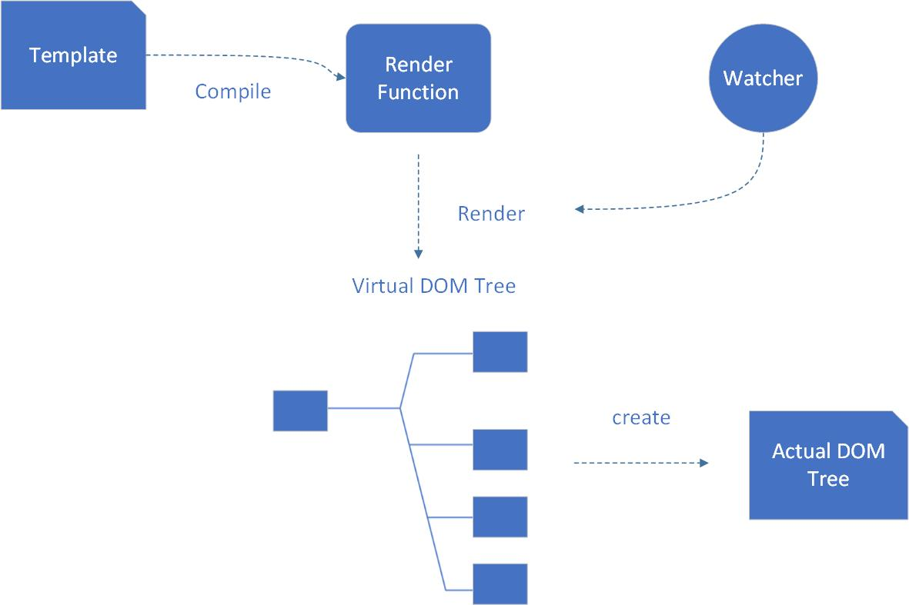
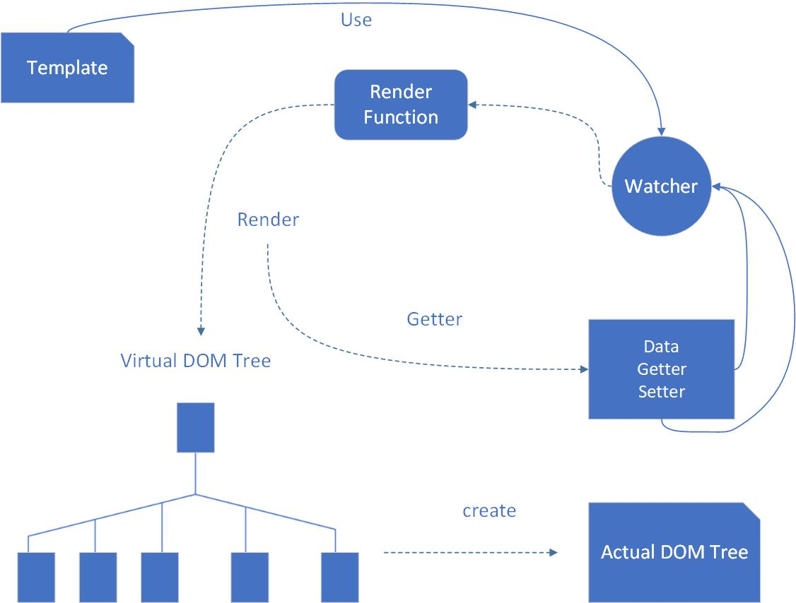
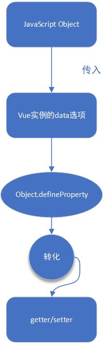

<!-- more -->

# 概念解析

---

## 基础概念

---

1. Vue 是什么

- `Vue` 是一个采取 `MVVM` 架构，通过 `数据驱动视图` 的形式来构建用户界面的 `渐进式框架`，被设计为 `自底向上逐层应用`
- 渐进式：从少到多，从弱到强，`Vue` 并不强制开发者一下子就使用它的全部

2. Vue 设计上的主要组成部分

- `声明式渲染` 和 `组件系统` 是 `Vue` 核心库所包含的内容
- `客户端路由`、`状态管理`、`构建工具` 都有其他各自专门的解决方案，这些解决方案各自独立
- `Vue` 将框架做了分层设计，可以在 `Vue核心库` 的基础上灵活地在不同层上使用其他方案 

3. 数据驱动视图

- `Vue` 是数据驱动视图的框架，采用了 `MVVM` 架构，核心库只关注视图层，视图与数据状态保持同步
- 数据与视图建立绑定以后，DOM（视图）将与数据保持同步，当数据被修改了，DOM 便相应的更新。同样，用户在视图上的操作也会更新相关的数据，所有关于 DOM 的操作都被 Vue 帮我们做了，因此，我们只需要关注数据即可，这就是 `数据驱动` 

---

## MVC、MVVM 模式的区别

---

1. 现代对比传统开发模式

|       现代开发模式       |                  传统开发模式                  |
| :----------------------: | :--------------------------------------------: |
|    Vue/React/Angluar     |                     Jquery                     |
| 只需花费 20%时间在视图层 |             需花费 80%时间在视图层             |
|  数据层与视图层自动绑定  |                数据与视图不分离                |
|                          | ajax 从服务端获取数据，然后操作 DOM 以改变视图 |

2. MVC 模式

- M：`Model （模型，也是数据）`、V：`View（视图）`、`Controller（控制器）`
- MVC 模式将程序分为三层：最上层是 View/视图层，即提供给用户的操作界面；中间层是 Controller/控制层，它会根据用户从 View/视图层输入的指令，对 Model/数据层中相关的数据进行操作，产生最终结果；最底层是数据层/Model，它存储了程序运行时所需的数据或信息
- 每一层都相互独立，每一层的内部的工作都并不影响其他层，各自对外提供接口，供上层调用。如此一来，程序实现了模块化，各层的处理都不会影响其它层



3. MVVM 架构

- V：`View（视图，用户界面）`
- VM：`ViewModel（视图模型）`，作为 View 与 Model 沟通的桥梁，负责监听 Model 或 View 的修改，由此实现 View 与 Model 的双向绑定
- M：`Model（数据模型）` 

4. Vue 中的 ViewModel

- `Vue` 应用通过实例化 Vue 来实现，这个实例需要挂载到一个 dom 节点/html 元素上 
- 在上图中，ViewModel 中的 `Dom Listener` 会监测页面上 Dom 元素的变化，如果有变化，则修改 Model 中的数据；而 `Data Bindings` 会监听数据的变化，如果数据有变化，则更新页面中的 Dom 元素

5. MVC 与 MVVM 的区别

| MVC | MVVM |
| :-: | :-: |
| MVC 模式的通信是单向的 | 各部分的通信是双向的 |
| View 传送只领到 Controller，controller 完成业务逻辑，要求 Model 改变状态，Model 将新的数据发送到 View，用户得到反馈 | 采用双向绑定（data-binding），View 的变动，自动反应在 ViewModel，反之亦然 |

---

## 响应式的数据绑定/深入响应式原理

---

1. 业务逻辑

- 在页面中，DOM 状态其实就是一种数据状态的映射，业务逻辑应该更关注于数据状态的操作
- 当数据发生变化时，框架理应帮助我们自动更新视图，而不需要在手动获取 DOM 元素再对它进行修改
- Vue 的核心是一个 `响应式` 的数据绑定系统，即数据变化更新视图，视图变化修改数据 

2. 声明式渲染

- `声明式`：开发者告诉 Vue 想要什么结果，这个过程由 Vue 去做，开发者不用关注这个过程

```js
<span>{{ item }}</span>
/* 使用模板代码声明式地让Vue将item地数据和span绑定在一起 */
```

- Vue 提供一套基于 HTML 的语法，允许开发者声明式地将真实 DOM 与 Vue 的实例的数据绑定在一起

3. 渲染原理

- `Vue` 会将这些模板编译成一个 `渲染函数`，该渲染函数被调用后渲染并返回一个虚拟的 `DOM树`，这个树的职责就是描述当前视图应处的状态
- 之后再通过一个 patch 函数，将这些虚拟 DOM 创建成真实的 DOM 元素
- 在上面的过程中，Vue 有一个 `依赖追踪系统`，它会检测渲染过程中所依赖到的数据来源。当数据源发生变动时，就可以根据需要重新渲染 DOM 树
- 当一个新的虚拟 DOM 树被渲染出来之后，Vue 会将新树与老的虚拟 DOM 树进行对比，并最终得出最小的差异变化，然后通过 patch 函数施加改动 

4. render 函数

- 字符串模板的代替方案，允许你发挥 `JavaScript` 最大的编程能力。该渲染函数接收一个 `createElement` 方法作为第一个参数用来创建 `VNode`。---VueJs

```html
<h1>{{ blogTitle }}</h1>
```

```js
render: function (createElement) {
  return createElement('h1', this.blogTitle)
}
```

- 手写渲染函数可以选择性地返回 DOM 结构，适合复杂逻辑情况

5. 开胃菜/Object.defineProperty

- 定义对象属性的另一种方式，对象中每一个属性都被添加了几个属性类型，用以描述这些属性的特点

```js
var app = {};
var msg = 'hello jetmine';
Object.defineProperty(app, 'msg', {
  // 读取，访问app.msg触发get方法
  get: function () {
    // 可以在数据被获取时做其他事
    return msg;
  },
  // 写入，修改app.msg触发set方法
  set: function (newval) {
    // 可以在数据被修改时做其他事
    msg = newval;
  },
});
```

6. 响应式原理

- 当你把一个普通的 JavaScript 对象传入 Vue 实例作为 `data选项`，Vue 将遍历此对象所有的 `property`，并使用 `Object.defineProperty` 把这些 `property` 全部转化为 `getter/setter`
- 这些 `getter/setter` 对于用户来说是不可见的，但是在内部它们能让 Vue 追踪依赖，在 `Property` 被访问和修改时通知变更
- 每个组件实例都对应一个 `watcher实例`，它会在组件渲染的过程中把“接触”过的数据 property 记录为依赖。之后当依赖项的 setter 触发时，会通知 watcher，从而使它关联的组件重新渲染 
- Vue 借助 `Object.defineProperty` 来劫持各个属性，这样一来属性地存取过程都会被监听到，`property` 需存在于 vue 的 `data选项` 中才是响应式的，否则是非响应式的 

7. 简单的响应式实现

```html
<!--  实现双线绑定、响应式原理 -->
<body>
  <h2 id="text"></h2>
  <input type="text" id="press" value="" />
</body>
<script type="text/javascript">
  var app = {};
  var username = 'Bob';
  Object.defineProperty(app, 'username', {
    // 定义对象的另一种方法，可以监听到对象的数据被访问或者修改时的变化
    get: function () {
      // 读取，访问app.username时触发get方法
      return username;
    },
    set: function (newValue) {
      // 写入，当修改app.username时，触发set方法
      username = newValue;
      // 修改username的值为新值
      watch(newValue);
      // 通知页面更新dom
    },
  });
  function watch(val) {
    // 更新dom节点
    document.getElementById('text').innerText = val;
    document.getElementById('press').value = val;
  }
  document.getElementById('press').addEventListener('keyup', function (e) {
    app.username = e.target.value;
    // 修改app.username的值,会触发set方法
  });
  watch(app.username);
  // 初始化dom
</script>
```

8. Vue2.x 与 Vue3.x 的区别

- _Object.defineProperty_ 存在的三个问题：① 不能监听数组变化。解决办法是将能够改变原数组的方法进行重写实现。② 必须遍历对象的每个属性，可以通过 _Object.keys()_ 来实现。③ 必须深层遍历嵌套的对象，递归遍历并通过 _Object.keys()_ 来劫持每个属性

```js
const mypush = Array.prototype.push;

Array.prototype.push = function (...args) {
  // 在此位置进行数据劫持

  mypush.apply(this, args);
};
```

- _Proxy_ 针对的是整个对象，_Object.defineProperty_ 针对的是单个属性，这就是解决了需要对复杂嵌套对象进行深度递归的实现对每个属性劫持的问题

```js
let obj = {
  name: 'home',
  people: {
    name1: 'Mary',
    name2: 'Bob',
    name3: 'Mali',
  },
  arr: [1, 2, 3, 4, 5],
};

let objProxy = new Proxy(obj, {
  get(target, property, receiver) {
    // 1. target表示被代理的对象
    // 2. property表示被访问的属性
    // 3. receiver表示创建的代理对象
    console.log(target, property, receiver);
    return Reflect.get(target, property, receiver);
  },
  set(target, property, value, receiver) {
    // 1. target表示被代理的对象
    // 2. property表示被访问的属性
    // 3. value表示被设置的新值
    // 4. receiver表示创建的代理对象
    console.log(target, property, value, receiver);
    return Reflect.set(target, property, value, receiver);
  },
});
```

- _Proxy_ 还解决了 _Object.defineProperty_ 无法劫持数组的问题，并且比起它还有更多的拦截方法，但是相对于旧版本的浏览器，可能需要考虑 _Proxy_ 的兼容问题
