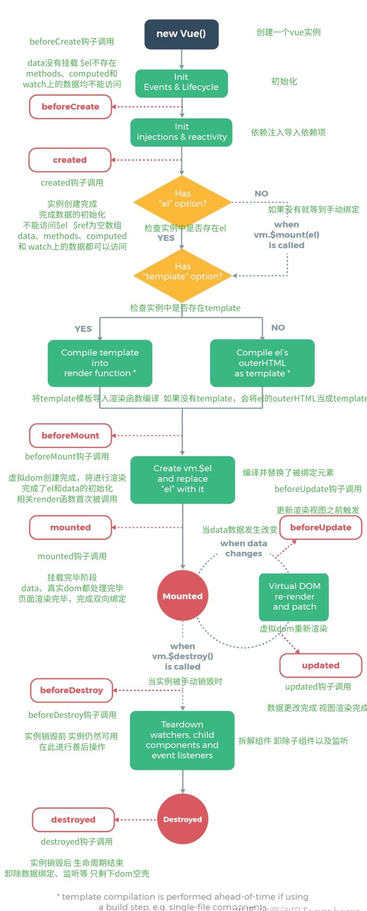
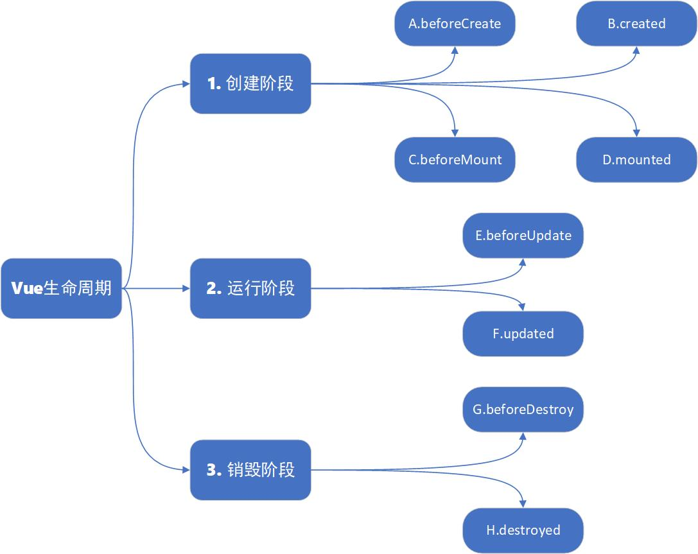
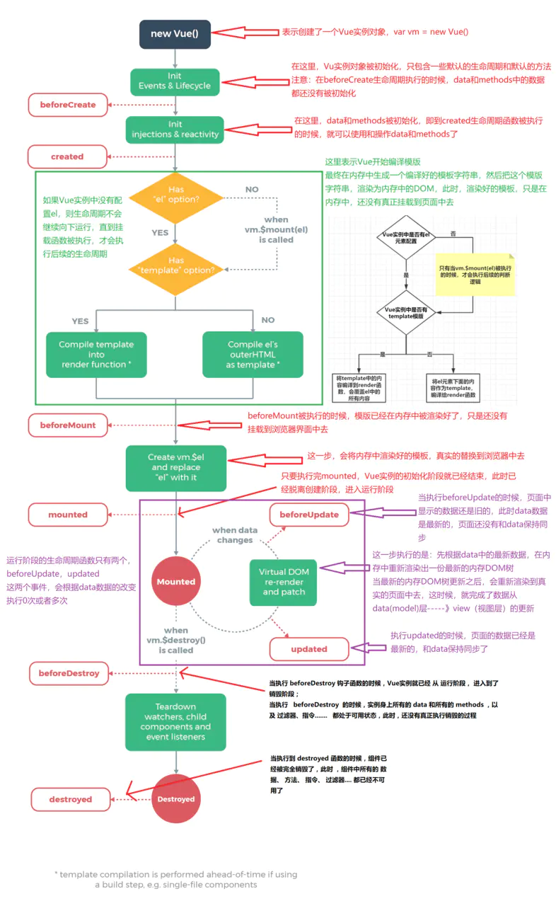

<!-- more -->

# 生命周期

---

## 基础概念

---

1. 生命周期是什么

- `生命周期` 可以理解为一个对象的生老病死的过程，反应到 Vue 中，这个对象就是 Vue 实例，而 Vue 的生命周期也就是指一个实例从开始创建到销毁的这个过程

2. 生命周期函数

- 在生命周期的过程中，运行着一些叫做生命周期的函数，给予了开发者在不同的生命周期阶段添加业务代码的能力
- 可以理解为回调，当执行到某处时，检查有否有钩子，有的话便会执行回调
- 就是在程序运行中，在某个特定的位置，框架的开发者设计好了一个钩子来告诉我们当前程序已经运行到特定的位置了，会触发一个回调函数，并提供给我们，让我们可以在生命周期的特定阶段进行相关业务代码的编写 

3. 运用在 vue 组件中 

---

## 生命周期钩子函数详解

---

1. beforeCreate

- 组件初始化前，`new Vue()` 触发的第一个钩子，在当前阶段，data 没有挂载、methods、computed、以及 watcher 上的数据和方法均不能访问，$el 不存在

2. created

- 组件初始化后，这个钩子在实例创建完成后发生，当前已经完成了数据观测、property 和 methods 的运算，watch/event 事件回调，也就是可以使用数据、更改数据、更改方法，在这个阶段更改数据不会触发 update 函数
- 可以做一些初始数据的获取，当前阶段无法与 dom 进行交互，也就是无法获取 \$el，但是可以通过 `this.$nextTick()` 来获取，它会返回一个`promise` 对象

3. beforeMount

- 被挂载到 DOM 前，这个钩子发生到挂载之前，在这之前 `template` 模板已导入渲染函数编译。当前阶段虚拟 DOM 已经创建完成，即将开始渲染。在此时也可以对数据进行更改，不会触发 updated

4. mounted

- 挂载到 DOM 后，这个钩子在挂载完成后，在当前阶段，真实的 DOM 挂载完毕，数据完成双向绑定，可以访问 DOM 节点，可以使用 `$refs` 属性对 DOM 进行操作
- 可以在此阶段向后台发生请求，拿到返回数据

5. beforeUpdate

- 声明式变量更新前，这个钩子发生更新之前，也就是响应式数据发生更新，虚拟 DOM 重新渲染之前被触发，你可以在当前阶段进行更改数据，不会造成重渲染
- 当前阶段页面的数据还是旧的，但是 data 数据已经更新，页面中的 data 还没有同步

6. 中间处理过程

- 非生命周期，属于一个抽象化的中间处理过程
- 先根据 data 中的数据，在内存中渲染处一个新的 DOM，当新的 DOM 更新之后，会渲染到真实的界面中去，从而实现了从数据层（model）---> 视图层（view）的转换

7. updated

- 声明式变量更新后，这个钩子发生在更新完成之后，当前阶段 DOM 已完成更新，页面重新渲染完毕，页面中的数据与 data 保持一致。要注意的是避免在此期间更改数据，因为这可能会导致无限循环的更新

8. beforeDestroy

- 组件被销毁前，这个钩子发生在实例销毁之前，在当前阶段实例可以被使用，我们可以在这时进行善后收尾工作，比如清除计时器、解绑事件等

9. destroyed

- 组件被销毁后，这个钩子发生在实例被销毁之后，这个时候只剩下了 DOM 空壳。组件已被拆解，数据绑定被解除，监听被移除，子实例也统统被销毁 

10. errorCaptured <Badge text="不常用" type="tip"/>

- 当捕获一个来自子孙组件的错误时被调用

11. activated <Badge text="不常用" type="tip"/>

- 被 `keep-alive/动态组件` 缓存时的组件激活时调用

12. deactivated <Badge text="不常用" type="tip"/>

- 被 `keep-alive/动态组件` 缓存时的组件停用时调用

---

## 生命周期函数的注意点

---

1. beforeCreate/created

- 在 `服务端渲染` 期间，除了这两个钩子以外，其余钩子均不被调用

2. updated

- 这个钩子函数中不要试图去修改声明式变量（data 中的数据），否则会造成死循环

3. this 指向问题

- vue 所有生命周期函数都自动绑定到 this 的上下文，因此，当你在这里使用箭头函数的话，就会使 this 指向父级（也就是 vue 实例）所在的作用域中的 this，就会报错
- vue 在钩子函数的回调函数中使用 `apply` 和 `call` 改变了 this 指向，而箭头函数中 this 指向是无法改变的
- 在 vue 的各个生命周期函数中都可以获取到 this，指向当前 vue 实例对象/组件
