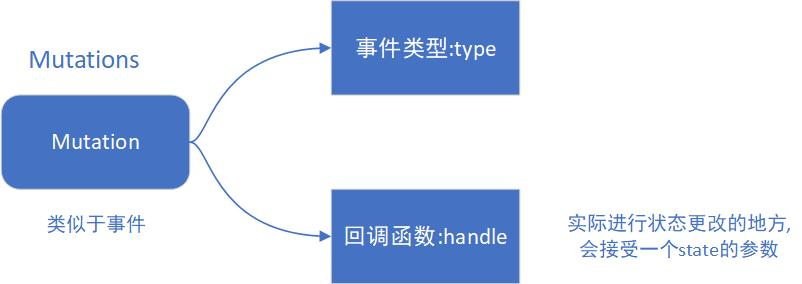

<!-- more -->

# 状态管理

---

## 状态管理的概念

---

1. 为什么需要状态管理

- 通过一个 `store` 实例，来管理应用程序中的状态数据，不仅能够实现组件之间的 `数据共享`，还能用于缓存后端返回的数据

2. 如何在项目中使用

- 首先，先定义一个全局数据管理中心

```js
// store,js
import Vue from 'vue';
import Vuex from 'vuex';
Vue.use(Vuex);
// 在vue中注册这个类
const sotre = new Vuex.store({
  state: {
    msg: 'hello jetmine',
  },
  mutations: {},
});
```

- 在根组件中引入并注册，之后在根组件中挂载这个 `store`，这样 vuex 会通过 `store` 选项提供一种机制将状态 `注入` 到每一个子组件中

```js
import store from './store.js';
new Vue({
  el: '#app',
  store,
  // 将store对象传递给父组件的"store"选项，这样可以将store的实例注入到所有的子组件
  reder: (h) => h(App),
}).$mount('#app');
```

- 子组件可以在内部通过 `this.$store` 访问到 `store` 实例

3. 如何理解 vuex

- `Vuex` 相当于是将数据源剥离下来，用一个全局变量或全单例的模式进行管理，就可以在任何页面获取到这个状态，他是一个全局模型
- 适用于大型的单页应用，对于一些不大不小的应用，`Vuex` 可能是一个负担

4. 官方描述

- `Vuex` 是一个专门为 `Vuejs` 应用程序开发的状态管理模式
- 它采用集中式存储管理应用的所有组件的状态，并以规则的形式保证以一种可预测的方式发生变化

5. Vuex 与全局对象的区别

- `Vue` 通过 `Vuex` 引入的一个内置对象来管理状态，也就是 `store`，它属于一个全局对象
- `Vuex` 的状态存储是响应式的，当组件从 `store` 中读取状态时，若 `store` 中的状态发生改变，那么相应的组件也会相应地得到高效更新
- 你不能直接改变 `store` 中的状态。改变 `store` 中状态的唯一途径就是 `显式地提交 (commit) mutation`。这样使得我们可以方便地跟踪每一个状态的变化，从而让我们能够实现一些工具帮助我们更好地了解我们的应用

6. 应用在组件中

- 每一个 vue 应用的核心就是 `store(仓库)`，它是一个容器，包含着应用中大部分的状态(state)
- 通过 `提交mutation` 方法，可以追踪到状态的变化，更容易解读到应用内部状态的变化(较于直接改变 store.state)

```js
const store = new Vuex.Store({
	state:{
		msg:'hello world',
		count:'2020'
	},
	mutations:{
		changeMsg(){
			state.msg=state.msg.reverse()
		}
		increment(){
			state.count++
		}
	}
})
```

7. Vuex 可能导致的性能问题

- 使用 `Vuex` 并不意味着你需要将所有的状态放入 `vuex`，因为所有的状态都放入 `Vuex` 中会使代码变得冗长和繁杂
- 组件的状态应根据需要来判断是否作为全局状态放入 `Vuex` 还是作为组件的局部状态

---

## Vuex 的选项

---

1. 组成部分

- state、gettets、mutation、action、module 
- `单一状态树`：每一个应用将仅仅包含一个 `store` 实例，通过单一状态树的形式，用一个对象就包含了全部的应用层级状态，以一个唯一数据源的形式存在

2. State

- 在组件中读取 `store` 实例中状态可以在计算属性中返回某个状态，每当 `store` 中 `state` 的某个状态变化时，使用了该状态的组件的计算属性都会重新变化并渲染组件

```js
computed:{
    count(){
        return this.$store.state.count
    }
}
```

- 如果将 `this.$store.state.count` 直接放在 `data` 中，`this.$store.state` 的变化无法主动触发界面刷新，而在模板中无法直接访问 `this.$store.state`
- 凡是放在 `state` 中的数据,可以被当前程序中任何组件进行访问(也就是共享)

3. Getters

- 相当于 `store` 中的计算属性，和计算属性一样，`getter` 的返回值会根据它的依赖被缓存起来，且只有它的依赖值发生了改变就会被重新计算

```js
const store = new Vuex.Store({
  state: {
    msg: 'hello world',
    count: '2020',
    num: '09',
    list: [],
  },
  getters: {
    listlen: function (state) {
      return state.count + state.num;
      // Getter接受state 作为其第一个参数，可以直接访问state中的状态数据
    },
    // listlen:state=>{
    // return state.count+state.num;
    // 箭头函数写法
    //},
  },
});
```

```js
const store = new Vuex.Store({
  state: {
    msg: 'hello world',
    count: '2020',
    num: '09',
    list: [],
  },
  getters: {
    listlen: function (state) {
      return state.count + state.num;
      // Getter接受state 作为其第一个参数，可以直接访问state中的状态数据
    },
    lastnum: function (state, getters) {
      return state.count + getters.listlen;
      // Getter接受state 作为其第一个参数，还可以接受getters作为第二个参数，可以直接访问state中的状态数据和getters中的某个计算属性
    },
    //lastnum:(state,getters)=>{
    //return state.count+getters.listlen;
    // 箭头函数写法
    //},
  },
});
```

- `getters` 与 `state` 一样，会将自身暴露出去，可以在不同的页面以 `$store` 的属性去访问它

```js
// store.js
console.log(store.state, store.getters);
```

```js
// compoment.vue
export default {
  methods: {
    print: function () {
      console.log(this.$store.state.list, this.$store.getters.listlen);
    },
  },
};
```

- `getter` 作为 `getters` 的一个属性存在，无法对其进行传参，但可以把它变为一个函数

```js
getters: {
  // 返回一个函数，就可以传参了
  weekDate: (state) => (fm) => {
    return moment(state.date).format(fm ? fm : 'dddd');
  };
}
```

4. Mutations

- 用于操作 `vuex` 中的状态
- 更改 `vuex` 的 `store` 的状态的唯一方法是提交 `mutation` 

```js
// store.js
const store = new Vuex.store({
  state: {
    num: 0,
  },
  mutations: {
    increment(state) {
      // 事件类型type为increment，参数为state
      state.num++;
      // 变更状态
    },
  },
});
```

- vuex 不允许直接通过 `store.mutations.increament()` 来调用 `mutation`，需要使用 `store.commit("increment")` 来触发 type 对应的方法

```js
$store.commit('increment');
```

- 在使用 `commit` 触发事件时，可以传入额外的参数

```js
// store.js
mutations:{
	increment(state,num){
		// 事件类型 type 为 increment，参数为 state、num
		state.count+=num
		// 状态变更
	}
}
store.commit('increment',2020)
// 2020又被称为载荷，这段代码也可叫做提交载荷
```

- `载荷（payload）` 在大多数情况下是一个对象

```js
mutations: {
		addList:function(state,payload){
			console.log('payload',payload)
			state.list=payload.data
		}
},
```

```js
// 直接提交数据，此时payload == res.data
store.commit('addList', res.data);
```

```js
// 事件类型与载荷分开提交，此时payload == {data:res.data}
store.commit('addList', { data: res.data });
```

```js
// 推荐方式
// 整个对象都作为载荷传给mutation函数
// 此时payload == {type:"addList",data:res.data}
store.commit({ type: 'addList', data: res.data });
```

- 如果要对 `state` 中的对象数据进行修改（注意是添加数据，而不是更换数据）

```js
const store = new Vuex.Store({
  state: {
    people: {
      name: 'Bob',
      age: 18,
    },
  },
});
```

- 如果需要动态的添加的话，不能以直接添加字段的形式修改该对象。修改的话，直接对该对象的属性对应的属性值进行修改即可

```js
// 添加一条新数据
mutations:{
   addSex(state){
    state.people = {...state.people,sex:'男'}
}
}
```

- store 中的状态是响应式的，当更改状态数据时，监视状态的 vue 组件也会自动更新，因此 vuex 中 mutation 也需要遵循 vue 的使用规则
- mutation 必须是同步函数

```js
mutations: {
  someMutation (state) {
    api.callAsyncMethod(() => {
      state.count++
    })
  }
}
// 此种情况下无法追踪状态变化，因为状态发生改变的时机是不确定的，因此其状态变得无法追踪
// 因此任何由 type(某事件类型) 引起的状态改变都应该在commit的时候完成
```

5. action

- 与 `mutation` 相似，区别在于 `action` 提交的是 `mutation`，`mutation` 是变更状态，要求 `mutation` 是一个同步函数，在提交的时候就要完成状态的更改，`action` 可以包含任意异步操作

```js
// store.js
import fetch from './utils/fetch.js';
const store = new Vuex.Store({
  state: {
    msg: 'hello world',
    count: '2020',
    list: [],
  },
  getters: {
    listlen: function (state) {
      return state.list.length;
    },
    counts: function (state, getters) {
      return getters.listlen + state.count;
    },
  },
  mutations: {
    changeMsg() {
      store.state.msg = store.state.msg.reverse();
    },
    addList: function (state, payload) {
      console.log('payload', payload);
      state.list = payload.data;
    },
  },
  actions: {
    getData(store, params) {
      fetch({
        url: '/topics',
        methods: 'GET',
        params,
      }).then((res) => {
        let payload = { data: res.data.data };
        store.commit({ type: 'addList', data: payload });
        // 这里的store与store实例有着相同的方法与属性，但是它们并不是同一个实例
      });
    },
    // 用于与后端api交互
    // 在组件中,使用this.$store.dispatch('methods',params)触发
    // 接口调用成功后,将数据通过mutations(store.commit('方法'))更新到state中
  },
});
```

- `mutation` 通过 `store.commit` 触发，`action` 通过 `store.dispatch` 触发。可以将异步操作放在 `action` 内部执行，解决 `mutation` 必须同步执行的限制

```js
// store.js
actions: {
  getData ({ commit }) {
     setTimeout(()=>{
        commit('increment')
},1000)
// 这里的{{commit}}解构到了store.commit方法，因此可以直接提交事件
  }
}
```

- dispatch 触发 mutation 的方式

```js
// 第一种方式
store.dispatch('increment', { data: { id: 10, class: '1204' } });
```

```js
// 第二种方式
store.dispatch({ type: 'increment', data: { id: 10, class: '1204' } });
```

- `store.dispatch` 可以处理被触发的 `action` 的处理函数返回的 `promise`，并且 `store.dispatch` 依然返回 `promise`

```js
actions:{
    getData({commit},params){
       return new Promise((resolve,reject)=>{
          setTimeout(()=>{
         commit('addList',{data:params.data})
          resolve()
},1000)
})
}
}
```

```js
// 调用
this.$store.dispatch('getData').then(() => {
  // ...
});
```

```js
// 上述结合起来
actions: {
  // ...
  getData ({ dispatch, commit }) {
    return dispatch('handleList').then(() => {
      commit('someOtherMutation')
    })
  }
}
```

- 一个 `store.dispatch` 在不同模块中可以触发多个 `action` 函数。在这种情况下，只有当所有触发函数完成后，返回的 `Promise` 才会执行

6. Module

- vuex 使用的是单一状态树，应用的所有状态会集中到一个对象中，当项目比较大时，相应的状态数据会很多，不便于管理
- Module 类似于公司中的各类部门主管，而 store 相当于老板，老板通过分配管理任务给主管，以减轻自己的负担，效率也大大提高
- vuex 允许我们将 store 分割成大大小小的对象，每个对象都拥有自己的 state、getter、acton、mutation，这个对象被称为 module(模块)，模块可以嵌套

```js
// 新建一个module文件夹
// src/module下可以新建多个moduleA.js moduleB.js moduleC.js
// 编写代码
export default {
  state: {
    msg: 'i m moduleA',
  },
  getters: {},
  mutation: {},
  action: {},
};
```

```js
const ModuleA = {
  state: {
    msg: 'i m moduleA',
  },
  getters: {},
  mutation: {},
  action: {},
};
export default ModuleA;
```

```js
// store.js
// 导入子模块
import moduleA from './module/moduleA';
import moduleB from './module/moduleB';

export default new Vuex.Store({
    modules: {
        moduleA, moduleB, // 注入子模块
    },
//    modules: {
//        mA:moduleA, mB:moduleB,
//    },
    // ...
}
```

- 模块内部的 `state` 是局部的，只属于模块本身所有，所以外部必须通过对应的模块名进行访问，可以通过 `this.$store.state.moduleA.text` 来访问模块中的 state 数据
- 模块内部的 `action`、`mutation`、`getter` 默认注册在全局命名空间，因此多个模块能够对同一 `mutation` 或 `action` 作出响应

```js
// 定义两个module，分别命名为moduleA.js、moduleB.js
// moduleA.js
export default {
	state:{
		text:"moduleA"
	},
	getters:{},
	mutations:{
		setText(state){
			state.text='A'
		}
	},
	actions:{}
}
// moduleB.js
export default {
	state:{
		text:"moduleB"
	},
	getters:{},
	mutations:{
		setText(state){
			state.text='B'
		}
	},
	actions:{}
}
```

```js
// 在store.js中导入该模块并使用modules选项
import moduleA from './module/moduleA.js';
import moduleB from './module/moduleB.js';
const store = new Vuex.Store({
  modules: {
    moduleA,
    moduleB,
  },
});
```

```js
// 在某组件中使用该子模块状态中的数据
<template>
	<div>
		this is old news
		<button type="button" @click="change">触发</button>
		<span style="display: block;">{{str}}</span>
		<span style="display: block;">{{str1}}</span>
	</div>
</template>
<script>
	import {
		mapMutations,
		mapState
	} from 'vuex'
	export default {
		computed: {
			...mapState({
				str: state => state.moduleA.text,
				str1: state => state.moduleB.text,
			})
		},
		methods: {
			...mapMutations([
				'setText'
			]),
			change() {
				this.setText()
			}
		}
	}
</script>
// 可以发现，当点击button时，str与str1的值都改变了
// 因此，多个模块能够对同一mutation或action作出响应
```

- 访问根节点，模块内部的 state 是局部的，只属于模块本身所有，如果想在模块中访问 store 根节点的数据，需要通过 rootAtate 来获取

```js
// moduleA.js
export default {
  state: {
    text: 'moduleA',
    count: '09',
  },
  getters: {
    detail(state, getters, rootState) {
      return state.count + '-' + rootState.count;
    },
  },
  mutations: {
    setText(state) {
      state.text = 'A';
    },
  },
  actions: {},
};
```

```js
// 组件访问
import { mapGetters } from 'vuex';
export default {
  computed: {
    ...mapGetters({
      year: 'detail',
    }),
  },
};
```

- 除了通过第三个参数 rootState 访问根节点的状态数据外，还可通过第四个参数 rootGetgets 来获取根节点的 gettets

```js
// moduleA.js
export default {
  state: {
    text: 'moduleA',
    count: '09',
  },
  getters: {
    detail(state, getters, rootState) {
      return state.count + '-' + rootState.count;
    },
    rootgetter(state, getters, rootState, rootGetters) {
      return rootGetters.rootmsg + '-' + getters.detail;
    },
  },
  mutations: {
    setText(state) {
      state.text = 'A';
    },
  },
  actions: {},
};
```

```js
// 组件访问
import { mapGetters } from 'vuex';
export default {
  computed: {
    ...mapGetters({
      detail: 'rootgetter',
    }),
  },
};
```

- action 中也可以接收四个参数，但对它们的顺序不作限制，因为传进去的数据都被包裹在一个名为 context 对象中的

```js
//moduleA.js
export default {
  state: {
    text: 'moduleA',
    count: '09',
  },
  getters: {
    detail(state, getters, rootState) {
      return state.count + '-' + rootState.count;
    },
    rootgetter(state, getters, rootState, rootGetters) {
      return rootGetters.rootmsg + '-' + getters.detail;
    },
  },
  mutations: {
    setText(state) {
      state.text = 'A';
    },
  },
  actions: {
    printData({ state, rootGetters, rootState }) {
      console.log(state.text, rootGetters.rootmsg, rootState.msg);
    },
  },
};
```

```js
// 组件内访问
import { mapActions } from 'vuex';
export default {
  mounted() {
    this.init();
  },
  methods: {
    ...mapActions({
      init: 'printData',
    }),
  },
};
```

- 命名空间，访问模块内的 state 的状态数据，可以通过 store.state.moduleA.xxx 来访问，而模块的 getters、mutations、actions 都是被注册在全局命名空间的，如果只想让它在当前的模块中生效，需要添加 `namespaced:true` 的方式使其成为带命名空间的模块，当模块被注册后，它们所有的 getter、action、mutation 都会根据模块注册的路径调整命名

```js
// moduleA.js
export default {
  namespaced: true,
};
```

- 当要再次访问模块中的方法时，需要带上该方法的路径

```js
// 组件内
	import { mapActions,mapMutations,mapGetters } from 'vuex'
	export default{
		mounted() {
			this.init()
		},
		computed() {
			msg(){
			message:'moduleA/msg'
			}
		},
		methods:{
			...mapActions({
				init:'moduleA/printData'
			}),
			...mapMutations({
				inc:'moduleA/increment'
			})

		}
	}
// 注意，如果一个模块启用了命名空间，那么它里面的 getter 和 action 中收到的 getter，dispatch 和 commit 也都是局部化的，不需要在同一模块内额外添加空间名前缀。也就是说，更改 namespaced 属性后不需要修改模块内的任何代码
```

- 如何在带有命名空间的模块内访问全局内容

```js
// moduleA.js
// 触发全局的action/mutation
export default {
  namespaced: true,
  // ...
  actions: {
    callAction({ state, commit, rootState }) {
      commit('setName', '改变', { root: true });
      alert(state.text + '-' + rootState.name);
    },
  },
};
```

- 如何在带有命名空间的模块内注册 `全局action`。若需要在带命名空间的模块注册 `全局action`，你可添加 `root: true`，并将这个 `actio`n 的定义放在函数 `handler` 中

```js
export default {
  namespaced: true,
  // ...
  actions: {
    callAction: {
      root: true,
      handler(namespacedContext, payload) {
        let { state, commit } = namespacedContext;
        commit('setText');
        alert(state.text);
      },
    },
  },
};
// namespacedContext：意为当前模块的上下文对象，payload是载荷
```

- `createNamespacedHelpers`：创建基于某个命名空间辅助函数，它返回一个对象，对象里有新的绑定在给定命名空间值上的组件绑定辅助函数需要启用命名空间

```js
import { createNamespacedHelpers } from 'vuex';

const { mapState, mapActions } = createNamespacedHelpers('some/nested/module');

export default {
  computed: {
    // 在 `some/nested/module` 中查找
    ...mapState({
      a: (state) => state.a,
      b: (state) => state.b,
    }),
  },
  methods: {
    // 在 `some/nested/module` 中查找
    ...mapActions(['foo', 'bar']),
  },
};
```

- 模块的动态注册：在 store 创建之后，可以使用 store.registerModule 方法动态的注册模块

```js
// 注册模块 `myModule`
store.registerModule('myModule', {
  // ...
});
// 注册嵌套模块 `nested/myModule`
store.registerModule(['nested', 'myModule'], {
  // ...
});
// 之后就可以通过 store.state.myModule 和 store.state.nested.myModule 访问模块的状态。
// store.unregisterModule(moduleName) 动态的卸载模块
// 动态模块在项目中使用较少，类似于懒加载，需要的时候再去注册使用，避免资源浪费，因此动态模块常用于第三方库当中
```

- 模块重用可能导致数据污染，因此可以选择返回引用类似的形式，避免 state 被污染

```js
// 类似于组件中的data
export default {
  state() {
    return {
      msg: 'hello world',
    };
  },
};
```

---

## Vuex 中常用的辅助函数

---

1. mapState

- 当组件需要获取多个状态时，就需要在 computed(计算属性)中定义多个计算属性去接收这些状态

```js
export default {
  name: 'home',
  data: function () {
    return {
      page: 0,
    };
  },
  computed: {
    computedA() {
      return this.$store.state.stateA;
    }, // == computedA:function(){}
    computedB() {
      return this.$store.state.stateB;
    },
    computedC() {
      return this.$store.state.stateC;
    },
    computedD() {
      return this.$store.state.stateD;
    },
  },
};
// 当需要的状态过多时，组件中就要定义多个计算属性去接收
```

- mapState 用来解决这种复杂的写法，可以取别名、做额外的操作

```js
import { mapState } from 'vuex';
// 从vuex中引入mapState辅助函数
export default {
  name: 'home',
  data: function () {
    return {
      page: 0,
    };
  },
  computed: mapState({
    computedA: (state) => state.stateA,
    computedB: (state) => state.stateB,
    computedC: (state) => state.stateC,
    computedD: (state) => state.stateD,
    Balias: 'computedA',
    cINfo(state) {
      return state.newmsg + this.computedA.font;
      // 须使用常规函数
    },
  }),
};
```

- 当计算属性名与 state 中的子节点名称相同时，可以使用数组的形式传递

```js
import { mapState } from 'vuex';
// 从vuex中引入mapState辅助函数
export default {
  name: 'home',
  data: function () {
    return {
      page: 0,
    };
  },
  computed: {
    ...mapState({
      stateA: 'stateA',
      stateB: 'stateB',
      stateC: 'stateC',
      stateD: 'stateD',
    }), // 对象形式
    ...mapState(['stateA', 'stateB', 'stateC', 'stateD']), // 数组形式
  },
  // 使用 ... 对象展开运算符将此对象混入到组件对象中
};
```

2. mapGettets

```js
import { mapGetters } from 'vuex';

export default {
  // ...
  computed: {
    ...mapGetters([
      'doneTodosCount',
      'anotherGetter',
      // ...
    ]),
  },
};
```

```js
// 使用对象的形式取别名
mapGetters({
  doneCount: 'doneTodosCount',
});
```

3. mapMutations

- 直接在组件中使用 `this.function` 调用即可

```js
import { mapMutations } from 'vuex';

export default {
  // ...
  methods: {
    ...mapMutations([
      // 将 `this.increment()` 映射为
      // `this.$store.commit('increment')`
      'increment',
      // `mapMutations` 也支持载荷：
      // 将 `this.incrementBy(amount)` 映射为
      // `this.$store.commit('incrementBy', amount)`
      'incrementBy',
    ]),
    ...mapMutations({
      // 将 `this.add()` 映射为
      // `this.$store.commit('increment')`
      add: 'increment',
    }),
  },
};
```

4. mapActions

- 直接在组件中使用 `this.function` 调用即可

```js
import { mapActions } from 'vuex';

export default {
  // ...
  methods: {
    ...mapActions([
      // 将 `this.increment()` 映射为
      // `this.$store. dispatch('increment')`
      'increment',
      // `mapActions` 也支持载荷：
      // 将 `this.incrementBy(amount)` 映射为
      // `this.$store. dispatch('incrementBy', amount)`
      'incrementBy',
    ]),
    ...mapActions({
      // 将 `this.add()` 映射为
      // `this.$store. dispatch('increment')`
      add: 'increment',
    }),
  },
};
```
