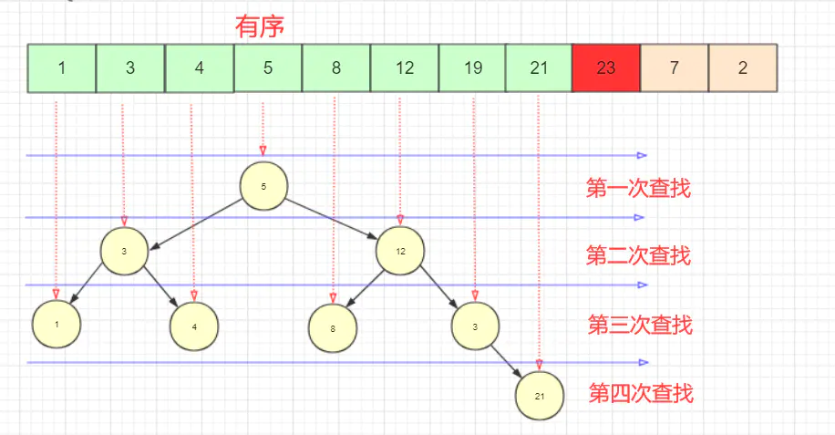

<div style="text-align: center;font-weight: 900;"> 排序与算法 </div>

<!-- more -->

---

# 排序与算法

---

## 排序

---

1. 冒泡排序

- 它重复地走访过要排序的数列，一次比较两个元素，如果他们的顺序错误就把他们交换过来。走访数列的工作是重复地进行直到没有再需要交换，也就是说该数列已经排序完成。这个算法的名字由来是因为越小的元素会经由交换慢慢 `浮` 到数列的顶端
- 简单来说，就是比较相邻的元素，对相邻的每一组元素进行比较，如果前一个比后一个大，那么就交换他们两个的位置，直到最后一个元素
- 性能分析：参数是正序时，排序最快；参数是反序时，排序最慢

```js
function bubbleSort(arr) {
  for (var i = 0; i < arr.length - 1; i++) {
    for (var j = 0; j < arr.length - 1 - i; j++) {
      // 控制对比次数
      if (arr[j] > arr[j + 1]) {
        var temp = arr[j + 1];
        arr[j + 1] = arr[j];
        arr[j] = temp;
      }
    }
  }
  return arr;
}
```

2. 选择排序

- 无论什么数据进去都是 `O(n^2)` 的复杂度
- 在未排序序列中寻找最小(大)的元素，将它放到序列的最前面；接着在剩下的未排序序列中寻找最小(大)元素，将其放在已排序序列的末尾，直到序列中所有元素排序完毕

```js
function selectionSort(arr) {
  var minIndex, temp;
  for (var i = 0; i < len - 1; i++) {
    minIndex = i;
    for (var j = i + 1; j < len; j++) {
      if (arr[j] < arr[minIndex]) {
        // 寻找最小的数
        minIndex = j; // 将最小数的索引保存
      }
    }
    temp = arr[i];
    arr[i] = arr[minIndex];
    arr[minIndex] = temp;
  }
  return arr;
}
```

3. 插入排序/暴力枚举

- 插入排序是一种最简单直观的排序算法，它的工作原理是通过构建有序序列，对于未排序数据，在已排序序列中从后向前扫描，找到相应位置并插入
- 将第一待排序序列第一个元素看做一个有序序列，把第二个元素到最后一个元素当成是未排序序列
- 从头到尾依次扫描未排序序列，将扫描到的每个元素插入有序序列的适当位置。（如果待插入的元素与有序序列中的某个元素相等，则将待插入元素插入到相等元素的后面）

```js
function insertionSort(arr) {
  var temp;
  for (var i = 1; i < arr.length; i++) {
    for (var j = i - 1; j >= 0; j--) {
      if (arr[j] > arr[j + 1]) {
        temp = arr[j];
        arr[j] = arr[j + 1];
        arr[j + 1] = temp;
      }
    }
  }
  return arr;
}
```

| 排序算法 | 平均时间复杂度 | 最坏时间复杂度 | 空间复杂度 | 稳定 |
| :------: | :------------: | :------------: | :--------: | :--: |
| 冒泡排序 |     O(n^2)     |     O(n^2)     |    O(1)    |  是  |
| 选择排序 |     O(n^2)     |     O(n^2)     |    O(1)    |  否  |
| 插入排序 |     O(n^2)     |     O(n^2)     |    O(1)    |  是  |

4. 折半插入/二分查找

- 折半插入排序的本质依然是插入排序，仅仅是对插入排序进行了部分优化 

5. 快速排序

- 快排是处理大数据最快的排序算法之一。它是一种分而治之的算法，通过递归的方式将数据依次分解为包含较小元素和较大元素的不同子序列。该算法不断重复这个步骤直至所有数据都是有序的
- 选择一个枢纽元，比枢纽元大的放在枢纽元右边，比枢纽元小或相等的放在枢纽元左边，不断重复以上过程 

```js
function quickSort(arr) {
  if (arr.length <= 1) {
    return arr;
  }
  var left = [];
  var right = [];
  var current = arr.splice(0, 1);
  for (let i = 0; i < arr.length; i++) {
    if (arr[i] > current) {
      right.push(arr[i]);
    } else {
      left.push(arr[i]);
    }
  }
  return quickSort(left).concat(current, quickSort(right));
}
```

6. 三路快排

- 三路快排会形成三个区间，分别是小于设定的枢纽元的元素的区间、等于设定的枢纽元的区间、大于设定的枢纽元的区间
- 思路：先选定一个枢纽元 `initValue`、一个左区间 `left`、一个右区间 `right`；如果当前 i 指向的元素等于 `initValue`，那么 `i+1`；如果当前 i 指向的元素小于 `initValue`，那么将左区间 `left+1` 处的元素与 i 指向的元素进行交换，然后 `left+1`，并且 `i+1`；如果当前 i 指向的元素大于 `initValue`，则将 `right-1` 处的元素与索引 i 处的元素进行交换，然后 `right-1`。当 i==right 时，说明除了第一个元素 `initValue` 外，其余的空间已经分区完毕，这时只需将首个元素与 right 处的元素进行交换即可，在 `left-1`，三个区间即形成

```js
const parttion = function (arr, L, R) {
  let current = arr[L];
  let left = L;
  let right = R + 1;
  for (let i = L + 1; i < right; ) {
    if (arr[i] == current) {
      i++;
    } else if (arr[i] > current) {
      [arr[right - 1], arr[i]] = [arr[i], arr[right - 1]];
      right--;
    } else {
      [arr[left + 1], arr[i]] = [arr[i], arr[left + 1]];
      left++;
      i++;
    }
  }
  [arr[L], arr[left]] = [arr[left], arr[L]];
  left--;
  return { left: left, right: right };
};
function threeQuickSort(arr, L, R) {
  if (L >= R) {
    return false;
  }
  var obj = parttion(arr, L, R);
  threeQuickSort(arr, L, obj.left);
  threeQuickSort(arr, obj.right, R);
}
```

7. 归并排序

- 是建立在归并操作上的一种有效的排序算法。该算法是采用分治法的一个非常典型的应用

```js
function mergeSort(arr) {
  if (arr.length < 2) {
    return arr;
  }
  var middle = Math.floor(arr.length / 2);
  var left = arr.slice(0, middle);
  var right = arr.slice(middle, arr.length);
  return merge(mergeSort(left), mergeSort(right));
}
function merge(left, right) {
  var result = [];
  while (left.length && right.length) {
    if (left[0] <= right[0]) {
      result.push(left.shift());
    } else {
      result.push(right.shift());
    }
  }
  while (left.length) result.push(left.shift());
  while (right.length) result.push(right.shift());
  return result;
}
```

---

## 算法

---

1. 排序的稳定性

- 假设一开始的序列中，元素 A 领先于元素 B，经过某排序方法以后，元素 A 依然领先于元素 B，那么称该排序方法是稳定的；如果可能出现元素 B 领先于元素 A，那么称该排序方法是不稳定的
