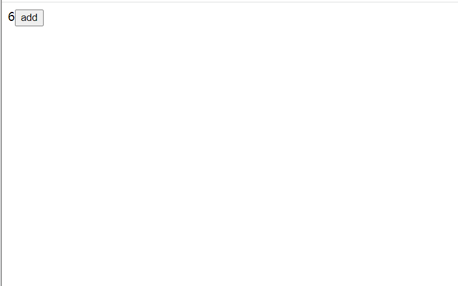
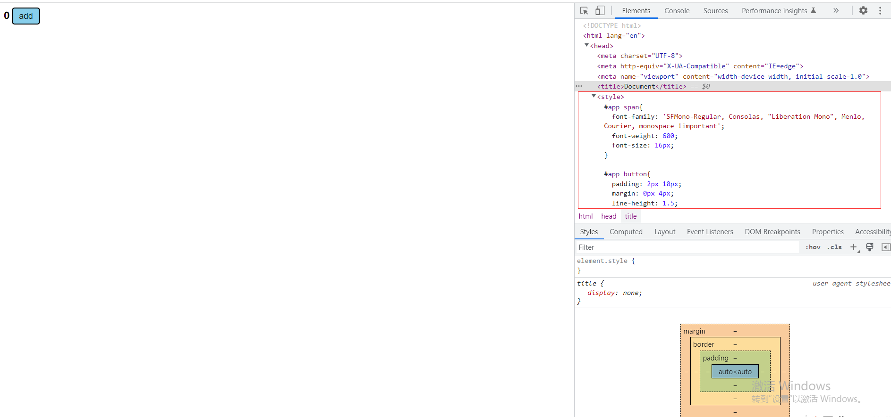
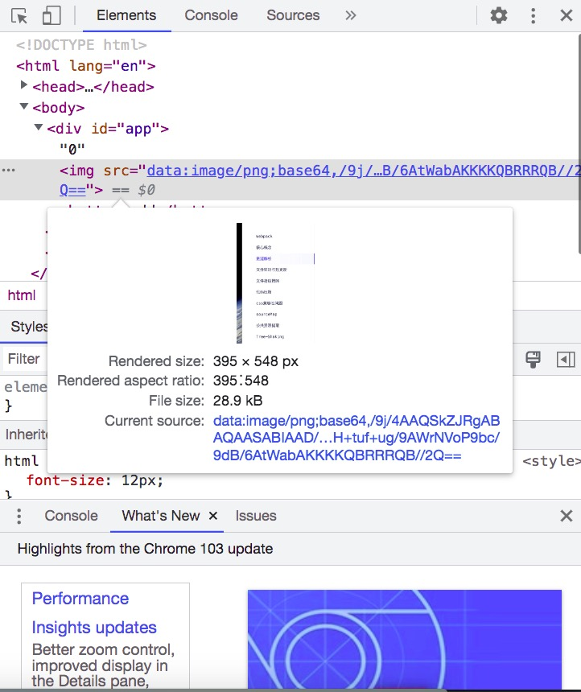

## 资源解析
---
1. babel-loader
- 借助 babel-loader 对新特性(如 es2015 的 import、export 等)的 js 语法进行解析，需要依赖 babel 的核心模块，它的配置文件是 `.babelrc`

```bash
# 先添加babel相关的包
npm i @babel/core @babel/preset-env babel-loader -D
```

```json
/** 
  * .babelrc 文件
  * plugins:一个plugin对应一个功能
  * presets：一系列babel-plugins的集合
*/
{
  "presets":[
    "@babel/preset-env"
  ],
  "plugins":[
    "@babel/proposal-class-properties"
  ]
}
```
2. 解析 jsx
- 使用 `@babel/preset-react` 来解析 jsx。在添加相应的包后，在 babel 里面添加相关的配置项

```bash
npm i @babel/preset-react -D
```

```json
/** 
  * .babelrc 文件
  * plugins:一个plugin对应一个功能
  * presets：一系列babel-plugins的集合
*/
{
  "presets":[
    "@babel/preset-env",
    "@babel/preset-react"
  ],
  "plugins":[
    "@babel/proposal-class-properties"
  ]
}
```

- 如果你需要解析 tsx、ts，那么你还需要显式地添加这个 babel-plugins

```json
{
  "presets":[
    "@babel/preset-env",
    "@babel/preset-react",
    "@babel/typescript"
  ],
  "plugins":[
    "@babel/proposal-class-properties"
  ]
}
```

- 我们来新建一个 js 文件和 html 文件，它的内容如下

```js
// app.js
import React from "react";
import  ReactDOM  from "react-dom";

const App = (props) => {
  const [count,setCount] = React.useState(0);

  return (
    <>
      {count}
      <button onClick={()=>setCount(count+1)}>add</button>
    </>
  )
}

ReactDOM.render(
  <App />,
  document.getElementById('root')
)
```

```html
<!-- app.html -->
<!DOCTYPE html>
<html lang="en">
<head>
  <meta charset="UTF-8">
  <meta http-equiv="X-UA-Compatible" content="IE=edge">
  <meta name="viewport" content="width=device-width, initial-scale=1.0">
  <title>Document</title>
</head>
<body>
  <div id="root"></div>
  <script src="app.js"></script>
</body>
</html>
```

- 配置打包完成以后，打开 app.html，查看页面上的内容，我们的组件就在页面上显示出来了



3. 解析 css
- css-loader，用于加载代码中引用过的 .css 文件，并且将它转换成 commonjs 对象，再插入到 js 代码中。我们可以在一个 js 中以模块的形式引入一个 css 文件，再来看看 css-loader 转换的内容

```css
/* index.css */
html,body{
  margin:0;
  padding:0;
  font-size: 14px;
}
```

```js
import './index.css';
console.log(JSON.stringify([1, 2, 3, 4, 5, 6]))
```

```js
/** 打包出来的模块文件 */
(()=>{
    "use strict";
    var n = {
        960: (n,t,o)=>{
            var r = o(81)
              , e = o.n(r)
              , a = o(645);
            o.n(a)()(e()).push([n.id, "html,body{\n  margin:0;\n  padding:0;\n  font-size: 14px;\n}\n\n", ""])
        }
        ,
        645: n=>{
            n.exports = function(n) {
                var t = [];
                return t.toString = function() {
                    return this.map((function(t) {
                        var o = ""
                          , r = void 0 !== t[5];
                        return t[4] && (o += "@supports (".concat(t[4], ") {")),
                        t[2] && (o += "@media ".concat(t[2], " {")),
                        r && (o += "@layer".concat(t[5].length > 0 ? " ".concat(t[5]) : "", " {")),
                        o += n(t),
                        r && (o += "}"),
                        t[2] && (o += "}"),
                        t[4] && (o += "}"),
                        o
                    }
                    )).join("")
                }
                ,
                t.i = function(n, o, r, e, a) {
                    "string" == typeof n && (n = [[null, n, void 0]]);
                    var c = {};
                    if (r)
                        for (var i = 0; i < this.length; i++) {
                            var s = this[i][0];
                            null != s && (c[s] = !0)
                        }
                    for (var u = 0; u < n.length; u++) {
                        var p = [].concat(n[u]);
                        r && c[p[0]] || (void 0 !== a && (void 0 === p[5] || (p[1] = "@layer".concat(p[5].length > 0 ? " ".concat(p[5]) : "", " {").concat(p[1], "}")),
                        p[5] = a),
                        o && (p[2] ? (p[1] = "@media ".concat(p[2], " {").concat(p[1], "}"),
                        p[2] = o) : p[2] = o),
                        e && (p[4] ? (p[1] = "@supports (".concat(p[4], ") {").concat(p[1], "}"),
                        p[4] = e) : p[4] = "".concat(e)),
                        t.push(p))
                    }
                }
                ,
                t
            }
        }
        ,
        81: n=>{
            n.exports = function(n) {
                return n[1]
            }
        }
    }
      , t = {};
    function o(r) {
        var e = t[r];
        if (void 0 !== e)
            return e.exports;
        var a = t[r] = {
            id: r,
            exports: {}
        };
        return n[r](a, a.exports, o),
        a.exports
    }
    o.n = n=>{
        var t = n && n.__esModule ? ()=>n.default : ()=>n;
        return o.d(t, {
            a: t
        }),
        t
    }
    ,
    o.d = (n,t)=>{
        for (var r in t)
            o.o(t, r) && !o.o(n, r) && Object.defineProperty(n, r, {
                enumerable: !0,
                get: t[r]
            })
    }
    ,
    o.o = (n,t)=>Object.prototype.hasOwnProperty.call(n, t),
    o(960),
    console.log(JSON.stringify([1, 2, 3, 4, 5, 6]))
}
)();
```

- style-loader，将样式通过 `<style>` 标签插入到 `<head>` 中

```bash
npm i style-loader css-loader -D
```

- 新建一个 app.css 文件，并将它引入到 app.js 文件中

```css
#app span{
  font-family: 'SFMono-Regular, Consolas, "Liberation Mono", Menlo, Courier, monospace !important';
  font-weight: 600;
  font-size: 16px;
}

#app button{
  padding: 2px 10px;
  margin: 0px 4px;
  line-height: 1.5;
  font-size: 14px;
  border-radius: 5px;
  background: skyblue;
}
```

- webpack 配置文件中添加如下配置

```js
const path = require('path');

module.exports = {
  mode: 'production',
  entry:{
    app: "./src/app.js"
  },
  output:{
    filename:"[name].js",
    path:__dirname + '/dist'
  },
  module:{
    rules:[
      {
        test:/\.js$/,
        use: "babel-loader"
      },
      {
        test:/\.css$/,
        use:[
          'style-loader',
          'css-loader'
        ]
      }
    ]
  }
}
```

- 来看一下最终打包出来的页面样式，可以发现样式被统一放到了 `<style>` 下了



4. 解析 less/scss
- less-loader，用于将 less 转换成 css

```bash
npm i less less-loader -D
```

```js
const path = require('path');

module.exports = {
  mode: 'production',
  entry:{
    app: "./src/app.js"
  },
  output:{
    filename:"[name].js",
    path:__dirname + '/dist'
  },
  module:{
    rules:[
      {
        test:/\.js$/,
        use: "babel-loader"
      },
      {
        test:/\.css$/,
        use:[
          'style-loader',
          'css-loader'
        ]
      },
      {
        test: /\.less$/,
        use: [
          'style-loader',
          'css-loader',
          'less-loader'
        ]
      },
    ]
  }
}
```
5. file-loader
- file-loader，用于处理文件、图片资源。它其实是先将我们导入的这个文件拷贝到输出的目录，然后再将这个路径返回出去

```bash
npm i file-loader -D
```

```js
/** 
 * webpack.config.js
*/

module.exports = {
  /** ... */

  module:{
    rules:[
      {
        test: /\.(png|jpg|jpeg|gif)$/,
        use: [
          'file-loader'
        ]
      },
    ]
  }
}
```

- 再在组件中以模块的方式将图片引入进来

```jsx | pure
import React from "react";
import  ReactDOM  from "react-dom";
import './app.less'
import img1 from './img/85fe57b2572999d0ef7030d671b35c68.png'

const App = (props) => {
  const [count,setCount] = React.useState(0);

  return (
    <div id="app">
      <span>{count}</span>
      <button onClick={()=>setCount(count+1)}>add</button>
      
    </div>
  )
}

ReactDOM.render(
  <App />,
  document.getElementById('root')
)
```

- 还可以使用 file-loader 来处理字体资源

```js
/** 
 * webpack.config.js
 * 在模块中引入一些字体资源，以模块的方式
*/

module.exports = {
  /** ... */

  module:{
    rules:[
      {
        test: /\.(woff|woff2|eot|ttf|otf)$/,
        use: [
          'file-loader'
        ]
      },
    ]
  }
}
```
6. url-loader
- 除了使用 file-loader 来处理图片资源，还可以使用 url-loader 来处理。它还可以设置小图片、小字体做一个自动的 base64 的转换
- 大文件单独提取存放，能够提高加载速度；小文件使用 Data URLs，能减少请求次数

```bash
npm i url-loader -D
```

```js
/** 
 * webpack.config.js
 * 在模块中引入一些字体资源，以模块的方式
 * 
*/

module.exports = {
  /** ... */

  module:{
    rules:[
      {
        test: /\.(png|jpg|jpge|git)$/,
        use: [
          {
            loader:"url-loader",
            options:{
              limit:10240
              // 如果图片的大小少于10k，会对图片做base64转换
            }
          }
        ]
      },
    ]
  }
}
```



- 如上图所示，图片被转换为 base64 编码

7. 内置 loader (webpack5)
- webpack5 内置了对文件、图片、字体的 loader，参照以下方式使用

```js
module.exports = {
    /** ... */

  module:{
    rules:[
      {
        test: /.(png|jpg|jpeg|gif|svg)$/, // 匹配图片文件
        type: "asset", // type选择asset
        parser: {
          dataUrlCondition: {
            maxSize: 10 * 1024, // 小于10kb转base64位
          }
        }
      }, {
        test: /.(woff2?|eot|ttf|otf)$/, // 匹配字体图标文件
        type: "asset", // type选择asset
        parser: {
          dataUrlCondition: {
            maxSize: 10 * 1024, // 小于10kb转base64位
          }
        },

      },
      {
        test: /.(mp4|webm|ogg|mp3|wav|flac|aac)$/, // 匹配媒体文件
        type: "asset", // type选择asset
        parser: {
          dataUrlCondition: {
            maxSize: 10 * 1024, // 小于10kb转base64位
          }
        },
      }
    ]
  }
}
```

8. html-loader
- 用于配置当在代码中导入一个 html 资源的加载，可以配置 html 在加载时对页面上的一些属性做额外的处理

```js
module.exports = {
  /** ... */

  module:{
    rules:[
      {
        test: /\.html$/,
        use: [
          {
            loader:"html-loader",
            options:{
              attrs:[
                "img:src",
                "a:href"
              ]
              // 默认不会将 a 的 href 引用的资源加载起来
            }
          }
        ]
      },
    ]
  }
}
```
---
## 本例的webpack配置
---

1. webpack.config.js
```js
const path = require('path');

module.exports = {
  mode: 'production',
  entry: {
    app: "./src/app.js",
    appAdmin: "./src/admin.js"
  },
  output: {
    filename: "[name].js",
    path: __dirname + '/dist'
  },
  module: {
    rules: [
      {
        test: /\.js$/,
        use: "babel-loader"
      },
      {
        test: /\.css$/,
        use: [
          'style-loader',
          'css-loader'
        ]
      },
      {
        test: /\.less$/,
        use: [
          'style-loader',
          'css-loader',
          'less-loader'
        ]
      },
      {
        test: /\.(png|jpg|jpeg|gif)$/,
        use: [
          {
            loader:"url-loader",
            options:{
              limit:10240
            }
          }
        ]
      },
    ]
  }
}

```
