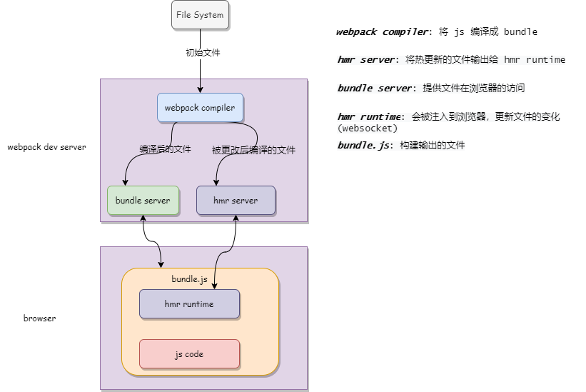

## 实时构建
---

1. 文件监听
- 在之前的开发过程中，在修改功能之后，我们需要手动的去执行构建的命令，这样在开发的过程中是比较麻烦的，因为我们期望页面在修改了之后就能看到结果
- 那么就可以使用文件监听，它是在发现源码发生变化之后，自动重新构建出新的输出文件。我们可以让 webpack 命令开启监听模式

```bash
webpack --watch
```

```json
{
  "script":{
    "watch":"webpack --watch"
  }
}
```

- 但是这种方式有个缺陷，就是在文件变更以后，需要手动刷新浏览器，变更才会生效体现到页面上。但我们还可以使用另一种方式，在 webpack.config.js 中添加 `watch:true` 来开启监听模式，以应对在文件更改的时候自动构建

```js
/** 
 * ignored：默认为空，指定不监听的文件或文件夹
 * aggregateTimeout：监听到变化后会等待一定的再去执行构建，默认为 300ms
 * poll：判断文件是否发生变化是通过不断地询问系统指定文件有没有变化实现的，默认为 每秒访问 1000次
*/
module.exports = {
  watch: true,
  watchOptions:{
    // 需要watch:true的情况下才有意义
    ignored: /node_modules/,
    aggregateTimeout:300,
    poll:1000
  }
}
```

- webpack 会去轮询判断文件的最后编辑时间是否变化。如果某个文件发生了变化，并不会立刻告诉监听者，而是先缓存起来，等待一定时间后再去构建相应的修改文件

2. 热更新
- webpack-dev-server 不刷新浏览器、不输出文件到磁盘中，而是放在内存中，这样构建速度就有一定的提升。需要配置 `HotModuleReplacementPlugin` 插件进行使用

```bash
npm i webpack-dev-server -D
```

```json
/** 
  * package.json
  * open 选项会在构建完成后自动开启一个webpack服务器
*/
{
  "script":{
    "dev":"webpack-dev-server --open"
  }
}
```

```js
/** 
 * @author: chencicsy
  * webpack.config.js
  * devServer：配置开发服务器
  * static：开发服务器的静态目录
  * hot：开启热更新
*/
const webpack = require('webpack')
module.exports = {
  mode:'development',
  plugins:[
    new webpack.HotModuleReplacementPlugin()
  ],
  devServer:{
    static:'./dist',
    hot: true
  }
}
```
- webpack-dev-middleware：与 webpack-dev-server 的作用差不多，这种方式会将 webpack 输出的文件传输到服务器，也就是说我们需要新建一个 node 服务器

- 热更新的原理如下图所示，在一开始的构建过程中，文件在由 webpack compiler 编译过后，被传输到 bundle server，由它提供文件在浏览器的访问(*通过开启一个服务器 localhost:xxxx*)。而在热更新模式下的对文件的更改，依然会通过 webpack compiler 编译文件，不过这次编译后的文件会传输到 hmr server，hmr server 就会知道哪些地方进行了变更，从而通知 hmr runtime 在浏览器端进行更新(一般是以json的形式传输到客户端)



---
## 本例的webpack配置
---

1. webpack.config.js
```js
const path = require('path');
const webpack = require('webpack')

module.exports = {
  mode: 'development',
  // watch: true,
  // watchOptions:{
  //   // 需要watch:true的情况下才有意义
  //   ignored: /node_modules/,
  //   aggregateTimeout:300,
  //   poll:1000
  // },
  entry: {
    app: "./src/app.js",
    appAdmin: "./src/admin.js"
  },
  output: {
    filename: "[name].js",
    path: __dirname + '/dist'
  },
  module: {
    rules: [
      {
        test: /\.js$/,
        use: "babel-loader"
      },
      {
        test: /\.css$/,
        use: [
          'style-loader',
          'css-loader'
        ]
      },
      {
        test: /\.less$/,
        use: [
          'style-loader',
          'css-loader',
          'less-loader'
        ]
      },
      {
        test: /\.(png|jpg|jpeg|gif)$/,
        use: [
          {
            loader:"url-loader",
            options:{
              limit:10240
            }
          }
        ]
      },
    ]
  },
  plugins:[
    new webpack.HotModuleReplacementPlugin()
  ],
  devServer:{
    static:'./dist',
    // hot: true,
    port:'3333',
    hotOnly:true
    // hot 默认热替换失败也会刷新页面，hotOnly 无论是处理模块的热替换，浏览器都不会自动刷新了，这样错误信息就能看到了
  }
}


```
