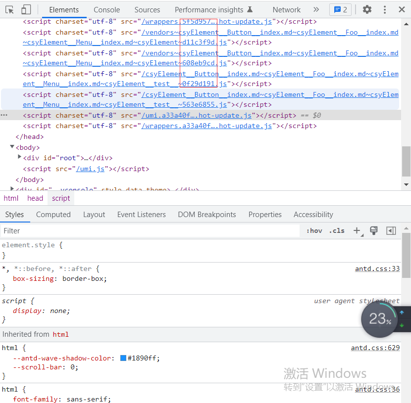

## 文件指纹
---

1. 什么是文件指纹
- 一般是指打包后输出的文件名的后缀，很多网站在它的开发者模式下都有这种情况，如下所示



- 这种就是文件指纹，它的后面的几个字符文件指纹，它可以用来做一些版本管理

2. 生成文件指纹
- 文件指纹一般可以生成三种不同形式的：Hash、Chunkhash、Contenthash
- `Hash`：和整个项目的构建有关，只要项目文件有修改，整个项目构建的 hash 值就会更改
- `Chunkhash`：和 webpack 打包的 chunk 有关，不同的 entry 会生成不同的 chunkhash 值，不会因为其他 chunk 的文件内容变化而重新构建
- `Contenthash`：根据文件内容来定义 hash，文件内容不变，则 contenthash 不变

```bash
npm i mini-css-extract-plugin -D
```

```js
/** 
  * js 一般使用 chunkhash 来生成文件指纹
  * css 一般使用 contenthash 来生成文件指纹。
  * css文件如果使用 style-loader/css-loader，css会被 style-loader 插入到 head 标签中，此时并没有独立的css文件，此时需要 plugin 来把 style-loader 中的 css 提取成一个独立的文件
  * style-loader 与 mini-css-extract-plugin 功能是冲突的，使用需要将 style-loader 去掉，替换成 mini-css-extract-plugin 的 loader
*/
const MiniCssExtractPlugin = require('mini-css-extract-plugin');

module.exports = {
  entry: {
    app: "./src/app.js",
    appAdmin: "./src/admin.js"
  },
  mode:"production",
  output: {
    filename: "[name][chunkhash:8].js",
    // 设置 js 文件指纹
    path: __dirname + '/dist'
  },
  module: {
    rule:[
      {
        test: /\.css$/,
        use: [
          MiniCssExtractPlugin.loader,
          // 使用MiniCssExtractPlugin的loader来提取css成一个独立的文件
          'css-loader'
        ]
      },
      {
        test: /\.less$/,
        use: [
          MiniCssExtractPlugin.loader,
          // 使用MiniCssExtractPlugin的loader来提取css成一个独立的文件
          'css-loader',
          'less-loader'
        ]
      },
    ]
  }
  plugins:[
    new MiniCssExtractPlugin({
      filename:"[name][contenthash:8].css"
      // 配置MiniCssExtractPlugin以contenthash的方式生成文件指纹
    })
  ]
}
```

- 图片的文件指纹设置，可以直接设置 file-loader 的 name，使用 hash
```js
/** 
  * 这里的 [hash] 占位符是文件内容的 hash，默认是 md5 生成，与上面的 [hash] 不一样
  * file-loader 占位符含义
  * [ext] 资源后缀名
  * [name] 文件名称
  * [path] 文件的相对路径
  * [floder] 文件所在的文件夹
  * [contenthash] 文件的内容hash，默认是md5生成
  * [hash] 文件的内容hash，默认是md5生成
  * [emoji] 一个随机的指代文件内容的 emoji
*/
module.exports = {
  entry: {
    app: "./src/app.js",
    appAdmin: "./src/admin.js"
  },
  mode:"production",
  output: {
    filename: "[name]_[chunkhash:8].js",
    // 设置 js 文件指纹
    path: __dirname + '/dist'
  },
  module:{
    rules:[
      {
        test:/\.(png|jpg|jpeg|git)/,
        use:[
          {
            loader:'file-loader',
            options:{
              name:'img/[name]_[hash:8].[ext]'
            }
          }
        ]
      }
    ]
  }
}
```
3. 区分生产与开发环境配置

- 新建 webpack.prod.js 文件，用来配置生产环境的 webpack 配置

```js
const path = require('path');
const webpack = require('webpack')
const MiniCssExtractPlugin = require('mini-css-extract-plugin')

module.exports = {
  mode: 'production',
  entry: {
    app: "./src/app.js",
    appAdmin: "./src/admin.js"
  },
  output: {
    filename: "[name]_[chunkhash:8].js",
    path: __dirname + '/dist'
  },
  plugins:[
    new MiniCssExtractPlugin({
      filename:"[name][contenthash:8].css"
    })
  ],
  module: {
    rules: [
      {
        test: /\.js$/,
        use: "babel-loader"
      },
      {
        test: /\.css$/,
        use: [
          MiniCssExtractPlugin.loader,
          'css-loader'
        ]
      },
      {
        test: /\.less$/,
        use: [
          MiniCssExtractPlugin.loader,
          'css-loader',
          'less-loader'
        ]
      },
      {
        test: /\.(png|jpg|jpeg|gif)$/,
        use: [
          {
            loader:"file-loader",
            options:{
              filename:"[name]_[hash:8].[ext]"
            }
          }
        ]
      },
    ]
  }
}
```

- 新建 webpack.dev.js 文件，配置开发环境的 webpack

```js
const path = require('path');
const webpack = require('webpack')

module.exports = {
  mode: 'development',
  entry: {
    app: "./src/app.js",
    appAdmin: "./src/admin.js"
  },
  output: {
    filename: "[name]_[chunkhash:8].js",
    path: __dirname + '/dist'
  },
  module: {
    rules: [
      {
        test: /\.js$/,
        use: "babel-loader"
      },
      {
        test: /\.css$/,
        use: [
          'style-loader',
          'css-loader'
        ]
      },
      {
        test: /\.less$/,
        use: [
          'style-loader',
          'css-loader',
          'less-loader'
        ]
      },
      {
        test: /\.(png|jpg|jpeg|gif)$/,
        use: [
          {
            loader:"url-loader",
            options:{
              limit:10240
            }
          }
        ]
      },
    ]
  },
  plugins:[
    new webpack.HotModuleReplacementPlugin()
  ],
  devServer:{
    static:'./dist',
    hot: true
  }
}
```

- 其中的 package.json 文件修改内容如下，指定不同环境的配置文件

```diff
{
  "scripts": {
    "test": "echo \"Error: no test specified\" && exit 1",
-   "build": "webpack",
+   "build": "webpack --config webpack.prod.js",
    "watch": "webpack --watch",
-   "dev":"webpack-dev-server --open",
+   "dev": "webpack-dev-server --config webpack.dev.js --open"
  }
}
```
