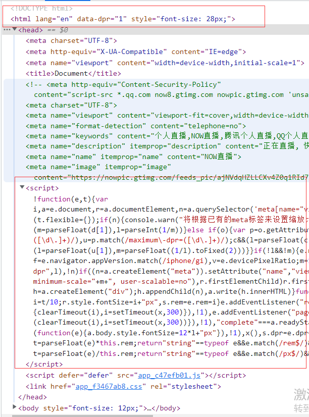

## CSS兼容性问题
---
1. css3前缀问题
- 由于各大浏览器的标准不同且不能完全统一，因此需要兼容其他浏览器样式。在 webpack 中可以通过一些插件来自动补齐 CSS3 前缀

> 因为 css 中有一些属性还没有确定下来，标准规范还没有发布，许多浏览器支持的程度也不同，而且每个浏览器厂商同一个样式支持的写法也不同，所以要加前缀来达到各个浏览器兼容，将来统一了规范就不用写前缀了

```bash
npm i autoprefixer postcss-loader -D
```

- autoprefixer：利用从 Can I Use 网站 获取的数据为 CSS 规则添加特定厂商的前缀。属于是 css 的后置处理器，样式处理完后代码打包后，在对它做一个后置处理。而 less/scss 是 css 的预处理器，预处理器是在打包之前进行处理

```js
module.exports = {
  module: {
    rule: [
      {
        test: /\.less$/,
        use: [
          MiniCssExtractPlugin.loader,
          'css-loader',
          'less-loader',
          {
            loader: 'postcss-loader',
            options: {
              postcssOptions: {
                plugins: ["autoprefixer"]
              }
            }
          }
        ]
      },
    ]
  }
}
```

- 接着，在 package.json 中添加 browserslist 字段，里面指定所需要兼容的浏览器版本

```json
/**
 * package.json
 * last 2 version：兼容最近的两个版本
 * > 1%：版本使用人数大于 1%
 * 其他的可以查看postcss官网
*/
{
  "browserslist": [
    "last 2 versions","> 1%","not ie <= 10"
	],
}
```
2. 静态资源内联
- 如果我们需要在代码里使用第三方库，比如 node_modules 中的模块，将它内联到代码中使用，在当前的配置环境下是无法做到的。这时候就要用到其他 loader 来做这个事了，raw-loader 可以解决 html 和 js 内敛的问题

```html
<!-- 内联html -->
<head>
  <%= {require('raw-loader!babel-loader!./index.html') %>
</head>
<script>${require('raw-loader!babel-loader!./index.html')}</script>
<!-- 内联js，代码中可能存在es6的语法，需要babel-loader去做处理 -->
<script><%= require('raw-loader!babel-loader!../../node_modules/lib-flexible/flexible.js')%></script>
```
- 内联 html 片段的作用在于当开发页面的时候，每个页面可能需要大量的 meta 信息，这时候可以将它提取出来，然后通过这个 raw-loader 把它内联到页面中
- css 内联可以直接借助 style-loader，但因为我们将 css 做了拆分，所以要使用其他的方式，`html-inline-css-webpack-plugin` 可以解决这个问题

```js
module.exports = {
  module:{
    rule:[
      {
        test:/\.css$/,
        use:[
          {
            loader:"style-loader",
            options:{
              insertAt: 'top', // 将样式插入到 head
              singleton:true // 将所有的style标签合并为一个
            }
          },
          "css-loader"
        ]
      }
    ]
  }
}
```

3. 移动端 px 自动转换 rem
- 由于机型的更新，会导致需要适配不同的分辨率的设备。rem 是一个相对单位，基于根元素的大小去适配机型
- 通过 px2rem-loader 将 px 转换成 rem，最后使用 lib-flexible 来动态的计算页面渲染时根元素的 font-size 的大小

```bash
npm i px2rem-loader -D
npm i lib-flexible -S
```

- 接着，在 webpack.prod.js 中使用这个 loader，将 px 转换成 rem

```js
/** 
 * px2rem-loader
 * remUnit: 75：表示 1rem === 75px，比较适合 750 的设计稿
 * remPrecision: 8：px 转换过的 rem 保留八位小数
*/
module.exports = {
  module:{
    rule:[
      {
        test: /\.less$/,
        use: [
          MiniCssExtractPlugin.loader,
          'css-loader',
          {
            loader: 'px2rem-loader',
            options: {
              remUnit: 75,
              remPrecision: 8
            }
          },
          'less-loader',
          {
            loader: 'postcss-loader',
            options: {
              postcssOptions: {
                plugins: ["autoprefixer"]
              }
            }
          }
        ]
      },
    ]
  }
}
```

- 接着，在主入口 js 文件中引入 lib-flexible，来动态计算根元素 font-size 的大小，也可以在模板 html 中引入。~~${require('raw-loader!babel-loader!./index.html')}~~

```js
/** 
 * main.js
*/

import 'lib-flexible'
```

```html
<script><%= require('raw-loader!babel-loader!../../node_modules/lib-flexible/flexible.js')%></script>
```



---
## 本例的webpack配置
---

1. webpack.prod.js
```js
const path = require('path');
const glob = require('glob')
const MiniCssExtractPlugin = require('mini-css-extract-plugin')
const OptimizeCssAssetsPlugin = require('optimize-css-assets-webpack-plugin');
const HtmlWebpackPlugin = require('html-webpack-plugin');
const TerserPlugin = require('terser-webpack-plugin');
const { CleanWebpackPlugin } = require('clean-webpack-plugin')

const matchFile = () => {
  const entry = {};
  const htmlWebpackPlguins = [];
  const entryFiles = glob.sync('./src/*/index.js')


  Object.keys(entryFiles).map(key => {
    const entryFile = entryFiles[key];

    const chunkName = entryFile.match(/src\/(.*)\/index\.js/);

    entry[chunkName[1]] = entryFile;

    console.log(chunkName[1],entryFile)

    htmlWebpackPlguins.push(new HtmlWebpackPlugin({
      template: path.join(__dirname, `src/${chunkName[1]}/index.html`),
      filename: `${chunkName[1]}.html`,
      chunks: [chunkName[1]],
      inject: true,
      minify: {
        html5: true,
        collapseWhitespace: true,
        preserveLineBreaks: false,
        minifyCSS: true,
        minifyJS: true,
        removeComments: false
      }
    })
    )
  })

  return {
    entry,
    htmlWebpackPlguins
  }
}

const {
  entry,
  htmlWebpackPlguins
} = matchFile()

module.exports = {
  mode: 'production',
  entry: entry,
  output: {
    filename: "[name]_[chunkhash:8].js",
    path: __dirname + '/dist'
  },
  optimization: {
    minimizer: [
      new OptimizeCssAssetsPlugin({
        assetNameRegExp: /\.css$/g,
        // cssProcessor: require('cssnano'),
        cssProcessorPluginOptions: {
          preset: ['default', { discardComments: { removeAll: true } }],
        },
        canPrint: true
      }),
      new TerserPlugin()
    ],
    noEmitOnErrors: true
  },
  plugins: [
    new MiniCssExtractPlugin({
      filename: "[name]_[contenthash:8].css"
    }),
    new CleanWebpackPlugin()
  ].concat(htmlWebpackPlguins),
  module: {
    rules: [
      {
        test: /\.js$/,
        use: "babel-loader"
      },
      {
        test: /\.css$/,
        use: [
          MiniCssExtractPlugin.loader,
          'css-loader'
        ]
      },
      {
        test: /\.less$/,
        use: [
          MiniCssExtractPlugin.loader,
          'css-loader',
          {
            loader: 'px2rem-loader',
            options: {
              remUnit: 75,
              remPrecision: 8
            }
          },
          'less-loader',
          {
            loader: 'postcss-loader',
            options: {
              postcssOptions: {
                plugins: ["autoprefixer"]
              }
            }
          }
        ]
      },
      {
        test: /\.(png|jpg|jpeg|gif)$/,
        use: [
          {
            loader: "file-loader",
            options: {
              filename: "[name]_[hash:8].[ext]"
            }
          }
        ]
      },
    ]
  }
}

```
