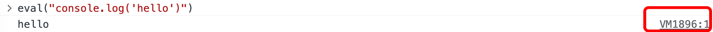
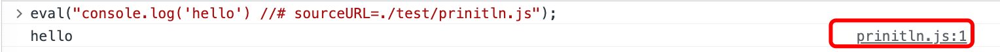
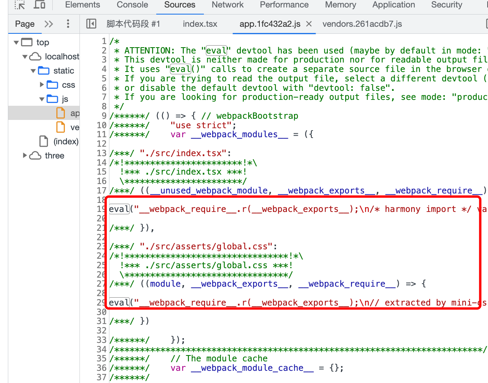
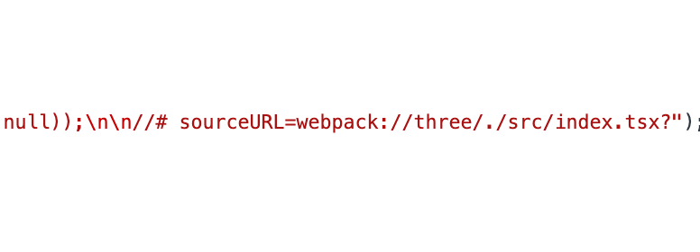
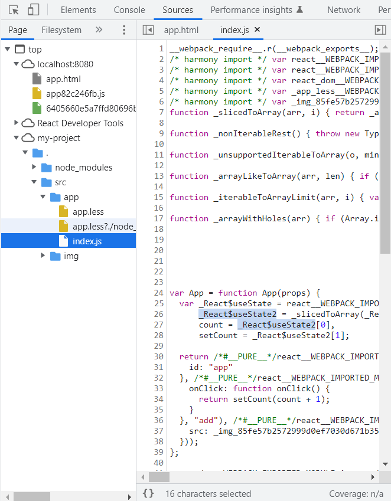
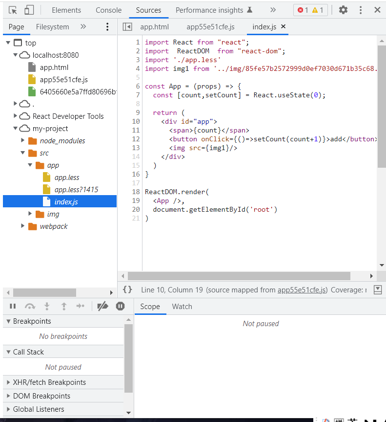

## sourceMap
---
1. 为什么需要sourceMap
- 源代码经过 webpack 处理后，会被打包成 bundle 文件，但它不利于开发过程中的调试，这时候就需要 sourceMap(线上环境最好不要使用，源码会暴露出来)

|关键字|描述|
|---|---|
|eval|使用 eval 函数包裹源代码。该关键字不会生成单独的 .map 文件。|
|source map|产生.map文件,并在 bundle 文件中添加引用注释|
|cheap|不包含列信息,忽略 loader source map|
|inline|将.map作为DataUrI嵌入，不单独产生.map文件,与形如 eval-* 类型生成的代码类似都会添加到 bundle 中|
|module|包含loader的sourceMap|

```js
module.exports = {
  mode:"none",
  devtool:"eval"
}
```

- 其他的几种模式，无外乎是这三种的排列组合罢了

|模式|描述|
|---|---|
|eval|是否使用 eval 执行模块代码|
|cheap|Source Map 是否包含行信息|
|module|是否能够得到 loader 处理之前的源代码|

- eval 是 js 中的一个函数，可以用于去运行字符串中的代码。默认情况下会运行虚拟机环境当中，还可以通过 sourceURL 来指明代码所属的文件路径(但这段代码仍然运行在虚拟机环境中)

```js
eval("console.log('hello')");
// hello
```



```js
eval("console.log('hello') //# sourceURL=./test/prinitln.js");
// hello
```



- 打包后的代码会被包裹到 eval 函数中去执行，并且在 eval 执行函数的最后通过 sourceURL 去标示对应的文件路径，这样浏览器就能知道所对应的源代码是哪一个文件，用于定位文件

 


3. 使用场景
- 一般是在开发环境下使用，如果没添加 sourceMap，当我们调试的时候就是经过打包后的代码，如下所示



- 当我们开启 sourceMap 之后，就能在具体的源代码上进行调试



---
## 本例的webpack配置
---

1. webpack.dev.js
```js
const path = require('path');
const webpack = require('webpack')
const glob = require('glob')
const HtmlWebpackPlugin = require('html-webpack-plugin')
const {CleanWebpackPlugin} = require('clean-webpack-plugin')

const matchFile = () => {
  const entry = {};
  const htmlWebpackPlguins = [];

  const entryFiles = glob.sync('./src/*/index.js')

  Object.keys(entryFiles).map(key => {
    const entryFile = entryFiles[key];

    const chunkName = entryFile.match(/src\/(.*)\/index\.js/);

    entry[chunkName[1]] = entryFile;

    htmlWebpackPlguins.push(new HtmlWebpackPlugin({
      template: path.join(__dirname, `src/${chunkName[1]}/index.html`),
      filename: `${chunkName[1]}.html`,
      chunks: [chunkName[1]],
      inject: true,
      minify: {
        html5: true,
        collapseWhitespace: true,
        preserveLineBreaks: false,
        minifyCSS: true,
        minifyJS: true,
        removeComments: false
      }
    })
    )
  })

  return {
    entry,
    htmlWebpackPlguins
  }
}

const {
  entry,
  htmlWebpackPlguins
} = matchFile()

module.exports = {
  mode: 'development',
  entry: entry,
  output: {
    filename: "[name][chunkhash:8].js",
    path: __dirname + '/dist'
  },
  module: {
    rules: [
      {
        test: /\.js$/,
        use: "babel-loader"
      },
      {
        test: /\.css$/,
        use: [
          'style-loader',
          'css-loader'
        ]
      },
      {
        test: /\.less$/,
        use: [
          'style-loader',
          'css-loader',
          'less-loader'
        ]
      },
      {
        test: /\.(png|jpg|jpeg|gif)$/,
        use: [
          {
            loader:"url-loader",
            options:{
              limit:10240
            }
          }
        ]
      },
    ]
  },
  plugins:[
    new webpack.HotModuleReplacementPlugin(),
    new CleanWebpackPlugin()
  ].concat(htmlWebpackPlguins),
  devServer:{
    static:'./dist',
    hot: true
  },
  devtool:"source-map"
}

```

