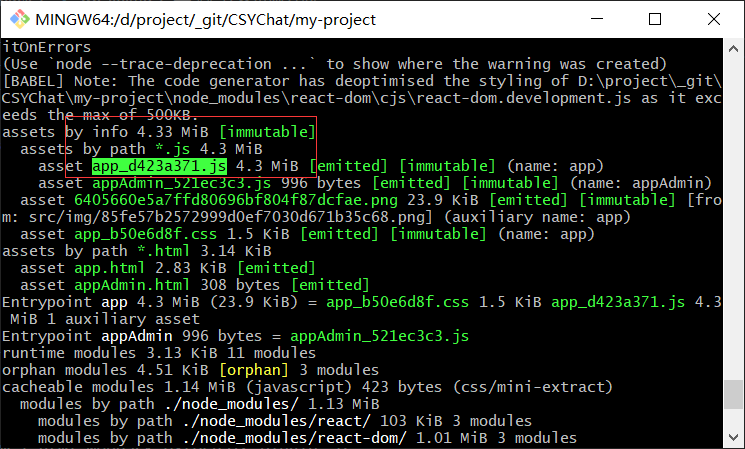
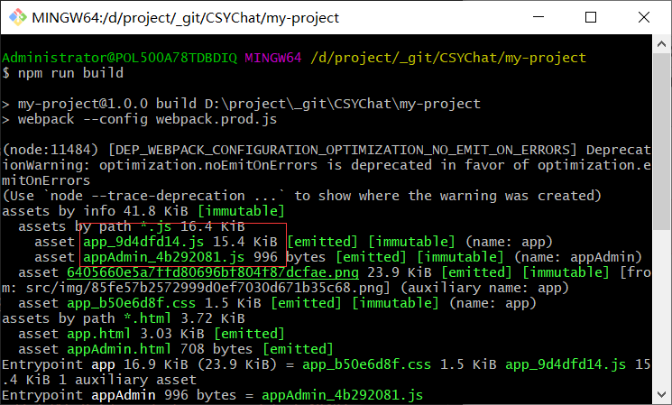
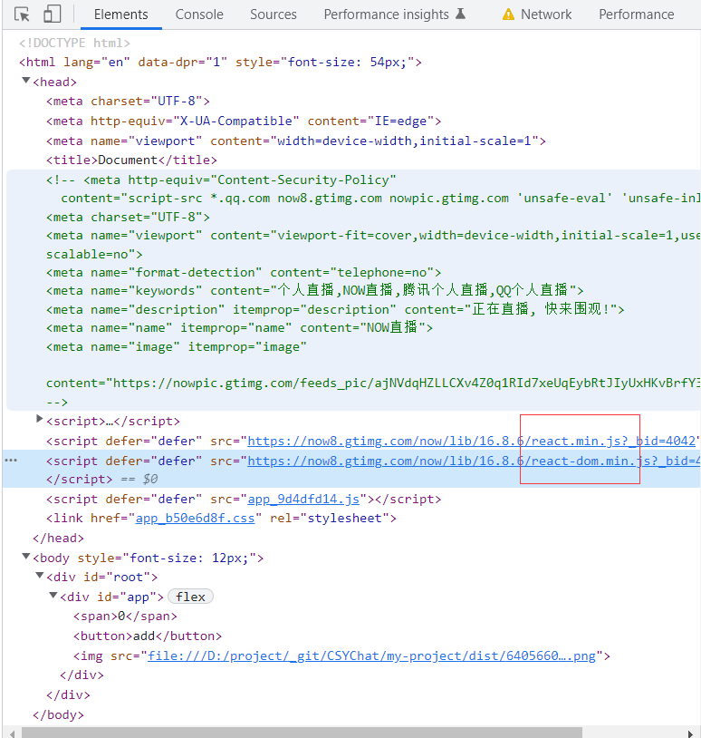
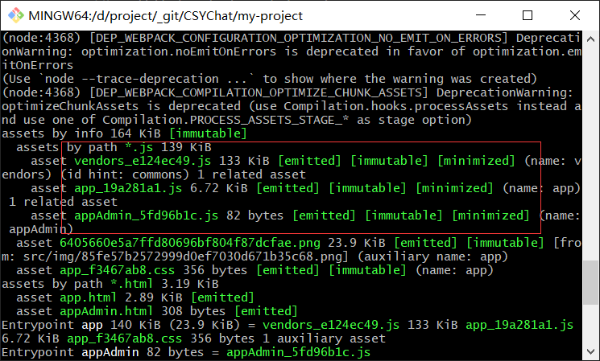

## 公共资源分离
---
1. 基础库分离
- 例如在 react 开发中，react、react-dom 基础包是常用的，我们可以将它通过 cdn 引入，而不打包到 bundle 中

```bash
npm i html-webpack-externals-plugin -D
```

- 先来看看，未提取公共资源前，打包出来的 js 文件的大小，有 4.3m



- 接着，使用 html-webpack-externals 对 react、react-dom 进行提取，以cdn的方式插入到页面中

```js
/** 
  * webpack.prod.js
  * 
*/

module.exports = {
  plugins:[
    new htmlWebpackExternalPlugin({
      externals:[
        {
          module:'react',
          entry:'https://now8.gtimg.com/now/lib/16.8.6/react.min.js?_bid=4042',
          global:'React'
        },
        {
          module:'react-dom',
          entry:'https://now8.gtimg.com/now/lib/16.8.6/react-dom.min.js?_bid=4042',
          global:'ReactDOM'
        }
      ]
    })
  ]
}

```



- 此时，对应的 js 文件也给我们自动引入到了页面中



- 还可以在基础包提取成一个 js 文件的方式，通过 webpack 内置的插件 splitChunks 来做这个事情

```js
module.exports = {
  optimization: {
    splitChunks: {
      cacheGroups: {
        commons: {
          test: /(react|react-dom)/,
          name: 'vendors',
          chunks: 'all'
        }
      }
    }
  },
}

```



- 可见入口文件的大小也得到了减少，基础库被提取了成 vendor 文件。除了提取第三方模块以外，还可以分离页面公共文件

```js
/** 
  * minChunks: 设置模块最小被引用次数，超过这个数字即将该模块分离
  * minSize：分离的包的体积大于设置的值，既将该模块分离
  * name: 表示抽离出来的 chunkname
*/
module.exports = {
  optimization:{
    splitChunks:{
      minSize:0,
      cacheGroups:{
        common:{
          name:"common",
          chunks:"all",
          minChunks:2
        },
        vendors:{
          name:"vendors",
          chunks:"all",
          test: /[\\/]node_modules[\\/]/,
        }
      }
    }
  }
}
```

```js
/**
  * webpack.prod.js
 */
const path = require('path');
const glob = require('glob')
const MiniCssExtractPlugin = require('mini-css-extract-plugin')
const OptimizeCssAssetsPlugin = require('optimize-css-assets-webpack-plugin');
const HtmlWebpackPlugin = require('html-webpack-plugin');
const TerserPlugin = require('terser-webpack-plugin');
const { CleanWebpackPlugin } = require('clean-webpack-plugin');
const htmlWebpackExternalPlugin = require('html-webpack-externals-plugin')

const matchFile = () => {
  const entry = {};
  const htmlWebpackPlguins = [];

  const entryFiles = glob.sync('./src/*/index.js')

  Object.keys(entryFiles).map(key => {
    const entryFile = entryFiles[key];

    const chunkName = entryFile.match(/src\/(.*)\/index\.js/);

    entry[chunkName[1]] = entryFile;

    htmlWebpackPlguins.push(new HtmlWebpackPlugin({
      template: path.join(__dirname, `src/${chunkName[1]}/index.html`),
      filename: `${chunkName[1]}.html`,
      chunks: ['vendors', 'common', chunkName[1]],
      inject: true,
      minify: {
        html5: true,
        collapseWhitespace: true,
        preserveLineBreaks: false,
        minifyCSS: true,
        minifyJS: true,
        removeComments: false
      }
    })
    )
  })

  return {
    entry,
    htmlWebpackPlguins
  }
}

const {
  entry,
  htmlWebpackPlguins
} = matchFile()

module.exports = {
  mode: 'production',
  entry: entry,
  output: {
    filename: "[name]_[chunkhash:8].js",
    path: __dirname + '/dist'
  },
  optimization: {
    minimizer: [
      new OptimizeCssAssetsPlugin({
        assetNameRegExp: /\.css$/g,
        // cssProcessor: require('cssnano'),
        cssProcessorPluginOptions: {
          preset: ['default', { discardComments: { removeAll: true } }],
        },
        canPrint: true
      }),
      new TerserPlugin()
    ],
    noEmitOnErrors: true,
    splitChunks:{
      minSize:0,
      cacheGroups:{
        common:{
          name:"common",
          chunks:"all",
          minChunks:2
        },
        vendors:{
          name:"vendors",
          chunks:"all",
          test: /[\\/]node_modules[\\/]/,
        }
      }
    }
  },
  plugins: [
    new MiniCssExtractPlugin({
      filename: "[name]_[contenthash:8].css"
    }),
    new CleanWebpackPlugin(),
    // new htmlWebpackExternalPlugin({
    //   externals: [
    //     {
    //       module: 'react',
    //       entry: 'https://now8.gtimg.com/now/lib/16.8.6/react.min.js?_bid=4042',
    //       global: 'React'
    //     },
    //     {
    //       module: 'react-dom',
    //       entry: 'https://now8.gtimg.com/now/lib/16.8.6/react-dom.min.js?_bid=4042',
    //       global: 'ReactDOM'
    //     }
    //   ]
    // })
  ].concat(htmlWebpackPlguins),
  module: {
    rules: [
      {
        test: /\.js$/,
        use: "babel-loader"
      },
      {
        test: /\.css$/,
        use: [
          MiniCssExtractPlugin.loader,
          'css-loader'
        ]
      },
      {
        test: /\.less$/,
        use: [
          MiniCssExtractPlugin.loader,
          'css-loader',
          {
            loader: 'px2rem-loader',
            options: {
              remUnit: 75,
              remPrecision: 8
            }
          },
          'less-loader',
          {
            loader: 'postcss-loader',
            options: {
              postcssOptions: {
                plugins: ["autoprefixer"]
              }
            }
          }
        ]
      },
      {
        test: /\.(png|jpg|jpeg|gif)$/,
        use: [
          {
            loader: "file-loader",
            options: {
              filename: "[name]_[hash:8].[ext]"
            }
          }
        ]
      },
    ]
  }
}

```
