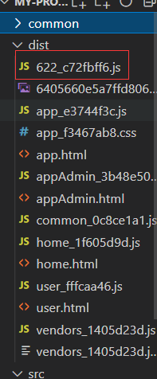

## 代码分割
---
1. 适用场景
- 主要是将代码库分割为 chunks(语块)，当代码运行到需要它的时候再进行加载。通常适用于 **抽离相同代码到同一个共享块**、**脚本懒加载，使得初始下载的代码更小（只在用到的时候才加载）**
- 两种方式，分别适用于 commonjs(require.ensure)、es6(动态import，相当于满足条件才加载，属于按需加载)

```bash
npm i @babel/plugin-syntax-dynamic-import -D
```

```json
// babelrc
{
  "plugins":["@babel/plugin-syntax-dynamic-import"]
}
```



- 那么这个效果，在打包时，将要动态加载的模块放置到一个单独的 chunks 中，import 接收模块路径作为参数，返回一个 promise

```jsx | pure
import React,{useState} from 'react';

export default (props) => {
  const [LoadComp,setLoadComp] = useState(null);

  const loadComponent = () => {
    import("./source/wp-10-test.js").then(comp=>{
      setLoadComp(comp.default)
    })
  }

  return (
    <div>
      <button onClick={loadComponent}>动态加载</button>
      {
        LoadComp && LoadComp
      }
    </div>
  )
}
```
- 第二种，使用 require.ensure 来实现应用程序的懒加载
```js
require.ensure([],function(require){
  var test = require("./moduleA")
})
```
---
## 本例的 .babelrc 配置
---
1. .babelrc
```json
{
  "presets":[
    "@babel/preset-env",
    "@babel/preset-react"
  ],
  "plugins":[
    "@babel/proposal-class-properties",
    "@babel/plugin-syntax-dynamic-import"
  ]
}
```
